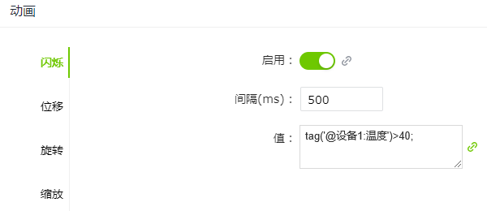
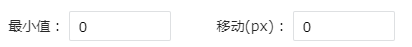
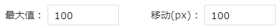
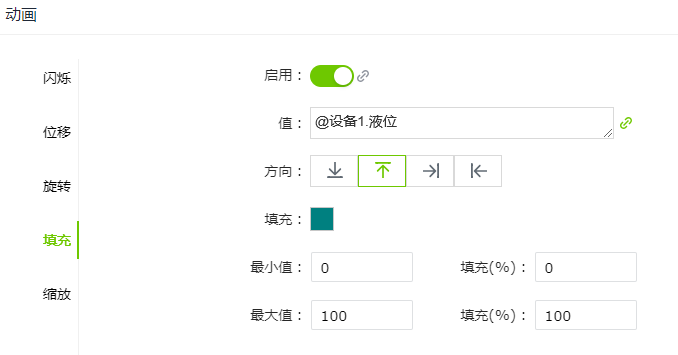
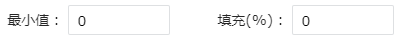

# 动画

通过合理应用动画效果，可以为用户带来更高效、直观和愉悦的界面交互体验。

WAGO VC Hub中，当控件具有动画属性时，在右侧的属性栏中会显示“动画”一列，点击设置按钮可以进行动画设置。

除了”值“支持绑定外，”启用“状态也支持绑定。通过绑定，可以让动画的启用状态跟随某个变量或表达式的值动态变化。不再是手动固定“开/关”，而是由绑定的值来动态决定动画是否启用。

## 动画类型

WAGO VC Hub支持以下动画类型：

#### 闪烁

闪烁效果易于引起注意，常用于出现非正常状态时的报警。

**示例**

创建一个圆形控件，该控件表示报警指示灯，当“温度”的值大于40时该控件闪烁。

| **属性**     | **值** |
|:--------------|:-------------|
| 填充色       | ff0000  |
| 边框色       | ff0000 |
| 闪烁启用状态 | 启用  |
| 闪烁间隔     | 500ms  |
| 闪烁值       | 表达式：tag(`'@设备1:温度'`)>40;  **说明**：该动画仅在值为布尔值时才生效。 |

#### 位移

通过改变控件的位置来产生动态效果，可以在水平和垂直方向进行移动。

**示例**

查看物体在传送带上的运行位置。

| **属性** | **值** |
|:----------|:------------|
| 水平位移 | 启用  |
| 水平值   | 变量：模型.水平位置  |
| 方向     | 从左向右   |
| 最小值   | 和“移动”属性组合起来使用。设置动画生效的最小值，以及最小值时物体的移动距离。    |
| 最大值   | 和“移动”属性组合起来使用。设置动画生效的最大值，以及最大值时物体的移动距离。    |

#### 旋转

物体随着值的变化而进行旋转。

**示例**

| **属性** | **值**   |
|:----------|:-------------|
| 启用旋转 | 启用 |
| 值       | 变量：设备1.转速 |
| 类型     | 值的结果类型。分为数值型和布尔型。 数值型：    布尔型：  |
| 最小值   | 类型为数值型时，显示该参数。和“角度“属性组合起来使用。设置动画生效的最小值，以及最小值时物体的旋转角度。   |
| 最大值   | 类型为数值型时，显示该参数。和“角度“属性组合起来使用。设置动画生效的最小值，以及最小值时物体的旋转角度。    |
| 向右偏移 | 类型为数值型时，显示该参数。用于设置旋转中心点向右偏移的距离。  |
| 向下偏移 | 类型为数值型时，显示该参数。用于设置旋转中心点向下偏移的距离。 |
| 方向     | 类型为布尔型时，显示该参数。表示旋转的方向。   |
| 转速     | 类型为布尔型时，显示该参数。表示多久转一次。 |
| 步长     | 类型为布尔型时，显示该参数。表示每次旋转的角度。 |

#### 填充

通过值的变化，改变物体的填充效果。

**示例**

罐子中的液位在不断变化。以矩形代表罐子。

| **属性** | **值** |
|:----------|:-------------|
| 启用填充 | 启用     |
| 值       | 变量：设备1.液位   |
| 方向     | 填充的方向。    自上向下填充。    自下向上填充。  自左向右填充。    自右向左填充。 |
| 填充     | 填充的颜色。  |
| 最小值   | 和“填充“属性组合起来使用。设置动画生效的最小值，以及最小值时物体的填充比例。    |
| 最大值   | 和“填充“属性组合起来使用。设置动画生效的最小值，以及最小值时物体的填充比例。    |

#### 缩放

通过值的变化，改变物体的大形态。可以在水平和垂直两个方向进行缩放。

**示例**

温度计的水银柱随着值的变化而变化。

| **属性** | **值**  |
|----------|------------|
| 垂直填充 | 启用 |
| 值       | 变量：设备1.温度  |
| 参考点   | 缩放的方向。    用于水平方向的缩放，表示以物体的左侧为参考点，进行左右缩放。     用于水平方向的缩放，表示以物体的中心为参考点，进行左右缩放。   用于水平方向的缩放，表示以物体的右侧为参考点，进行左右缩放。   用于垂直方向的缩放，表示以物体的顶部为参考点，进行上下缩放。   用于垂直方向的缩放，表示以物体的中心为参考点，进行上下缩放。   用于垂直方向的缩放，表示以物体的底部为参考点，进行上下缩放。 |
| 最小值   | 和“缩放“属性组合起来使用。设置动画生效的最小值，以及最小值时物体的缩放比例。   |
| 最大值   | 和“缩放“属性组合起来使用。设置动画生效的最小值，以及最小值时物体的缩放比例。   |

