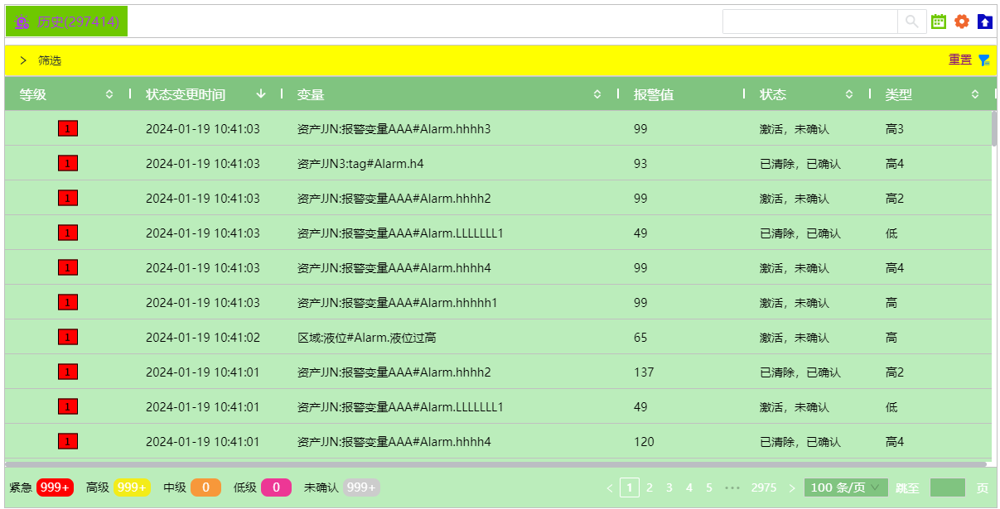
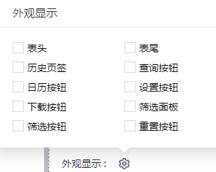
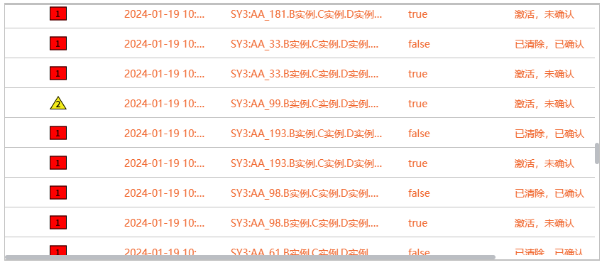

# 历史报警

历史报警控件用于显示报警的历史记录, 包括当前节点的历史报警以及组网环境下的远端节点的历史报警。

**界面元素**

在使用历史报警控件查看数据之前，需先在“报警”->"历史库"页面配置 [报警历史库](../../../../management-platform/alarming/history-storage.md)。

默认情况下，该控件将显示最近12小时的报警数据。您也可以根据筛选条件进行数据筛选。

您可以在预览和运行画面上点击“列设置”按钮设置需要显示的列。单击并拖动列的边距以调整其宽度。您还可以按升序或降序对列进行排序，只需单击

每个列标题旁边的向上或向下箭头即可。

通过导出按钮，可以将查询到的数据导出为excel文件，便于对数据进行整理和分析。最多可导出50000条数据。

 历史报警无闪烁，无报警声音、无行 颜色。

**属性**

| **名称** | **描述** |
|----------|---------------------|
| 名字     | 此控件的名称。|
| X        | 控件左侧距画布左侧的距离，单位px。 |
| Y        | 控件顶部距画布顶部的距离，单位px。|
| W        | 控件的宽度，单位px。 |
| H        | 控件的高度，单位px。 |
| 显示     | 设置控件上显示哪些按钮。 |
| 等级颜色 | 为每个报警等级设置对应颜色。仅修改等级对应的符号的颜色，不会整行显示颜色。 |
| 边框颜色 | 设置控件外边框及表体的表格线颜色。  |
| 边框粗细 | 设置控件外边框及表体的表格线的粗细。   |
| 表头     | 设置表头的背景色、字体型号、字体大小、加粗、倾斜、字体颜色。  |
| 表体     | 设置表体的背景色、字体型号、字体大小、加粗、倾斜、字体颜色。|
| 页签     | 设置历史页签的样式。 - **背景**：页签的填充颜色。 - **边框色**：页签的边框颜色。 - **字体**：设置页签内容的字体型号、字体大小、加粗、倾斜、字体颜色。 |
| 筛选面板 | 设置筛选面板的样式。 - **面板背景色**：筛选面板的背景色。 - **面板名称字体**：设置面板名称(筛选)的字体型号、字体大小、加粗、倾斜、字体颜色。 - **标签**：筛选面板展开后，显示的页签的样式。     包括页签选中以及未选择时所显示的背景色、边框色、字体型号、字体大小、加粗、倾斜、字体颜色。 |
| 按钮样式 | 设置控件上使用的按钮的样式。点击按钮样式的设置按钮进行设置。   日历按钮.日历按钮的颜色。  设置按钮.设置按钮的颜色。 下载按钮.下载按钮的颜色。 重置按钮.重置按钮的颜色。 筛选按钮.筛选按钮的颜色。 搜索.搜索框的背景色、边框色，以及输入的搜索内容的字体型号、字体大小、加粗、倾斜、字体颜色。 |
| 筛选条件 | 勾选需要的筛选条件。|
| 列设置   | 设置列表显示的列。  |
| 操作     | 设置操作按钮并设置触发操作，当触发报警时，执行该操作。  |
| 每页条数 | 设置每页显示的报警条数。|

**动作**

允许您基于某种条件执行特定的动作。请参阅“[动作](../../../event/index.md)”页上各种动作的完整描述。

**示例1**

在设计器中，您可以设置控件的外观样式。

**示例2**

在运行页面，在搜索框中输入搜索条件，按照搜索内容进行数据筛选。

**示例3**

不显示任何按钮，仅显示报警信息。在属性的“外观显示”中，所有选项都不选择。

显示效果如下：

