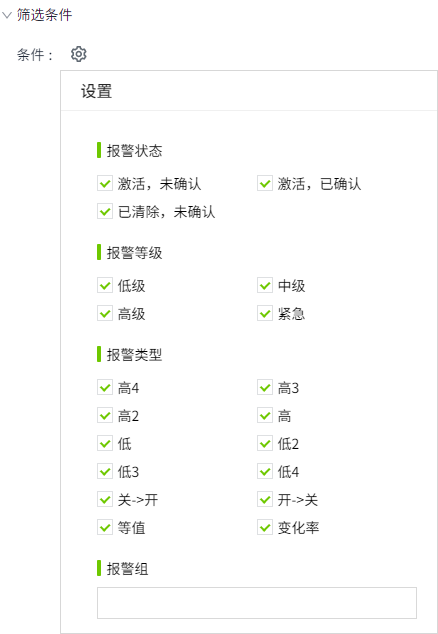
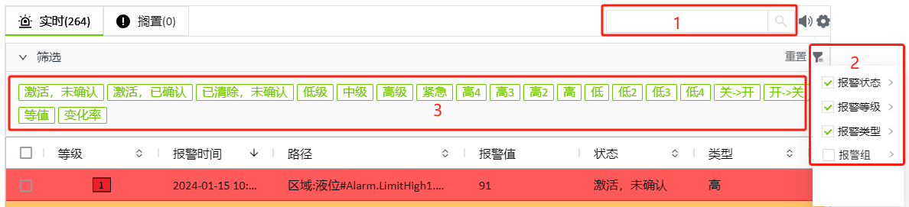
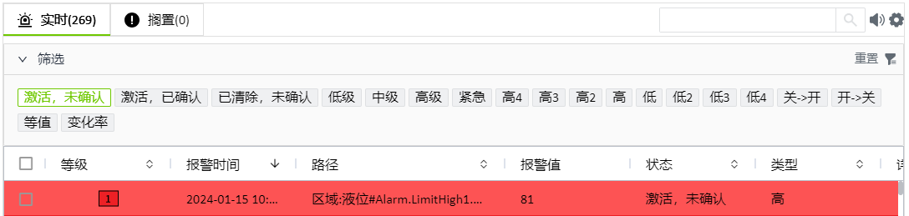

# 报警筛选

默认情况下，系统内的所有报警都显示在控件上，包括组网的远端报警数据。您可以在控件上按照条件对数据进行筛选。

设计时和运行时页面均支持数据筛选。

## 设计时数据筛选

在控件的”属性“->”筛选条件“中可以进行数据筛选。此处设置了筛选条件后，在运行页面，按照已设置的条件进行数据筛选和显示。

#### 按状态筛选

可以根据报警的状态进行筛选。例如，可以通过启用”激活，未确认“和 “已清除，未确认”属性，在控件上仅显示未确认的报警。

#### 按等级筛选

可以根据报警的等级进行筛选。例如，可以通过启用”紧急“和 “高级”属性，在控件上仅显示这两个等级的报警。

#### 按类型筛选

可以根据报警的类型进行筛选。例如，可以通过启用”关- >开“和 “开->关”属性，在控件上仅显示布尔值跳变的报警。

#### 按报警组筛选

可以根据报警组进行筛选。例如，选择报警组"Line1"，则在控件上值显示该报警组内的变量的报警信息。

## 运行时数据筛选

在运行页面，有3处地方可以进行数据筛选。

1.  在搜索框中输入查询内容，在控件的 所有列中对输入的内容进行模糊 查找。
2. 点击筛选按钮进行数据筛选，筛选条件同设计页面，包含：报警状态、报警等级、报警类型、报警组。点击重置按钮，将筛选条件恢复到设计页面设置的筛选条件。
3. 在折叠面板中进行数据筛选。此处默认显示在筛选条件中已经启用的选项。可以点击选项快速禁用筛选条件。例如下图仅显示“激活，未确认”的报警。

    

**说明**：筛选面板中选项的启用/禁用，仅表示是否在控件中显示数据，并不代表不查询数据，不会影响筛选条件中各选项的启用/禁用状态。  例如在筛选面板中，只有“激活，未确认”启用，但在筛选条件中，所有选项均处于启用状态。 

 

