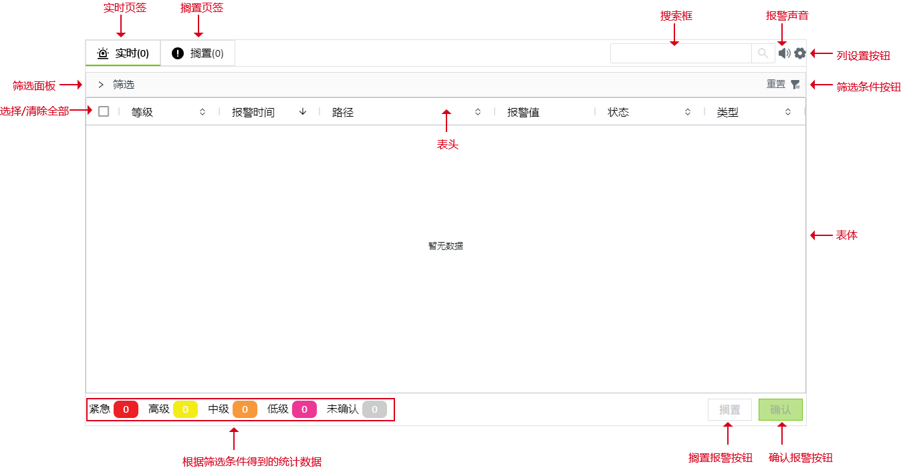
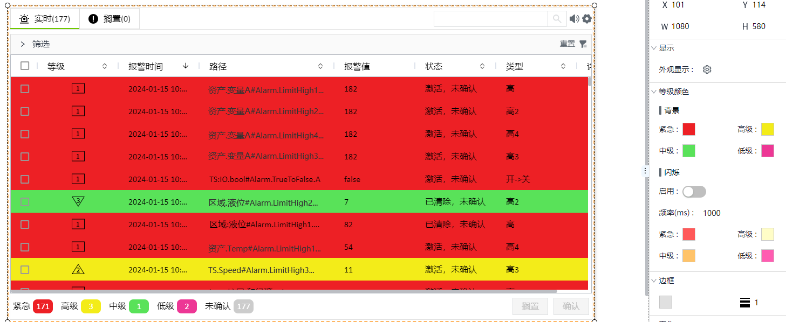
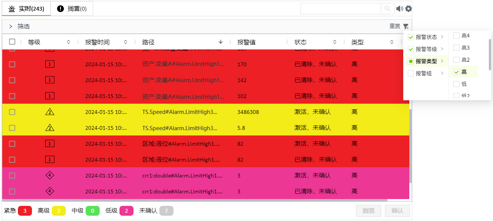

# 实时报警

实时报警控件显示正在发生的报警, 包括当前节点的报警以及组网环境下的远端节点的报警。默认情况下，显示所有的报警信息，控件仅支持显示最新的2000条报警数据，您也可以设置筛选条件。

支持对列表中显示的所有报警进行确认，搁置，筛选等操作。

**界面元素**

您可以在预览和运行画面上点击“列设置”按钮设置需要显示的列。单击并拖动列的边距以调整其宽度。您还可以按升序或降序对列进行排序，只需单击每个列标题旁边的向上或向下箭头即可。

**属性**

| **名称** | **描述**  |
|:----------|:---------------|
| 名字     | 此控件的名称。   |
| X        | 控件左侧距画布左侧的距离，单位px。  |
| Y        | 控件顶部距画布顶部的距离，单位px。|
| W        | 控件的宽度，单位px。 |
| H        | 控件的高度，单位px。 |
| 显示     | 设置控件上显示哪些按钮。 |
| 等级颜色 | 为每个报警等级设置颜色及其闪烁效果。 |
| 边框颜色 | 设置控件外边框及表体的表格线颜色。  |
| 边框粗细 | 设置控件外边框及表体的表格线的粗细。  |
| 表头     | 设置表头的背景色、字体型号、字体大小、加粗、倾斜、字体颜色。  |
| 表体     | 设置表体的背景色、字体型号、字体大小、加粗、倾斜、字体颜色。  |
| 页签     | 设置实时和搁置页签的样式。 - **指示条**：选中页签后，页签下方显示的指示条的颜色。 - **实时页签**：设置实时页签的背景色、边框色、字体型号、字体大小、加粗、倾斜、字体颜色。 - **搁置页签**：设置搁置页签的背景色、边框色、字体型号、字体大小、加粗、倾斜、字体颜色。|
| 声音     | 设置报警声音。 - **启用**：用于开启或关闭报警声音。 - **声音**：内置一个蜂鸣声，用户也可以手动上传报警声音，最多支持上传5个。 - **紧急**：设置等级为”紧急“的报警的报警声音。 - **高级**：设置等级为”高级“的报警的报警声音。 - **中级**：设置等级为“中级”的报警的报警声音。 - **低级**：设置等级为”低级“的报警的报警声音。|
| 筛选面板 | 设置筛选面板的样式。 - **面板背景色**：筛选面板的背景色。 - **面板名称字体**：设置面板名称(筛选)的字体型号、字体大小、加粗、倾斜、字体颜色。 - **标签**：筛选面板展开后，显示的页签的样式。      包括页签选中以及未选择时所显示的背景色、边框色、字体型号、字体大小、加粗、倾斜、字体颜色。|
| 按钮样式 | 设置控件上使用的按钮的样式。点击按钮样式的设置按钮进行设置。    声音按钮.声音按钮的颜色。  设置按钮.设置按钮的颜色。  重置按钮.重置按钮的颜色。  筛选按钮.筛选按钮的颜色。 搜索.搜索框的背景色、边框色，以及输入的搜索内容的字体型号、字体大小、加粗、倾斜、字体颜色。   确认按钮.确认按钮的背景色、边框色、字体型号、字体大小、加粗、倾斜、字体颜色。 搁置按钮.搁置按钮的背景色、边框色、字体型号、字体大小、加粗、倾斜、字体颜色。  解除搁置按钮.解除搁置按钮的背景色、边框色、字体型号、字体大小、加粗、倾斜、字体颜色。 |
| 筛选条件 | 勾选需要的筛选条件。 |
| 列设置   | 设置需要显示在实时列表和搁置列表的列名。 |
| 操作     | 设置操作按钮并设置触发操作，当触发报警时，执行该操作。|
| 最大条数 | 设置控件允许显示的最大报警条数。 |

**动作**

允许您基于某种条件执行特定的动作。请参阅“[动作](../../event/index.md)”页上各种动作的完整描述。

**示例1**

在设计器中，您可以将等级颜色配置为其他颜色。在此示例中，将中级报警的颜色设置为绿色。

**示例2**

在运行页面，在筛选按钮中设置筛选条件，仅筛选报警类型为高的报警数据。

**示例3**

不显示任何按钮，仅显示报警信息。在属性的“外观显示”中，所有选项都不选择。

显示效果如下：

