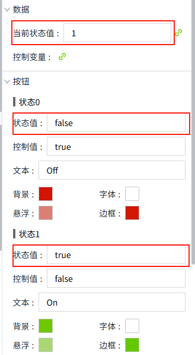

# 2-State Button

2-State Button 是一种带有两种明确状态的按钮控件，常见的状态是开/关、启动/停止等。可以为每个状态配置独立的外观样式（颜色、文字等），用户通过按钮的外观就能清晰地知道当前状态。

**属性**

| **名称** | **描述** |
|:----------|:----------------|
| 名字  | 此控件的名称。 |
| X  | 控件左侧距画布左侧的距离，单位px。|
| Y  | 控件顶部距画布顶部的距离，单位px。   |
| W   | 控件的宽度，单位px。 |
| H  | 控件的高度，单位px。  |
|  | 控件的圆角曲率。   |
| 当前状态值 | 将该值去和"按钮"分类下的2个状态值进行匹配，根据匹配到的结果，显示对应状态的按钮外观。     |
| 控制值   | 绑定到一个控制状态的属性。当按钮被按下时，当前状态对应的控制值会被写入绑定的属性中。通常情况下，当前状态值和控制值会绑定同一属性。  |
| 按钮  | 设置控件在不同状态值时的外观样式。包含2个状态：状态0，状态1。   **- 状态值**：和”数据“->“当前状态值”搭配使用。当前状态值等于按钮的哪个状态值，则显示该状态的外观。  - **控制值**：和”数据“->“控制值”搭配使用。在当前状态下按下按钮时，会将对应的控制值写入到”数据“->“控制值”绑定的属性中。  - **文本**：控件在对应状态下显示的文本内容。    - **背景**：控件在对应状态下的背景色。   - **字体**：控件在对应状态下的字体颜色。    - **悬浮**：控件在对应状态下的悬浮色。   - **边框**：控件在对应状态下的边框色。 |
| 边框 | 设置控件的边框粗细。|
| 字体| 设置文本内容的字体。包括字体型号、字体大小、粗体、倾斜、水平对齐方式、垂直对齐方式。|

**动作**

允许您基于某种条件执行特定的动作。请参阅“[动作](../../event/index.md)”页上各种动作的完整描述。

**示例**

可通过 2-State button 控件开启或关闭风机。

1. 在画面上添加一个 2-State button 控件
2. 当前状态值绑定到一个布尔型变量：“Demo:status”
3. 控制值也绑定到变量：“Demo:status”
4. 按钮属性如下：

    | **状态**  | **属性** |
    |:-----------|:-------------|
    | **状态0** | - **状态值**：false  - **控制值**：true  - **文本**：Off   - **背景**：d11404  - **字体**：ffffff  - **悬浮**：db7f75  - **边框**：d11804   |
    | **状态1** | - **状态值**：true      - **控制值**：false     - **文本**：On         - **背景**：6ec800     - **字体**：ffffff     - **悬浮**：aad773   - **边框**：64c800    |

5. 在运行页面点击按钮来启动和停止风机，查看按钮样式。

    

