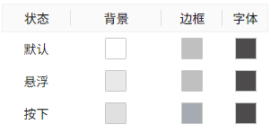

# 按钮

按钮用于在按下时启动某种操作，也可以用于显示状态。

**属性**

| **名称** | **描述** |
|:--------------------|:-----------------|
| 名字  | 此控件的名称。|
| X | 控件左侧距画布左侧的距离，单位px。 |
| Y   | 控件顶部距画布顶部的距离，单位px。 |
| W   | 控件的宽度，单位px。   |
| H   | 控件的高度，单位px。 |
|  | 按钮四个角的圆角曲率。  |
| 填充文本   | 控件显示的内容。        控件的背景图，仅支持JPG、GIF、PNG、SVG、JPEG格式。 |
| 边框粗细  | 边框的线条粗细。 |
| 阴影 | 设置控件的阴影效果。可以设置外阴影和内阴影。   **外阴影**    - **启用**：是否启用阴影效果   - **颜色**：用于设置阴影颜色   - **X**：控制阴影在水平方向上的偏移量。   `X = 10` → 阴影往右移了10像素   `X = -5` → 阴影往左移了5像素   - **Y**：控制阴影在垂直方向上的偏移量。   `Y = 8` → 阴影往下移了8像素   `Y = -3` → 阴影往上移了3像素    - **模糊**：控制阴影的模糊程度，模糊值越大，边缘越柔和、越自然。  **内阴影**  - **启用**：是否启用阴影效果  - **颜色**：用于设置阴影颜色   - **X**：控制阴影在水平方向上的偏移量。   `X = 10` → 阴影往右移了10像素   `X = -5` → 阴影往左移了5像素  - **Y**：控制阴影在垂直方向上的偏移量。   `X = 8` → 阴影往下移了8像素   `Y = -3` → 阴影往上移了3像素   - **模糊**：控制阴影的模糊程度，模糊值越大，边缘越柔和、越自然。 - **扩散**：控制阴影的大小|
| 颜色 | 设置控件不同操作状态下的颜色效果。状态包括：默认、悬浮、按下。  可以为每种状态设置背景色、边框颜色、字体颜色。   |
| 字体   | 设置文本内容的字体。包括字体型号、字体大小、加粗、倾斜、水平对齐方式、垂直对齐方式。 |

**动作**

允许您基于某种条件执行特定的动作。请参阅“[动作](../../event/index.md)”页上各种动作的完整描述。

**示例**

点击按钮导航到其他画面。

| **名称**   | **描述**                        |
|:-----------------------|:---------------------------------|
| W   | 80                              |
| H | 32                              |
|  | 4     |
| 背景  | 1c1c88                          |
| 文本   | < Back                          |
| 字体 | Calibri, 22, 水平居中, 垂直居中 |

在按钮上添加按下动作，操作类型选择“导航”，画面选择“画面1”，打开位置选择“替换画面”。

在运行页面，点击该按钮后，将导航到 画面1。

