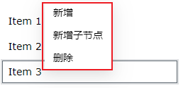

# 导航菜单

导航菜单控件用于方便用户进行快速导航。最多支持二级菜单。

**属性**

| **名称** | **描述**   |
|:----------|:----------------|
| 名字     | 此控件的名称。 |
| X        | 控件左侧距画布左侧的距离，单位px。|
| Y        | 控件顶部距画布顶部的距离，单位px。 |
| W        | 控件的宽度，单位px。  |
| H        | 控件的高度，单位px。  |
| 布局     | 设置菜单的整体布局方式。包含水平、垂直、内嵌。 |
| 一级     | 设置一级菜单的显示样式。    - **W**：一级菜单的宽度，单位px。  - **H**：一级菜单的高度，单位px。   - **字体**：设置一级菜单的字体。包括字体型号、字体大小、加粗、倾斜、水平对齐方式、垂直对齐方式。   可以为菜单设置不同操作状态下的颜色效果。状态包括：默认、悬浮、选中。  可以为每种状态设置背景色和字体颜色。   |
| 二级     | 设置二级菜单的显示样式   - **W**：二级菜单的宽度，单位px。   - **H**：二级菜单的高度，单位px。   - **字体**：设置二级菜单的字体。包括字体型号、字体大小、加粗、倾斜、水平对齐方式、垂直对齐方式。  可以为菜单设置不同操作状态下的颜色效果。状态包括：默认、悬浮、选中。  可以为每种状态设置背景色和字体颜色。    |
| 导航内容 | 设置各级菜单的名称以及导航画面。   |

## 设置菜单

在导航内容中您可设置菜单个数、名称和画面导航功能。

**设置菜单名称**

将鼠标移至菜单上，菜单显示编辑框，在编辑框内点击鼠标，进入编辑状态，可以设置菜单名称。

**新增菜单**

在菜单上右击，显示操作选项，点击选项后进行对应的操作。

**说明**：只有一级菜单才支持新增操作。

**设置导航**

点击菜单项右侧的设置按钮，弹出导航设置窗口。

**动作**

允许您基于某种条件执行特定的动作。请参阅“[动作](../../event/index.md)”页上各种动作的完整描述。

**示例**

使用导航菜单显示光伏电力系统的各个组件信息。

1. 在一个画面上新增一个导航菜单控件。
2. 设置控件中导航菜单内容为：（仅设置为一级菜单）主页、光伏板、风机、汇流箱、逆变箱、储能箱、线路图。

    

3. 为每个菜单设置导航画面，以“主页”菜单设置为例，进行导航设置。
4. 在导航窗口中，选择需要导航的画面，设置打开位置为替换窗口。

    

5. 以此类推，设置其他菜单的导航画面。
6. 在运行界面，点击导航菜单控件中主页菜单，则跳转显示“主页”的内容；再次点击光伏板菜单，显示“光伏板”画面内容。

    