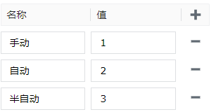

# 单选按钮

单选按钮控件用于在多个互斥选项中选择一个，当用户选择一个单选按钮时，其他选项将自动取消选择，确保只有一个选项被选中。

**属性**

| **名称** | **描述** |
|:----------|:-----------------------|
| 名字     | 此控件的名称。|
| X        | 控件左侧距画布左侧的距离，单位px。 |
| Y        | 控件顶部距画布顶部的距离，单位px。 |
| W        | 控件的宽度，单位px。   |
| H        | 控件的高度，单位px。  |
| 选项名称 | 单选按钮的选项的名称。此处的“名称”和“选中文本”相对应。     |
| 选项值   | 单选按钮的选项的值。此处的“名称”和“选中值”相对应。     |
| 选中文本 | 当前选项的对应文本内容。 |
| 选中值   | 当前选项的值。    **说明**：选中文本和选中值只能二选一，设置一个选项后，另一个选项处于禁用状态。只有将当前设置的选项值清空或者解除绑定后，另一个选项才变为可编辑状态。  |
| 样式     | 单选按钮的布局样式。包含水平和垂直。|
| 填充色   | 单选按钮的填充色。     |
| 边框色   | 单选按钮的边框颜色。   |
| 阴影     | 设置控件的阴影效果。可以设置外阴影和内阴影。    **外阴影**    - **启用**：是否启用阴影效果   - **颜色**：用于设置阴影颜色   - **X**：控制阴影在水平方向上的偏移量。   `X = 10` → 阴影往右移了10像素   `X = -5` → 阴影往左移了5像素   - **Y**：控制阴影在垂直方向上的偏移量。   `Y = 8` → 阴影往下移了8像素   `Y = -3` → 阴影往上移了3像素    - **模糊**：控制阴影的模糊程度，模糊值越大，边缘越柔和、越自然。  **内阴影**  - **启用**：是否启用阴影效果  - **颜色**：用于设置阴影颜色   - **X**：控制阴影在水平方向上的偏移量。   `X = 10` → 阴影往右移了10像素   `X = -5` → 阴影往左移了5像素  - **Y**：控制阴影在垂直方向上的偏移量。   `X = 8` → 阴影往下移了8像素   `Y = -3` → 阴影往上移了3像素   - **模糊**：控制阴影的模糊程度，模糊值越大，边缘越柔和、越自然。 - **扩散**：控制阴影的大小| 
| 字体     | 设置文本内容的字体。包括字体型号、字体大小、字体颜色、粗体、倾斜、下划线。|

**动作**

允许您基于某种条件执行特定的动作。请参阅“[动作](../../event/index.md)”页上各种动作的完整描述。

**示例**

通过单选按钮改变设备的工作模式。

| **属性** | **值** |
|:----------|:-----------------------|
| 选项     | 设置选项名称和选项值。    |

1. 在画面上添加一个单选按钮控件。
2. 设置选中变化事件，启用变量赋值。将所选的单选按钮的值赋值给变量，通过变量控制设备的工作模式。

    

