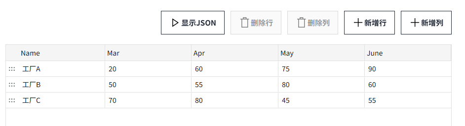
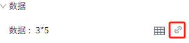

# 柱状图

柱状图用于比较不同类别或组成部分的数值差异。它由一系列长方形柱子组成，每个柱子的高度表示相应类别或组成部分的数值大小。

**属性**

| **名称** | **描述**|
|:----------|:-------------------|
| 名字     | 此控件的名称。 |
| X        | 控件左侧距画布左侧的距离，单位px。 |
| Y        | 控件顶部距画布顶部的距离，单位px。|
| W        | 控件的宽度，单位px。 |
| H        | 控件的高度，单位px。 |
| 数据     | 单击“绑定”按钮将数据绑定到柱状图。在“选择标签”窗口中双击标签进行绑定。   点击此按钮为柱状图设置默认数据。   点击绑定按钮为数据集里的单元格绑定变量、属性或编写表达式。 |
| 刷新频率 |- 频率(s)：按此频率对柱状图上的数据进行刷新。 |
| 样式     | 设置柱状图的展现样式：柱状图或堆叠柱状图。柱状图的方向：垂直或水平。默认显示垂直柱状图。 |
| 颜色     | - **背景**：控件的整体背景色。   - **栅格**：栅格的线条颜色。 - **边框**：柱子的外边框颜色。 - **X轴**：X轴的轴线颜色。  - **Y轴**：Y轴的轴线颜色。 - **系列颜色**：设置柱状图不同系列的颜色，默认显示色卡的颜色。  - **柱体区间颜色**：可以设置数值区间。当柱体的对应数值处于不同的数值区间时，柱体显示不同的颜色。   **说明**：一旦设置柱体区间颜色后，区间颜色优先级高于系列颜色。 |
| 边距     | 设置柱状图与其选中框之间的间距。确保图表能清晰显示，并为图表元素（如图例）预留足够的空间。  |
| 系列     | - **柱子宽度**：柱子的宽度。  - **柱子间距**：不同系列之间的距离。|
| X轴      | 设置X轴显示的文字的样式，包括字体、字体大小、粗体、斜体、字体颜色。 |
| Y轴      | 设置Y轴的样式。  - **显示Y轴**：控制Y轴的显示、隐藏。默认显示。  - **显示栅格**：控制栅格的显示、隐藏。默认显示。 - **分度数**：设置在Y轴上插入的分割线数量。 - **显示范围**：设置Y轴量程的显示、隐藏。默认选中。  该项处于选中状态时，需设置Y轴的上限和下限。  - **自动显示刻度值**：Y轴的量程根据柱子的值的范围动态变化。如果选中，则将自动确定Y轴的值范围。如果未选中，则将使用指定的上限和下限。 - **小数位数**：设置 Y 轴刻度值上显示的小数位数。   - **字体**：设置图例的字体、字体大小、粗体、斜体、字体颜色。|
| 图例     |设置饼图图例的样式。  - **显示**：控制图例的显示、隐藏。默认显示。  - **位置**：设置图例的显示位置。 - **字体**：设置图例的字体、字体大小、粗体、斜体、字体颜色。|
| 标注值   | 设置每个柱子上显示的数值的样式。 - **显示**：控制标注值的显示、隐藏。默认显示。 - **位置**：设置标注值的显示位置。 - **小数位**：标注值显示的小数位数。 - **字体**：设置标注值的字体、字体大小、粗体、斜体、字体颜色。|

**动作**

允许您基于某种条件执行特定的动作。请参阅“[动作](../../event/index.md)”页上各种动作的完整描述。

**示例**

使用柱状图来显示不同工厂的不同产线的日产能。

1. 在画面上插入一个柱状图。
2. 设置柱状图的属性。

    | **属性**     | **值**  |
    |:--------------|:---------|
    | 柱体区间颜色 | 设置为以下内容：    |
    | 标注值       | 开启。位置：上。  |
    | Y轴范围      | 0~100  |
    | 数据         | 点击 **数据集** 按钮，设置数据集。         设置完成后，点击绑定按钮进行 [动态单元格](../../property-binding/dynamic-cell.md) 绑定。       |

3. 点击预览按钮进行预览。

    
