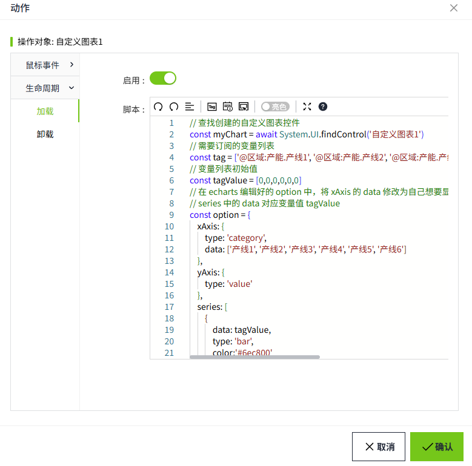
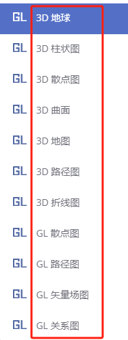

# 自定义图表

自定义图表可以根据您的特定需求显示数据。通过此控件，您可以在 **echarts** 中实现各种图表，并自定义控件的样式、外观等。

该控件只能通过编写脚本来进行属性设置，因此要想轻松的使用该控件，您需要具备一定的代码编写能力。

**说明**：echarts 是一个基于 JavaScript 的开源可视化图表库。具体的图表请参见：  [https://echarts.apache.org/examples/zh/index.html](https://echarts.apache.org/examples/zh/index.html) 


**属性**

| **名称** | **描述**                         |
|:----------|:----------------------------------|
| 名字     | 此控件的名称。                    |
| X        | 控件左侧距画布左侧的距离，单位px。 |
| Y        | 控件顶部距画布顶部的距离，单位px。 |
| W        | 控件的宽度，单位px。               |
| H        | 控件的高度，单位px。               |

**动作**

允许您基于某种条件执行特定的动作。请参阅“[动作](../../event/index.md)”页上各种动作的完整描述。

**示例**

使用自定义图表显示一个柱状图，在柱状图上显示生产线的产能。

1. 在echarts的图表分类下，点击柱状图， [https://echarts.apache.org/examples/zh/index.html#chart-type-bar](https://echarts.apache.org/examples/zh/index.html#chart-type-bar) 

    

2. 在柱状图分类下，点击基础柱状图，进入柱状图编辑页面。复制左侧的代码。如有需要，也可以直接对此处的代码进行编辑。

    

3. 在WAGO VC Hub的画面上插入一个”自定义图表“控件。
4. 为控件设置动作属性，添加一个”加载“动作。

    

5. 在脚本编辑器里输入如下脚本。

    ```typescript
    // 查找创建的自定义图表控件
    const myChart = await System.UI.findControl('自定义图表1')
    // 需要订阅的变量列表
    const tag = ['@区域:产能.产线1', '@区域:产能.产线2', '@区域:产能.产线3', '@区域:产能.产线4', '@区域:产能.产线5', '@区域:产能.产线6'];
    // 变量列表初始值
    const tagValue = [0,0,0,0,0,0]
    // 在 echarts 编辑好的 option 中，将 xAxis 的 data 修改为自己想要显示的 data 对应 tag
    // series 中的 data 对应变量值 tagValue
    const option = {
        xAxis: {
            type: 'category',
            data: ['产线1', '产线2', '产线3', '产线4', '产线5', '产线6']
        },
        yAxis: {
            type: 'value'
        },
        series: [
            {
                data: tagValue,
                type: 'bar',
                color:'#6ec800'
            }
        ]
    };
    // 订阅变量
    System.Tag.subscribe(tag, (data => {
        // 如果当前订阅变量的 path 在变量列表中，找到对应的下标
        const index = tag.findIndex(res => res === data.Path)
        // 更新变量值列表中的对应下标的变量值
        tagValue[index] = data.Value;
        // 更新echarts的option
        myChart.setOptions(option)
    }))
    ```
 
    

6. 点击画面的"预览"按钮进行查看。

    

**注意**：  

1. 自定义图表只有在预览或运行页面，才能看到实际的显示效果。 

2. 自定义图表只支持echarts中的以下三种方法:  

    - setOption(option); 

    - clear() 

    - dispose()  
    
不支持echarts中的所有3D类图表。  

 


