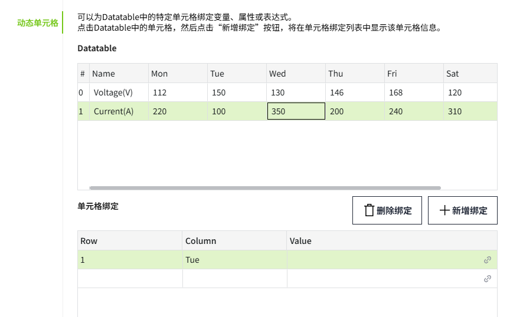

# 自定义曲线

自定义曲线是指根据实际情况或特定需求而创建或定义的一种曲线形式。自定义曲线并没有固定的数学表达式或形式，而是根据数据的特点和关系进行定制。

**属性**

| **名称** | **描述** |
|:----------|:------------------------|
| 名字     | 此控件的名称。  |
| X        | 控件左侧距画布左侧的距离，单位px。  |
| Y        | 控件顶部距画布顶部的距离，单位px。 |
| W        | 控件的宽度，单位px。 |
| H        | 控件的高度，单位px。 |
| 数据     | 数据：设置自定义曲线的数据集和单元格绑定。 点击该按钮可以设置曲线的数据集。     默认设置2行8列数据，行数据分别标记为 "Series1" 和 "Series2"，列数据分别是Name和一周七天的名称，每行数据对应着一周中的每一天，显示了两个系列的数值。 单击按钮设置数据集的单元格绑定。  |
| 颜色     | 设置控件的颜色效果。  | 
| 边距     | 设置控件与其选中框之间的间距。确保图表能清晰显示，并为图表元素（如图例）预留足够的空间。|
| X轴      | 设置X轴显示的文字的样式，包括字体、字体大小、粗体、斜体、字体颜色。  |
| Y轴      | 设置Y轴的样式。 - **显示栅格**：控制栅格的显示、隐藏。默认显示。 - **分度数**：设置在Y轴上插入的分割线数量。 - **显示范围**：设置Y轴量程的显示、隐藏。默认选中。  该项处于选中状态时，需设置Y轴的上限和下限。  - **自动显示刻度值**：Y轴的量程根据值的范围动态变化。如果选中，则将自动确定Y轴的值范围。如果未选中，则将使用指定的上限和下限。   **说明**：显示范围和自动显示刻度值，只能2选1。 - **小数位**：设置Y轴的刻度值上显示的小数位数。 - **字体**：设置Y轴显示的文字的字体、字体大小、粗体、斜体、字体颜色。|
| 图例     | 设置控件的图例的样式。 - **显示**：控制图例的显示、隐藏。默认显示。 - **位置**：设置图例的显示位置。默认选择下。 - **字体**：设置图例的字体、字体大小、粗体、斜体、字体颜色。 | |

**动作**

允许您基于某种条件执行特定的动作。请参阅“[动作](../../event/index.md)”页上各种动作的完整描述。

**示例**

使用自定义曲线来显示设备的故障率。

1. 在画面上插入一个自定义曲线。
2. 设置自定义曲线的属性。

    | **属性** | **值** |
    |:----------|:------------------|
    | Y轴      | 显示范围设置为1~60。|
    | 数据     | 设置曲线数据集和单元格绑定。       设置曲线的样式。    - **线条颜色**：#00bfbf  - **线宽**：1   - **区域填充**：未启用  - **线条样式**：实线   - **线条类型**：折线   - **标记颜色**：#00bf35 - **标记样式**：圆点  - **标记大小**：6      - **小数位**：1 |

3. 点击预览按钮进行预览。

    

