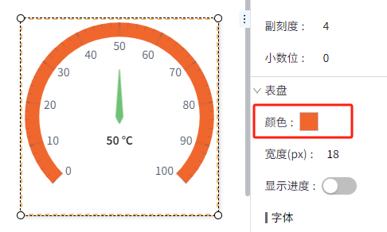

# 仪表盘

仪表盘包含指针和刻度盘，用户可以设置多个数值区间，并为每个区间设置对应的颜色。

**属性**

| **名称** | **描述**  |
|:----------|:---------------------|
| 名字     | 此控件的名称。   |
| X        | 控件左侧距画布左侧的距离，单位px。 |
| Y        | 控件顶部距画布顶部的距离，单位px。  |
| W        | 控件的宽度，单位px。 |
| H        | 控件的高度，单位px。    |
| 起始角度 | 表盘的起始角度。  |
| 结束角度 | 表盘的结束角度。    |
| 指针     |- **显示指针**：设置指针是否显示 - **值**：仪表盘的值。 - **单位**：当前值的单位。 - **指针长度**：指针的长度。 - **背景**：指针的背景色。 - **边框**：指针的边框颜色。 - **边框粗细**：指针的边框粗细。 - **字体**：设置指针值和单位的字体、字体大小、粗体、斜体、字体颜色。 |
| 测量范围 | 仪表盘的测量范围。默认0~100。|
| 刻度     |- **主刻度值**：主刻度的数量。 - **主刻度颜色**：主刻度的颜色。 - **副刻度值**：相邻两个主刻度之间的副刻度线个数。 - **副刻度颜色**：副刻度的颜色。 - **小数位**：刻度值和指针值上显示的数值的小数位个数。|
| 表盘     | - **颜色**：表盘刻度的背景色             - **宽度**：刻度的宽度     - **显示进度**：是否将值显示为进度条     - **进度颜色**：进度条颜色  - **字体**：设置刻度值的字体、字体大小、粗体、斜体、字体颜色。    - **表盘区间颜色**：表盘上不同的数值区间对应的颜色。   |

**说明**：如果既设置了区间颜色又开启了“显示进度”，则进度条颜色会覆盖对应数值内的区间颜色。

例如下图所示，0~30内的区间颜色被进度颜色覆盖。

**动作**

允许您基于某种条件执行特定的动作。请参阅“[动作](../../event/index.md)”页上各种动作的完整描述。

**示例1  进度仪表盘**

通过进度仪表盘显示当前设备的温度。

| **属性** | **值**   |
|:----------|:-----------------|
| 起始角度 | 180°  |
| 结束角度 | 0°   |
| 指针     |- **值**：变量(`@设备:温度`)  - **单位**：℃  - **指针长度**：50   - **指针背景**：rgba(112,193,117,100)   - **指针边框**：rgba(112,193,117,60)  - **宽度边框**：2 |
| 表盘     |- **表盘颜色**：rgba(234,235,246,100)  - **表盘宽度**：18  - **显示进度**：用   - **进度颜色**：rgba(110,200,0,80)  - **表盘字体**：Calibri, 14, rgba(78,89,105,100)  - **颜色区间**：空 |

**示例2  区间仪表盘**

| **属性** | **值** |
|:----------|:----------------------|
| 起始角度 | 225°  |
| 结束角度 | 315°  |
| 指针     |- **值**：绑定变量(`@设备:温度`)  - **单位**： ℃  - **指针长度**：50    - **指针背景**：rgba(112,193,117,100)  - **指针边框**：rgba(112,193,117,60)    - **宽度边框**：2    - **指针字体**：Calibri, 18 , 加粗，斜体，rgba(51,51,51,100)|
| 刻度     | - **主刻度颜色**：rgba(0,0,0,100)  - **副刻度颜色**：rgba(0,0,0,100)  |
| 表盘     |- **表盘颜色**：rgba(234,235,246,100)  - **表盘宽度**：25  - **表盘字体**：Calibri, 14, rgba(78,89,105,100)  - **颜色区间**： 0-30 rgba(128,128,128,100)；   30-40 rgba(110,200,0,100)；   40-100 rgba(255,0,0,100)；   |

