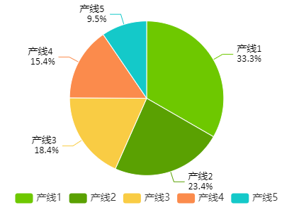

# 饼图

饼图用于展示不同类别或组成部分在整体中的比例关系。它以圆形为基础，将整个圆分成几个扇形，每个扇形的角度对应于所表示的类别或组成部分的比例。饼图更适合表现数据相对于总数的百分比等关系。

有两种样式：**饼图** 和 **环形图**。

**属性**

| **名称** | **描述**   |
|:----------|:--------------|
| 名字     | 此控件的名称。   |
| X        | 控件左侧距画布左侧的距离，单位px。|
| Y        | 控件顶部距画布顶部的距离，单位px。  |
| W        | 控件的宽度，单位px。|
| H        | 控件的高度，单位px。 |
| 数据     | 点击数据集按钮为饼图设置默认数据，点击绑定按钮为数据集里的单元格绑定变量、属性或编写表达式。|
| 刷新频率 | 按此频率对饼图上的数据进行刷新。|
| 样式     | 设置饼图的展现样式。包含饼图和环形图。  |
| 背景     | 控件的整体背景色。 |
| 边框     | 饼图的各个扇形区域的边框颜色。|
| 边框粗细 | 饼图的各个扇形区域的边框粗细。 |
| 区块颜色 | 设置饼图不同区块的颜色，默认显示色卡的颜色。 |
| 半径     | 设置饼图的中心点到饼图选中框的距离。通常用于定义饼图的大小。当控件样式为环图时，需设置内外半径。|
| 图例     | 设置饼图的图例的样式。  - **显示**：控制图例的显示、隐藏。默认显示。 - **位置**：设置图例的显示位置。  - **字体**：设置图例的字体、字体大小、粗体、斜体、字体颜色。 |
| 标注值   | 设置饼图上各个扇形区域的数值显示样式。 - **显示**：控制标注值的显示、隐藏。默认隐藏。 - **位置**：设置标注值的显示位置。 - **数值类型**：设置标注值显示的数值类型。可以是值，也可以是百分比。 - **小数位**：标注值显示的小数位数。 - **字体**：设置图例的字体、字体大小、粗体、斜体、字体颜色。|

**动作**

允许您基于某种条件执行特定的动作。请参阅“[动作](../../event/index.md)”页上各种动作的完整描述。

**示例**

通过饼图来展示不同生产线的每日产能占比。

1. 在画面上插入一个饼图。
2. 设置饼图的属性。

    | **属性** | **值** |
    |:----------|:----------------|
    | 图例     | 显示，微软雅黑，字体大小14。 |
    | 标注值   | - **显示**：开启。 - **位置**：外。 - **数值类型**：百分比。 - **小数位**：1。 - **字体**：Calibri，14。|
    | 数据     | 点击 **数据集** 按钮，设置数据集。         设置完成后，点击 **绑定** 按钮进行 [动态单元格](../../property-binding/dynamic-cell.md) 绑定。    |

3. 点击预览按钮进行预览。

    

4. 关闭预览，在设计页面将饼图的样式改为：环形图。关闭图例的显示，重新预览。

    