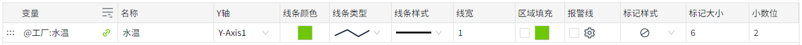

# 实时趋势

实时趋势图是一种用于显示数据随时间实时变化的图表。X轴是时间轴，Y轴是数据轴。

**属性**

| **名称** | **描述**   |
|:----------|:---------------------|
| 名字     | 此控件的名称。 |
| X        | 控件左侧距画布左侧的距离，单位px。  |
| Y        | 控件顶部距画布顶部的距离，单位px。 |
| W        | 控件的宽度，单位px。  |
| H        | 控件的高度，单位px。   |
| 数据     | 单击“绑定”按钮将数据绑定到控件。在“选择标签”窗口中双击标签进行绑定。绑定标签后，单击“设置”按钮设置曲线样式。    点击该按钮可以设置曲线的数据源和样式。       - **变量**：设置线条的数据来源。  点击变量栏最右侧的如下符号，可以将变量的路径直接复制到名称栏。     - **名称**：设置线条名称。 - **Y轴**：选择一个Y轴，作为当前变量的Y轴。 - **线条颜色**：设置线条的颜色。 - **线条类型**：设置线条的类型。 - **线条样式**：设置线条的样式。 - **线宽**：设置线条的粗细。 - **区域填充**：设置线条和轴之间的区域背景色。 - **报警线**：设置是否将变量的报警值作为一条直线显示在当前控件上。点击报警线的设置按钮，选择需要显示的报警线，并为其设置样式。勾选报警 checkbox，用于在控件上启用报警线的显示。 - **标记样式**：设置线条连接点的样式。  - **标记大小**：设置线条连接点的大小，单位px。 - **小数位**：鼠标移到线条上所显示的数值的小数位数。|
| 刷新频率 | 按此频率对控件上的数据进行刷新。 |
| 显示     | 选择变量按钮：控制选择变量按钮的显示、隐藏。显示的情况下，在运行页面可以通过此按钮重新设置变量及其对应曲线的显示样式。 |
| 按钮样式 | | 选择变量按钮：设置选择变量按钮的颜色。 |
| 颜色     | 设置控件的颜色效果。  - **背景**：控件的整体背景色。 - **栅格**：栅格的线条颜色。 - **X轴**：X轴的轴线颜色。|
| 边距     | 设置实时趋势图与其选中框之间的间距。确保图表能清晰显示，并为图表元素（如时间或图例）预留足够的空间。 |
| X轴      | 设置X轴的样式。  - **显示栅格**：控制栅格的显示、隐藏。    - **时间格式**：设置X轴显示的时间的格式,可以选择系统预置的时间格式，也可以手动输入，设置的时间格式须符合Echarts的时间格式要求，详见：  [https://echarts.apache.org/zh/option.html#xAxis.axisLabel.formatter](https://echarts.apache.org/zh/option.html#xAxis.axisLabel.formatter)   - **时间范围**：X 轴显示的时间范围。  - **字体**：设置X轴显示的文字的字体、字体大小、粗体、斜体、字体颜色。 |
| Y轴      | 设置Y轴的样式。   - **显示栅格**：控制栅格的显示、隐藏。  - **启用子图**：控制主图表中是否允许嵌入另一个图表。 - **分度数**：设置在Y轴上插入的分割线数量。 - **轴**：显示轴的行列数。  点击该按钮可以设置轴的样式。      - **名称**：Y轴的名称。   - **自动显示范围**：Y轴的量程根据值的范围动态变化。如果选中，则将自动确定Y轴的值范围。如果未选中，则将使用最小值和最大值。  选择自动后，最小值和最大值变为失效状态。 - **最小值**：Y轴的最小值。 - **最大值**：Y轴的最大值。 - **小数位**：设置Y轴的刻度值上显示的小数位数。 - **显示**：控制Y轴的显示、隐藏。  - **位置**：设置Y轴的显示位置。 - **偏移**：设置Y轴相对于默认位置的偏移。 - **轴颜色**：设置Y轴的颜色。 - **字体**：设置Y轴坐标的字体。 - **字体大小**：设置Y轴坐标的字体大小。 - **字体颜色**：设置Y轴坐标的字体颜色。 - **字体粗细**：设置Y轴坐标的字体粗细。 - **字体倾斜**：设置Y轴坐标的字体倾斜。 - **子图权重**：设置子图在主图表中所占的空间大小。  - **子图背景**：设置子图的背景色。| 
| 图例     | 设置图例的样式。   - **显示**：控制图例的显示、隐藏。默认显示。   - **位置**：设置图例的显示位置。 - **字体**：设置图例的字体、字体大小、粗体、斜体、字体颜色。 |

**说明**：实时趋势控件基于Echarts 5.x版本开发，该版本上分度数存在缺陷，不按设置的数值生效，导致实时趋势图也存在此问题。请等待Echarts修复该缺陷。

**动作**

允许您基于某种条件执行特定的动作。请参阅“[动作](../../event/index.md)”页上各种动作的完整描述。

**示例1**

使用实时趋势来显示水温。

1. 在画面上插入一个实时趋势图。
2. 设置实时趋势图的属性。

    | **属性** | **值** |
    |:----------|:-----------|
    | X轴      | 关闭栅格的显示。 |
    | Y轴      | 关闭栅格的显示。 |
    | 数据     | 绑定变量，设置曲线的样式。   >  - **变量**：`@工厂:水温`  - **名称**：水温    - **Y轴**：水温   - **线条颜色**：#6ec800  - **线条类型**：折线    - **线条样式**：实线    - **线宽**：1    - **区域填充**：未启用     - **报警线**：未启用    - **标记样式**：无       - **标记大小**：6         - **小数位**：2  |

3. 点击预览按钮进行预览。

    

**示例2**

使用实时趋势来显示水温，并显示水温报警线。

1. 在画面上插入一个实时趋势图。
2. 设置实时趋势图的属性。

    | **属性** | **值** |
    |:----------|:---------------|
    | X轴      | 关闭栅格的显示。 |
    | Y轴      | 关闭栅格的显示。  |
    | 数据     | 绑定变量，设置曲线的样式。     - **变量**：`@Demo:temperature`  - **名称**：水温   - **Y轴**：水温  - **线条颜色**：#6ec800   - **线条类型**：折线   - **线条样式**：实线   - **线宽**：1    - **区域填充**：未开启   - **报警线**：开启。选择高温报警，将线条颜色设置为红色，样式设置为虚线。     - **标记样式**：无   - **标记大小**：6  - **小数位**：2 |

3. 点击预览按钮进行预览，红色的虚线为水温的报警线。通过报警线可以只管的判断出，在哪些时刻变量产生了报警。

    

