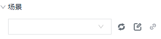
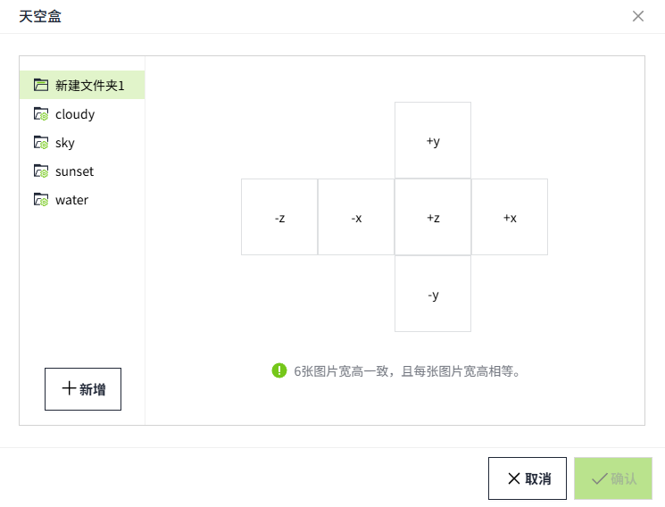

# 3D查看器

3D查看器用于查看和浏览三维模型和场景。

**属性**

| **名称** | **描述**  |
|:----------|:----------------|
| 名字     | 此控件的名称。  |
| X        | 控件左侧距画布左侧的距离，单位px。 |
| Y        | 控件顶部距画布顶部的距离，单位px。 |
| W        | 控件的宽度，单位px。  |
| H        | 控件的高度，单位px。 |
| 场景     | 为控件绑定场景。         下拉选择已创建的场景      刷新按钮，点击后对下拉列表内容进行刷新        绑定按钮，点击后弹出属性绑定窗口，为控件绑定场景  |
| 外观     | 设置3D查看器的外观，支持进行背景色、背景图和天空盒设置。|

### 背景色设置

在外观的下拉选项中选择“背景色”，点击下拉框后面的颜色选择器，设置颜色。

**预览效果：**

### 背景图设置

1. 在外观的下拉选项中选择“背景图”，点击下拉框后面的设置按钮，弹出文件选择窗口。文件选择窗口显示图库的所有内容。

    

2. 选择 png或 jpg格式的图片后，点击弹窗的确认按钮，完成设置。

**说明**：背景图仅支持 png、 jpg格式。 

**预览效果：**

### 天空盒设置

1. 在外观的下拉选项中选择“天空盒”，点击下拉框后面的设置按钮，弹出天空盒设置窗口。系统内置了4个天空盒素材供您使用，您也可以自行上传天空盒素材。

    

2. 在左侧的天空盒名称列表中，点击某个名称，右侧会自动显示该天空盒的素材图片。
3. 点击确认按钮，完成设置。

**预览效果：**

### 创建天空盒

1. 在天空盒弹窗中，点击“新增”按钮，会自动新增一个天空盒，您可以设置该天空盒名称。
2. 点击新增的天空盒名称，在弹窗右侧，显示天空盒的6个组成部分（+x, -x，+y, -y，+z, -z）。

    

3. 将鼠标移至某个区域，显示上传提示，点击后弹出文件选择窗口，选择文件进行上传。
4. 6张图全部上传完成，点击确认按钮，进行保存。

**说明：**  
1. 天空盒的6张图片宽高需一致，且每张图片的宽高也需一样。 
2. 天空盒的图片 仅支持png、jpg格式。 |

### 重命名天空盒

系统内置的天空盒不支持重命名。在用户创建的天空盒上右击鼠标，在弹出的菜单中，点击重命名，可以修改当前天空盒的名称。

### 删除天空盒

统内置的天空盒不支持删除。在用户创建的天空盒上右击鼠标，在弹出的菜单中，点击删除，即可删除当前天空盒。

天空盒删除后，所有应用了该天空盒的3D查看器，将不再显示该天空盒效果。

**动作**

允许您基于某种条件执行特定的动作。请参阅“[动作](../../event/index.md)”页上各种动作的完整描述。

**示例**

查看3D场景。

1. 在画面上插入3D查看器控件。
2. 选择场景：园区。
3. 点击画面的预览按钮，查看运行效果。

    

