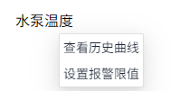
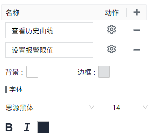
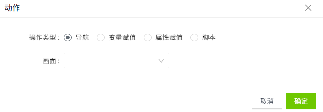

# 文本标签

文本标签控件用来显示文本，可以是静态文本，也可以通过属性绑定，显示动态内容。

**属性**

| **名称**  | **描述** |
|:-------------------|:---------------------|
| 名字 | 此控件的名称。 |
| X  | 控件左侧距画布左侧的距离，单位px。|
| Y  | 控件顶部距画布顶部的距离，单位px。 |
| W    | 控件的宽度，单位px。 |
| H   | 控件的高度，单位px。  |
|  | 控件的角度。  |
| 文本  | 控件显示的内容。 |
| 填充 | 控件的背景色。                   |
| 边框  | 控件的边框色。                    |
| 边框粗细 | 控件的边框粗细。 |
| 阴影 |设置控件的阴影效果。可以设置外阴影和内阴影。   **外阴影**    - **启用**：是否启用阴影效果   - **颜色**：用于设置阴影颜色   - **X**：控制阴影在水平方向上的偏移量。   `X = 10` → 阴影往右移了10像素   `X = -5` → 阴影往左移了5像素   - **Y**：控制阴影在垂直方向上的偏移量。   `Y = 8` → 阴影往下移了8像素   `Y = -3` → 阴影往上移了3像素    - **模糊**：控制阴影的模糊程度，模糊值越大，边缘越柔和、越自然。  - **内阴影**  - **启用**：是否启用阴影效果  - **颜色**：用于设置阴影颜色   - **X**：控制阴影在水平方向上的偏移量。   `X = 10` → 阴影往右移了10像素   `X = -5` → 阴影往左移了5像素  - **Y**：控制阴影在垂直方向上的偏移量。   `X = 8` → 阴影往下移了8像素   `Y = -3` → 阴影往上移了3像素   - **模糊**：控制阴影的模糊程度，模糊值越大，边缘越柔和、越自然。 - **扩散**：控制阴影的大小|
| 字体  | 设置文本内容的字体。包括字体型号、字体大小、字体颜色、加粗、倾斜、下划线、水平对齐方式、垂直对齐方式。 |
| 右键菜单 | 在控件上设置右键菜单，可以设置菜单的背景色、边框色、字体型号、字体大小、字体颜色、加粗、倾斜。可以为右键菜单配置对应的动作，包括：导航，变量赋值，属性赋值和执行脚本。  在运行许页面，在控件上单击鼠标右键，显示右键菜单。 |

**动画**

允许您基于某种条件执行特定的动画。请参阅 [动画](../../animation/animation.md) 页上各种动画的完整描述。

**动作**

允许您基于某种条件执行特定的动作。请参阅 [动作](../../event/index.md) 页上各种动作的完整描述。

**示例1**

显示一段静态文本。

| **名称** | **描述**                       |
|:----------|:--------------------------------|
| 背景     | ace9ac                         |
| 文本     | 演示画面                       |
| 字体     | Calibri,16, 水平居中, 垂直居中 |

**示例2**

使用文本显示设备的运行状态。

| **名称** | **描述**                                          |
|----------|---------------------------------------------------|
| 文本     | 绑定表达式："设备运行状态:"+tag('@区域:设备1状态') |
| 字体     | Calibri, 16, 字体颜色f0672e，水平居左, 垂直居中    |

**示例3**

当用户右键点击一个水泵温度的文本标签 时，弹出如下右键菜单

控件属性：

| **名称** | **描述** |
|:----------|:----------------------------|
| 文本     | 水泵温度  |
| 字体     | Calibri, 16, 字体颜色000000，水平居左, 垂直居中   |
| 右键菜单 | 增加如下2个右键菜单：      - 查看历史曲线：点击动作按钮，在动作设置窗口选择“导航“，选择一个弹窗，该弹窗用于显示水泵的历史趋势图。 说明，需预先配置好该弹窗。     - 设置报警限值：点击动作按钮，在动作设置窗口选择“变量赋值”。变量选择 “Demo: temperature#Alarm.高温报警.Limit”。新值选择”数字输入框1#value”。   点击该右键菜单时，会将数字输入框中输入的值，设置为变量 Demo:temperature#Alarm.高温的报警限值。    |

点击画面的预览按钮，在预览页面点击该label控件，在右键菜单中点击“查看历史曲线”，显示效果如下：

