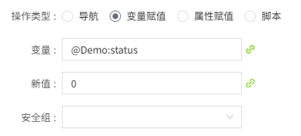
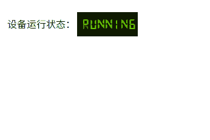

# 数码管

工业自动化设备中，用于监控和显示各种参数、状态和故障信息

**属性**

| **名称**| **描述** |
|:-------------------|:------------------------|
| 名字 | 此控件的名称。 |
| X| 控件左侧距画布左侧的距离，单位px。|
| Y | 控件顶部距画布顶部的距离，单位px。|
| W | 控件的宽度，单位px。 |
| H | 控件的高度，单位px。 |
|  | 控件的角度。|
| 数据 | 控件接收的数据。    - 文本：需要显示的内容。可以手动输入，也可以点击绑定按钮进行绑定。    - 格式：期望显示的内容格式。可以手动输入，也可以点击设置按钮，双击选择需要的格式。 |
| 填 | 控件的填充色。|
| 边框 | 设置边框色和边框粗细。 |
| 字体  | 设置控件内容的字体。包括字体型号、字体大小、字体颜色、加粗、倾斜、下划线、水平对齐方式、垂直对齐方式。|
| 右键菜单 | 在控件上设置右键菜单，可以设置菜单的背景色、边框色、字体型号、字体大小、字体颜色、加粗、倾斜。可以为右键菜单配置对应的动作，包括：导航，变量赋值，属性赋值和执行脚本。  在运行页面，在控件上单击鼠标右键，显示右键菜单。|

**动画**

允许您基于某种条件执行特定的动画。请参阅“[动画](../../animation/index.md)”页上各种动画的完整描述。

**动作**

允许您基于某种条件执行特定的动作。请参阅“[动作](../../event/index.md)”页上各种动作的完整描述。

**示例1**

显示设备的运行状态。

| **属性** | **值**                        |
|:---------|:-------------------------------|
| 填充色   | 2a2a2a                        |
| 边框色   | 808080                        |
| 边框粗细 | 4                             |
| 文本     | @区域.运行状态                |
| 字体颜色 | e9bf2b，加粗，水平居中，垂直居中 |

**示例2**

显示车间的温度。

| **属性** | **值**  |
|:----------|:--------------------|
| 填充颜色 | c0c0c0 |
| 边框颜色 | f06868|
| 边框粗细 | 2 |
| 文本     | 绑定表达式：tag('@区域:温度')+"℃"    |
| 字体颜色 | 18，加粗，ff0000, 水平居中，垂直居中 |

**示例3**

通过右键菜单控制设备的启停状态并显示。

| **属性** | **值** |
|:----------|:-----------------------|
| 填充颜色 | c0c0c0  |
| 边框颜色 | f06868 |
| 边框粗细 | 2  |
| 文本     | 绑定表达式：  let a =tag(`@Demo:status`);   if (a)   {    return "Running"; //变量值为true时，控件内容显示Running   }   else   {       return "Stopped";//变量值为true时，控件内容显示Stopped   }|
| 字体颜色 | 18，加粗，ff0000, 水平居中，垂直居中 |
| 右键菜单 | 创建2个右键菜单：开启，关机。  设置开机动作：点击该菜单时，将变量@Demo:status的值设置为1      设置关机动作：点击该菜单时，将变量@Demo:status的值设置为0    |

点击画面的预览按钮，在预览页面点击控件的右键菜单，查看控件的显示内容。当点击开机菜单时，开启设备，控件显示Running，当点击关机菜单时，关闭设备，控件显示Stopped。

