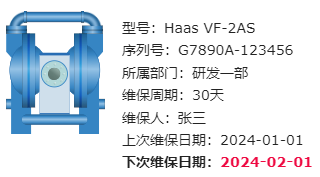

# 富文本

富文本控件允许您在文本中应用丰富的样式、格式和多媒体元素。与纯文本相比，富文本可以包含字体样式、颜色、加粗、斜体、下划线等文本样式，同时还可以插入表格、链接等。

WAGO VC Hub内置的富文本编辑器支持两种编辑模式：Markdown、所见即所得。

#### Markdown 模式

- Markdown 是一种轻量级的标记语言，用于格式化纯文本并添加结构和样式。
- 在 Markdown 模式下，你可以使用简单的符号和标记来表示不同的文本样式，例如标题、粗体、斜体、链接等。
- 编辑器会将 Markdown 语法转换为富文本格式，以便在预览或发布时显示所期望的样式。
- Markdown 模式适合熟悉 Markdown 语法的用户，它提供了更多的控制和灵活性。

#### 所见即所得模式

- 所见即所得模式允许你直接在编辑器中看到最终的格式化效果，就像在一个常规的文本处理软件中一样。
- 在所见即所得模式下，你可以通过工具栏、快捷键或右键菜单来应用不同的样式，例如字体、大小、颜色、对齐方式等。
- 所见即所得模式更加直观和易于使用，无需记忆或了解特定的标记语法。

选择 Markdown 模式还是所见即所得模式取决于您的个人偏好和使用场景。如果您习惯使用 Markdown 语法，或者需要更多的控制和灵活性，那么 Markdown 模式可能更适合您。如果您更喜欢直观地编辑文本并即时看到结果，那么所见即所得模式可能更适合您。

**属性**

| **名称** | **描述**  |
|:----------|:-----------------------------|
| 名字     | 此控件的名称。 |
| X        | 控件左侧距画布左侧的距离，单位px。 |
| Y        | 控件顶部距画布顶部的距离，单位px。   |
| W        | 控件的宽度，单位px。 |
| H        | 控件的高度，单位px。  |
| 背景     | 富文本控件的背景色。  |
| 文本     | 设置文本的内容和格式。点击编辑按钮，弹出富文本编辑器，可以在编辑器内对文本进行编辑。  编辑窗口如下：        标题    字体加粗    字体倾斜   设置文字的颜色   在选中的文本上显示删除线   在两行文本之间插入分割线    突出引用的内容    无序列表。每个内容都以符号或特定的标记进行标识，而不是按照顺序编号。无序列表的作用是突出项目之间的平等性，并提供一个简单的方式来列举相关的内容。 例如：      有序列表。用于呈现按顺序排列的内容格式，每个项目都以数字作为标记，并按照其在列表中的顺序进行编号。有序列表的作用是使项目之间的关系更清晰，并提供结构化和有序的信息。 例如：      待办列表。用于记录和组织待完成任务的格式。 例如：      缩进。选中要缩进的文本，然后使用Tab键或缩进按钮，将其向右移动。在启用了无序、有序或待办列表的情况下，缩进功能才生效。   减少缩进。选中要减少缩进的文本，然后使用Shift+Tab键或减少缩进按钮，将其移回原来的位置。在启用了无序、有序或待办列表的情况下，减少缩进功能才生效。    插入表格    插入URL     插入代码，适用于简短的代码片段。 插入代码，适用于插入较长的代码片段。  |
| 边框颜色 | 富文本的边框颜色。  |
| 边框粗细 | 富文本的边框粗细。 |

**说明**：如何退出代码模式：在 Markdown 模式下，在格式外按回车即可； 在WYSIWYG 模式下，按ctrl+回车

**动作**

允许您基于某种条件执行特定的动作。请参阅“[动作](../../event/index.md)”页上各种动作的完整描述。

**示例**

通过富文本，显示设备的相关信息。

