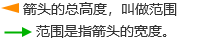

# 刻度尺

刻度尺用于测量和标记长度。

**属性**

| **名称**   | **描述**  |
|:--------------------|:-----------------------|
| 名字  | 此控件的名称。 |
| X | 控件左侧距画布左侧的距离，单位px。  |
| Y | 控件顶部距画布顶部的距离，单位px。 |
| W  | 控件的宽度，单位px。  |
| H | 控件的高度，单位px。 |
|  | 控件的角度。|
| 填充 | 控件的背景色。 |
| 刻度 | 设置刻度的外观样式。   - **轴**：设置刻度尺主轴颜色和粗细。下图的红色区域为主轴。    - **主刻度**：设置刻度尺主刻度颜色，粗细，数量和长度。下图的红色区域为主刻度。     - **副刻度**：设置刻度尺副刻度颜色，粗细，数量和长度。下图的红色区域为副刻度。    |
| 刻度值 | 设置刻度尺的测量范围。   - **显示**：是否显示刻度值。  - **反向**：将刻度值的最大值和最小值反向显示。  反向前：   反向后：    - **最大值**：刻度尺的最大值  - **最小值**：刻度尺的最小值    - **数值类型**：包含数值和百分比，用于设置刻度值的数值类型。  - **小数位**：设置刻度值的小数位数。 - **字体**：设置刻度值的字体类型，字体大小，加粗，倾斜和字体颜色。|
| 指示条 | 设置刻度尺上各指示条的样式。样式包含箭头，直线和楔形。  点击设置按钮，在窗口中设置指示条及其样式。    - **指示值**：指示条对应的值   - **样式**：选择指示条的样式，包含箭头，直线和楔形。    - **颜色**：设置指示条的颜色。   - **范围**：选择直线时，范围无效，禁用。       - **长度**：指示条的整体长度。   - **线宽**： 选择 **楔形** 时，范围无效，禁用。   选择 **直线** 和 **箭头** 时，表示线段的宽度。   - **偏移**：设置指示器与轴之间的距离。   - **文本**：可以为指示条设置文本描述。  - **文本方向**：设置文本的内容显示方向。 - **文本颜色**：设置文本内容的字体颜色。  |

**动作**

允许您基于某种条件执行特定的动作。请参阅“[动作](../../event/index.md)”页上各种动作的完整描述。

**示例**

在刻度尺上添加3个指示条，分别表示最大值，最小值和平均值。

1. 在画面上插入一个刻度尺控件
2. 点击该控件，在控件的外观属性中点击指示条的数据集按钮

    

3. 在数据集弹窗中进行如下设置

    

4. 保存弹窗后，刻度尺显示效果如下：

    

