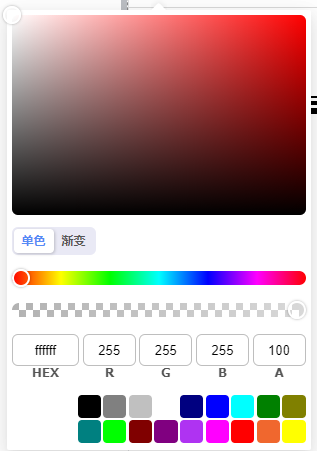
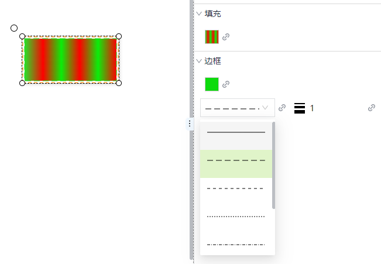
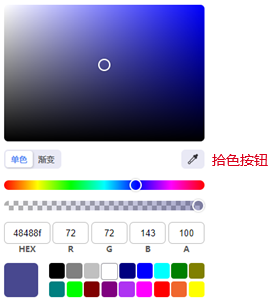

# 填充、描边、阴影和拾色

通过设置控件的填充色、边框色、边框类型、边框粗细、阴影效果，可以改变其外观样式。

## 填充

包含2中填充样式：**单色、渐变**。

在控件的外观属性中，点击填充的颜色选择器，进行填充设置。

#### 单色

单色填充示例：

## 渐变

1. 在颜色编辑器中选择 “渐变”。

2. 选择 “线性”或 “径向”。

3. 您将看到两个停靠点：白色和黑色。单击每个停止点并选择不同的颜色。

4. 如果要添加其他停止点，请左键单击颜色栏，然后选择停靠点颜色。您还可以删除添加的停止点。

渐变填充示例：

## 描边

边框也常用来设置控件的外形。包含边框色、边框类型和边框粗细。边框色的设置与填充类似。在控件的外观属性中，点击边框的颜色选择器，进行颜色设置。

类型主要控制所绘制线条的样式，例如用虚线来绘制。粗细设置以像素为单位。在粗线条上，您可以更容易地观察到它们的效果。

描边样式示例：

## 阴影

通过为控件设置阴影效果， 可以增加深度感和层次感，使用户界面看起来不那么扁平，提高界面的整体视觉吸引力和专业性。

阴影效果：

## 拾色

在颜色选择器上点击拾色按钮进行拾色。

1. 在画面上绘制两个矩形：矩形1、矩形2。矩形1 的填充色设置位红色，矩形2的填充色为白色。

2. 对矩形2进行填充 设置，在打开的颜色选择器上点击拾色按钮。

3.  移动拾色光标，将其放在矩形1的填充区域，从而 吸取矩形1的填充 色（红色）。

4. 点击鼠标左键， 完成拾色操作。此时矩形2自动填充 矩形1的填充 色。

