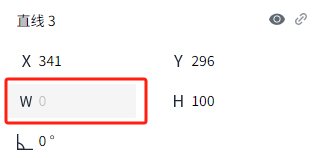
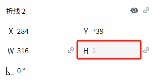

# 形状

使用绘图工具绘制形状后，可以对其进行更改和编辑，包含多种形状，每种形状都有不同的用途。

## 椭圆

用于创建和编辑椭圆形状。若要创建椭圆，请将鼠标放在该控件上，然后按住鼠标左键，移动鼠标至画布区域，释放鼠标，会在画布上创建一个椭圆。创建后，点击该椭圆，可以通过选中框的操作按钮调整椭圆的角度和大小。也可以在属性栏中调整大小和角度。

下图1~8对应的位置，用于调整椭圆的大小。位置9，按住后移动鼠标，可以对椭圆进行旋转。

## 矩形

用于创建和编辑矩形。它的使用方式与椭圆大致相同。若要创建矩形，请将鼠标放在该控件上，然后按住鼠标左键，移动鼠标至画布区域，释放鼠标，会在画布上创建一个矩形。创建后，点击该矩形，可以通过选中框的操作按钮调整其角度和大小。也可以在属性栏中调整大小和角度。

## 圆角矩形

用于创建和编辑圆角矩形。它的使用方式与椭圆大致相同。若要创建圆角矩形，请将鼠标放在该控件上，然后按住鼠标左键，移动鼠标至画布区域，释放鼠标，会在画布上创建一个圆角矩形。创建后，点击该圆角矩形，可以通过选中框的操作按钮调整其角度和大小。也可以在属性栏中调整大小和角度。

## 直线

用于创建和编辑直线。若要创建直线，请将鼠标放在该控件上，然后按住鼠标左键，移动鼠标至画布区域，释放鼠标，会在画布上创建一条直线。创建后，点击该直线，可以通过选中框的操作按钮调整其角度和长度。也可以在属性栏中调整长度和角度。

## 水平直线

用于创建和编辑水平直线。若要创建水平直线，请将鼠标放在该控件上，然后按住鼠标左键，移动鼠标至画布区域，释放鼠标，会在画布上创建一条水平直线。创建后，点击该直线，可以通过选中框的操作按钮调整其角度和长度。也可以在属性栏中调整长度和角度。

## 垂直直线

用于创建和编辑垂直直线。若要创建垂直直线，请将鼠标放在该控件上，然后按住鼠标左键，移动鼠标至画布区域，释放鼠标，会在画布上创建一条垂直直线。创建后，点击该直线，可以通过选中框的操作按钮调整其角度和长度。也可以在属性栏中调整长度和角度。

## 弧线

用于创建和编辑弧线。若要创建弧线，请将鼠标放在该控件上，然后按住鼠标左键，移动鼠标至画布区域，释放鼠标，会在画布上创建一条弧线。创建后，点击该弧线，可以通过选中框的操作按钮调整其角度和大小。也可以在属性栏中调整大小和角度。

双击该弧线，弧线处于编辑状态，可以通过鼠标移动弧线的起点和终点的位置，改变弧线的外形。

## 箭头

用于创建单侧或双侧箭头形状。若要创建箭头，请将鼠标放在该控件上，然后按住鼠标左键，移动鼠标至画布区域，释放鼠标，会在画布上创建一个箭头。可以在属性中选择单侧箭头或双侧箭头。创建后，点击该箭头，可以通过选中框的操作按钮调整其角度和大小。也可以在属性栏中调整大小和角度。

## 折线

用于创建和编辑折线。若要创建折线，请选择该控件，然后在窗口内单击并拖动鼠标以绘制一条线段，松开鼠标完成一条线段的绘制，再次按下并拖动鼠标，继续绘制下一个线段，绘制完成时单击鼠标左键确定终点位置。之后再双击鼠标左键或者单击鼠标右键退出编辑状态。创建后，点击该折线，可以通过选中框的操作按钮调整其角度和大小。也可以在属性栏中调整大小和角度。

若想绘制水平或者垂直的线段线，可以在绘制过程中，按住Shift键，之后在画布上拖动鼠标，自动绘制水平或者垂线段。

双击该折线，折线处于编辑状态，通过鼠标移动折线的各个顶点（下图1~5所处位置），对折线样式进行调整。

## 多边形

用于创建和编辑多边形。每次要制作多边形时，选中该控件， 在画面上单击后移动鼠标，此时在单击点与鼠标当前位置之间画出一条线。单击鼠标左键，确定当前边的位置。之后继续按住鼠标左键并移动鼠标，按照点的绘制顺序，前一个点和后一个点连接，最后一个点再和起点连接，形成图形。双击鼠标左键或者单击鼠标右键完成绘制。

创建后，点击该多边形，可以通过选中框的操作按钮调整其角度和大小。也可以在属性栏中调整大小和角度。

 鼠标双击多边形，多边形处于选中状态，每个顶 点显示选中效果，鼠标左键点击任意顶 点，在页面上拖动鼠标，顶 点位置跟随鼠标位置的变化而变化，图形按照顶 点位置的变动而改变。

## 管道

用于创建管道。它的绘制方式与折线大致相同。若要创建管道，请选择该控件，然后在窗口内单击并拖动鼠标进行绘制，松开鼠标完成一条管道的绘制，再次按下并拖动鼠标，继续绘制下一段管道，双击鼠标左键或者单击鼠标右键完成绘制。可以在属性中设置管道的样式。创建后，点击该管道，可以通过选中框的操作按钮调整其角度和大小。也可以在属性栏中调整大小和角度。

双击该管道，管道扇形处于编辑状态，可以通过鼠标移动管道的任意端点的位置，改变管道的外形。

还可以在属性窗口中对管道的样式进行设置。

**属性**

| **名称** | **描述**  |
|:------------------------------------------------------------------------------------------------------------------------------------------------------------------------------------------------------------|:----------------------------------------------------------------------------------------------------------------------------------------------------------------------------------------------------------------------------------------------------------------------------------------------------------------------------------------------------------------------------------------------------------------------------------------------------------------------------------------------------------------------------------------------------------------------------------------------------------------------------------------------------------------------------------------------------------------------------------------------------------------------------------------------------------------------------------------------------------------------------------------------------------------------------------------------------------------------------------------------------------------------------------------------------------------------------------------------------------------------------------------------------------------------------------------------------------------------------------------------------------------------------------------------------------------------------------------------------------------------------------------------------------------------------------------------------------------------------------------------------------------------------------------|
| 名字  | 此控件的名称。 |
| X  | 控件左侧距画布左侧的距离，单位px。  |
| Y | 控件顶部距画布顶部的距离，单位px。 |
| W  | 控件的宽度，单位px。 |
| H  | 控件的高度，单位px。 |
|  | 管道的倾斜角度。  |
| 管道样式  | 设置管道的两端以及拐角的样式。    方头方拐角   方头圆拐角     圆头方拐角    圆头圆拐角 |
| 背景    | 管道的背景色。 |
| 直径 | 管道的直径。  |
| 流体 | 设置管道内流体的样式。   - **样式**：  设置流体的样式。包括：无、三角形、矩形、箭头。也可以点击样式后面的设置按钮，从图库中选择svg格式的图片作为流体样式。  - **宽度**：  流体的宽度。   - **高度**：  流体的高度。  - **颜色**： 流体的颜色。   - **间距**： 相邻流体间的距离，单位px。     - **流速**：  包含4个选项：0、1、2、3。0表示静止，3流动最快。   - **流向**：  流体的流动方向。从起点流向终点为正向，从终点流向起点为反向。    **说明**：起点是指开始绘制的位置，终点是指结束绘制的位置。|

## 说明

1. 水平直线的高度为0，通过属性写值或脚本修改其高度将不会生效；

    

2. 垂直直线的宽度为0，通过属性写值或脚本修改其宽度将不会生效；

    

3. 水平折线的高度为0时，通过属性写值或脚本修改折线的高度将不会生效；

    

4. 垂直折线的宽度为0时，通过属性写值或脚本修改折线的宽度将不会生效；

    

5. 水平管道的高度为0时，通过属性写值或脚本修改管道的高度将不会生效；

    

6. 垂直管道的宽度为0时，通过属性写值或脚本修改管道的宽度将不会生效；

    

