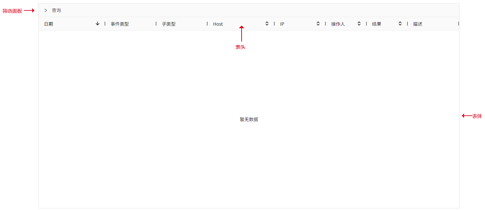

# 历史事件

历史事件控件用于显示已经发生的事件。默认情况下它不显示任何数据，您需要在运行页面设置查询条件后，才执行查询操作。

**界面元素**

您可以在预览和运行页面上单击并拖动列的边距以调整其宽度。您还可以按升序或降序对列进行排序，只需单击每个列标题旁边的向上或向下箭头即可。

**属性**

| **名称** | **描述**  |
|:----------|:--------------|
| 名字     | 此控件的名称。 |
| X        | 控件左侧距画布左侧的距离，单位px。  |
| Y        | 控件顶部距画布顶部的距离，单位px。|
| W        | 控件的宽度，单位px。 |
| H        | 控件的高度，单位px。  |
| 边框颜色 | 设置控件外边框及表体的表格线颜色。|
| 边框粗细 | 设置控件外边框及表体的表格线的粗细。 |
| 表头     | 设置表头的背景色、字体型号、字体大小、加粗、倾斜、字体颜色。  |
| 表体     | 设置表体的背景色、字体型号、字体大小、加粗、倾斜、字体颜色。  |
| 颜色     | 设置每个事件类型在控件上显示的颜色。  |
| 按钮样式 | 设置控件上使用的按钮的样式。点击按钮样式的设置按钮进行设置。 查询按钮.查询按钮的背景色、边框色、字体型号、字体大小、加粗、倾斜、字体颜色。  导出按钮.导出按钮的背景色、边框色、字体型号、字体大小、加粗、倾斜、字体颜色。 |
| 筛选面板 | 设置筛选面板的样式，包括标签页查询与页内查询两种方式。执行标签页查询后，若当前每页展示的数据条目数量仍偏多，可针对当前页面已展示的数据再次进行查询，即页内查询。  - **面板背景色**：筛选面板的背景色。  - **面板名称字体**：设置面板名称的字体型号、字体大小、加粗、倾斜、字体颜色。 - **搜索条件**：筛选面板内搜索条件的背景色、边框色，搜索标题和输入的搜索内容的字体型号、字体大小、加粗、倾斜、字体颜色。|
| 列设置   | 设置需要显示在控件上的列名。 |
| 每页条数 | 设置每页显示的条数。 |

**动作**

允许您基于某种条件执行特定的动作。请参阅“[动作](../../event/index.md)”页上各种动作的完整描述。

**示例**

查看最近24小时产生的事件。

1. 在运行页面，展开”查询“面板，设置起止时间。
2. 点击”查询“按钮。

