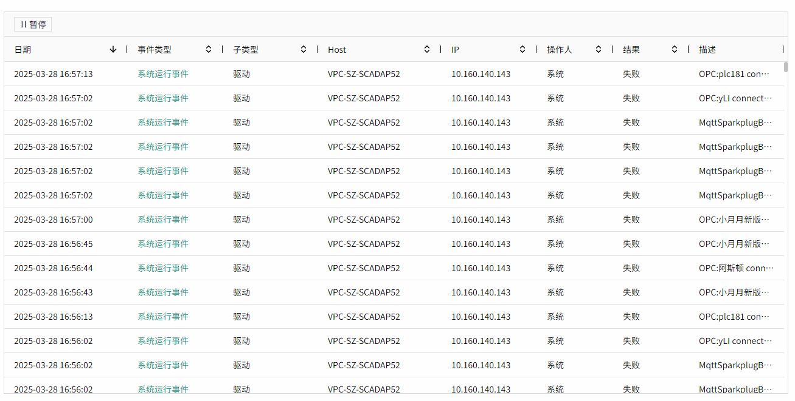

# 实时事件

实时事件控件用于显示正在发生的事件。默认情况下，它显示所有事件，控件仅支持显示最新的2000条数据，您也可以设置筛选条件。

您可以在预览和运行画面上单击并拖动列的边距以调整其宽度。您还可以按升序或降序对列进行排序，只需单击每个列标题旁边的向上或向下箭头即可。

您也可以点击暂停按钮，暂停数据刷新，在暂停的状态下对数据进行查询和查看。点击暂停按钮后，显示恢复和查询按钮。

**属性**

| **名称** | **描述** |
|:----------|:-----------|
| 名字     | 此控件的名称。|
| X        | 控件左侧距画布左侧的距离，单位px。  |
| Y        | 控件顶部距画布顶部的距离，单位px。 |
| W        | 控件的宽度，单位px。 |
| H        | 控件的高度，单位px。 |
| 边框颜色 | 设置控件外边框及表体的表格线颜色。   |
| 边框粗细 | 设置控件外边框及表体的表格线的粗细。 |
| 表头     | 设置表头的背景色、字体型号、字体大小、加粗、倾斜、字体颜色。 |
| 表体     | 设置表体的背景色、字体型号、字体大小、加粗、倾斜、字体颜色。 |
| 颜色     | 设置每个事件类型在控件上显示的颜色。|
| 按钮样式 | 设置控件上使用的按钮的样式。点击按钮样式的设置按钮进行设置。   暂停按钮.暂停按钮的背景色、边框色、字体型号、字体大小、加粗、倾斜、字体颜色。  恢复按钮.恢复按钮的背景色、边框色、字体型号、字体大小、加粗、倾斜、字体颜色。 查询按钮.查询按钮的背景色、边框色、字体型号、字体大小、加粗、倾斜、字体颜色。|
| 搜索     | 设置搜索框的背景色、边框色，搜索标题以及输入的搜索内容的字体型号、字体大小、加粗、倾斜、字体颜色。|
| 列设置   | 设置需要显示在控件上的列名。|
| 排序方式 | 设置数据在控件上的排序方式。|

**动作**

允许您基于某种条件执行特定的动作。请参阅“[动作](../../event/index.md)”页上各种动作的完整描述。

**示例1**

在运行页面进行数据过滤。

1. 在运行页面点击”暂停“按钮。
2. 设置查询条件，事件类型中选择：操作事件，子类型选择：报警。
3. 点击”查询“按钮。

