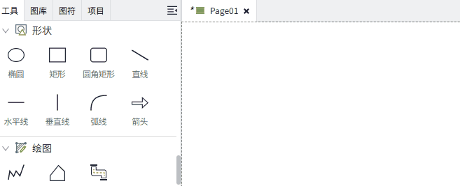

# 控件

本节介绍所有内置的控件。选择控件后，可以在”属性“窗口中更改控件的属性，从而更改控件的外观和行为。

**折线，多边形，管道** 这 3 个控件，需要在工具栏点击控件后，在画面上拖动鼠标进行绘制；其他控件直接通过鼠标拖拽的方式将其添加到画面上。

在画面上通过鼠标移动控件时，如果选中的控件数量大于400个，则移动后，选中框会自动取消。

若要使这些控件设置动画效果，例如旋转，请为控件配置动画。若要使控件对用户交互做出反应，请为其配置动作。

**绘图**  
- [填充、描边、阴影和拾色](drawing/fill-stroke.md) 

- [形状](drawing/shape.md) 

**输入** 

- [日历](input/datetime-input.md)

- [下拉框](input/dropdown.md)  

- [数字输入框](input/number-input.md)  

- [滑动条](input/slider.md)  

- [文本输入框](input/text-input.md) 

**显示**  
- [3D 查看器](display/3d-viewer.md) 

- [IFrame](display/iframe.md) 

- [文本标签](display/label.md) 

- [数码管](display/led-display.md) 

- [画面容器](display/page-container.md) 

- [富文本](display/rich-text.md) 

- [刻度尺](display/ruler.md) 

- [值显示](display/value-display.md) 

**按钮** 

- [2-State Button](button/2-state-button.md) 

- [按钮](button/button.md) 

- [复选框](button/checkbox.md) 

- [导航菜单](button/menu.md)

- [Multi-State Button](button/multi-state-button.md)

- [单选按钮](button/radio-button.md)

- [Toggle Button](button/toggle-button.md)

**图表**  

- [柱状图](chart/bar-chart.md) 

- [自定义图表](chart/custom-chart.md) 

- [自定义曲线](chart/custom-curve.md) 

- [仪表盘](chart/gauge.md) 

- [历史趋势](chart/historical-chart.md) 

- [饼图](chart/pie-chart.md) 

- [实时趋势](chart/realtime-chart.md) 

**报警**  

- [历史报警](alarm/historical-alarm/index.md) 

- [实时报警](alarm/real-time-alarm/index.md)  

**事件**   

- [历史事件](event/historical-event.md)  

- [实时事件](event/realtime-event.md) 

**表格**  

- [历史检索](table/historical-data-table.md) 

- [报表查看器](table/report-viewer.md)  

- [表格](table/table.md)  

- [变量列表](table/tag-list.md) 

