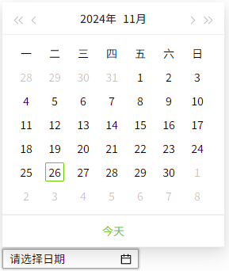
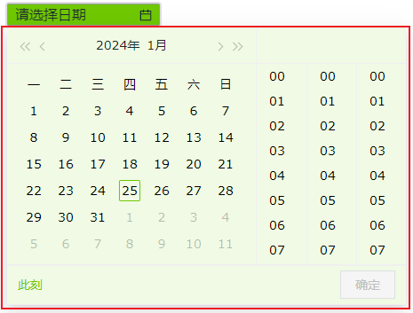
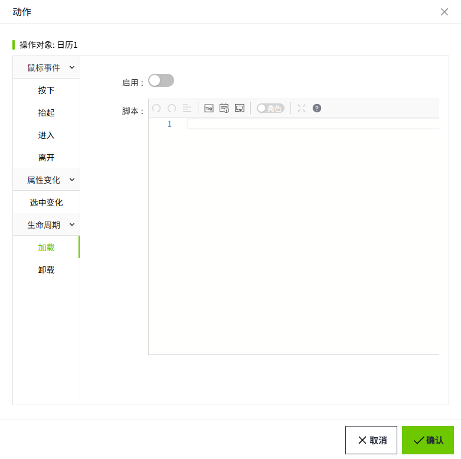

# 日历

日历控件用于设置日期，并对日期进行格式化。


**属性**

| **名称**   | **描述**  |
|:------------|:----------------------------------------------------------------------------------|
| 名字       | 此控件的名称。  |
| X          | 控件左侧距画布左侧的距离，单位px。|
| Y          | 控件顶部距画布顶部的距离，单位px。|
| W          | 控件的宽度，单位px。  |
| H          | 控件的高度，单位px。 |
| 日期       | 设置控件上显示的日期。   |
| 选择器类型 | 设置日历显示的内容格式，包含Datetime和Date。  当选择 **Datetime** 时，控件上可以选择年月日时分秒；  <br>  <br>当选择 **Date** 时，只能选择年月日。 <br>  |
| 格式       | 对日期进行格式化，可下拉选择预设的格式，也可自行输入。   点击弹出格式窗口，在弹窗中双击选择格式。 | 
| 背景       | 控件的背景色。  <br>  |
| 选择器背景 | 控件弹出日历窗口的背景色。  <br> |
| 边框颜色   | 控件的边框颜色。|
| 边框粗细   | 控件的边框粗细。 |
| 字体       | 设置控件的字体。包括字体型号、字体大小、字体颜色、加粗、倾斜。|

**动作**

允许您基于某种条件执行特定的动作。请参阅 [动作](../../event/index.md) 页上各种动作的完整描述。

**示例**

通过日历控件显示当前系统时间。


1. 在画面上插入一个日历控件。
2. 为控件设置如下属性。

    | **属性**   | **值**                                 |
    |:------------|:----------------------------------------|
    | 背景色     | 03172c                                 |
    | 日历背景色 | eff0f2                                 |
    | 边框色     | 12b5ac                                 |
    | 边框粗细   | 2                                      |
    | 字体       | Digital Numbers，18，加粗，字体颜色12b5ac |
    | 选择器类型 | Datetime                               |
    | 格式       | a `h:mm:ss`                            |

3. 为控件设置动作，动作类型为“生命周期”->“加载”。

    

4. 开启“启用”按钮，在脚本编辑器内容输入如下脚本：

    ```typescript
    const data = await System.Tag.read('@System:Server.CurrentDateTime')
    const calendar = await System.UI.findControl('日历1');
    calendar.value = data.value;
    calendar.applyChanges();
    ```
 
5. 在运行页面，查看日历控件显示内容。

    


