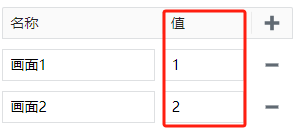
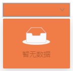

# 下拉框

当用户选择一个选项时，可以执行特定的操作，例如更新数据，打开画面等。您可以在控件的属性中手动设置列表内容。


**属性**

| **名称** | **描述** |
|:----------|:-----------------------------------------------------------------------------|
| 名字     | 此控件的名称。|
| X        | 控件左侧距画布左侧的距离，单位px。   |
| Y        | 控件顶部距画布顶部的距离，单位px。  |
| W        | 控件的宽度，单位px。 |
| H        | 控件的高度，单位px。 |
| 下拉名称 | 下拉选项的名称。 <br> |
| 下拉值   | 下拉选项的值。  <br>  |
| 选中文本 | 当前选中的下拉选项的文本内容。  |
| 选中值   | 当前选中的下拉选项的值。 |
| 选中颜色 | 选中某个下拉选项后，该选项在下拉列表显示的背景颜色。|
| 悬浮颜色 | 鼠标悬浮在某个下拉选项上时，该选项在下拉列表显示的背景颜色。|
| 最大行数 | 在显示滚动条之前要在下拉列表中显示的行数。|
| 行高     | 确定下拉列表中每个选项的高度，单位px。 |
| 填充色   | 下拉框的填充色。 <br>               |
| 边框颜色 | 下拉框的边框颜色。 <br>               |
| 边框粗细 | 下拉框的边框粗细。|
| 阴影     | 设置控件的阴影效果。可以设置外阴影和内阴影。 <br> **外阴影**   <br>- **启用**：是否启用阴影效果  <br>- **颜色**：用于设置阴影颜色  <br>- **X**：控制阴影在水平方向上的偏移量。  <br>`X = 10` → 阴影往右移了10像素  <br>`X = -5` → 阴影往左移了5像素  <br>- **Y**：控制阴影在垂直方向上的偏移量。  <br>`Y = 8` → 阴影往下移了8像素  <br>`Y = -3` → 阴影往上移了3像素   <br>- **模糊**：控制阴影的模糊程度，模糊值越大，边缘越柔和、越自然。 <br>- **内阴影** <br>- **启用**：是否启用阴影效果 <br>- **颜色**：用于设置阴影颜色  <br>- **X**：控制阴影在水平方向上的偏移量。  <br>`X = 10` → 阴影往右移了10像素  <br>`X = -5` → 阴影往左移了5像素 <br>- **Y**：控制阴影在垂直方向上的偏移量。  <br>`X = 8` → 阴影往下移了8像素  <br>`Y = -3` → 阴影往上移了3像素  <br>- **模糊**：控制阴影的模糊程度，模糊值越大，边缘越柔和、越自然。<br>- **扩散**：控制阴影的大小|
| 字体     | 设置的下拉选项的字体。包括字体型号、字体大小、字体颜色、加粗、倾斜、下划线设置。 |

**动作**

允许您基于某种条件执行特定的动作。请参阅 [动作](../../event/index.md) 页上各种动作的完整描述。

**示例**

在下拉列表中选择某个选项时，打开指定的画面。


在控件的动作属性中，选择 “值变化”，在脚本中编写如下内容：


```js
// 当下拉选项的值为1时打开画面1，当下拉选项的值为2时打开画面2。
if (Context.currentEvent.newValue == '1') {
    System.UI.open('画面1');
}
else if(Context.currentEvent.newValue == '2') {
    System.UI.open('画面2');
}
```
 


