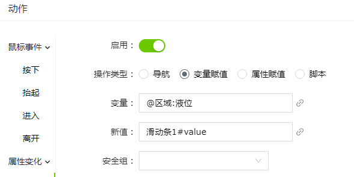

# 滑动条

滑动条控件用于展示当前值和可选范围，即在一定数值范围内通过滑动条来设置参数，选取数值。

**属性**

| **名称** | **描述** |
|------------------------------------------------------------------------------------------------------------------------------------------------------------------------------------------------------------|---------------------------------------------------------------------------------------------------------------------------------------------------------------------------------------------------------------------------------------------|
| 名字 | 此控件的名称。 |
| X | 控件左侧距画布左侧的距离，单位px。 |
| Y    | 控件顶部距画布顶部的距离，单位px。 |
| W | 控件的宽度，单位px。   |
| H   | 控件的高度，单位px。 |
| | 控件的角度。|
| 显示 | 设置滑动条的显示样式。    - **反向**：设置滑动条的方向，选中后将滑动条置反。 - **背景**：设置整个背景条的背景色。      - **滑块颜色**：设置滑块部分颜色。      - **最小值**：设置滑动条的最小值。    - **最大值**：设置滑动条的最大值。   - **值**：设置滑动条的当前值。 **说明**：一旦绑定了值，则在运行页面滑块不可拖动。 |  
| 提示信息  | 设置滑动块提示信息的显示样式。  - **显示提示**：控制提示信息的显示或隐藏。  - **背景**：设置提示信息的背景色。   - **边框色**：设置提示信息的边框颜色。   - **小数位**：设置提示数值的小数位。   - **字体**：设置提示信息的字体型号、字体大小、粗体、斜体、字体颜色。 |

**动作**

允许您基于某种条件执行特定的动作。请参阅 [动作](../../event/index.md) 页上各种动作的完整描述。

**示例1**

使用滑动条显示液位值。

1. 画面上插入一个滑动条。

2. 滑动条的“值”属性绑定变量：液位。

**示例2**

使用滑动条改变变量值。手动拖动滑块改变滑动条的值，松开滑动条时会将滑动条的当前值设置到变量上。

1. 画面上插入一个滑动条和一个值显示控件。
2. 值显示控件绑定变量：液位
3. 滑动条的动作属性中设置值变化事件，值变化是进行变量赋值。将滑动条的值赋到变量“液位”上。

    

4. 在运行页面，改变滑动条的滑块值，值显示控件上的值显示为松开滑块时的值。

    

