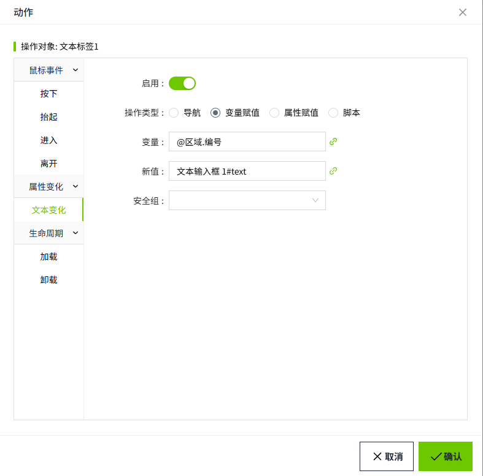

# 文本输入框

文本输入框用于输入任何单行文本进行写值操作。

**属性**

| **名称** | **描述**  |
|:----------|:---------------------------|
| 名字     | 此控件的名称。|
| X        | 控件左侧距画布左侧的距离，单位px。|
| Y        | 控件顶部距画布顶部的距离，单位px。 |
| W        | 控件的宽度，单位px。 |
| H        | 控件的高度，单位px。 |
| 文本     | 输入框内显示的内容。  |
| 密文     | 默认不开启。开启后文本框中输入的内容显示密文。|
| 填充色   | 文本输入框的填充色。 |
| 边框颜色 | 文本输入框的边框颜色。  |
| 边框粗细 | 文本输入框的边框粗细。   |
| 阴影     | 设置控件的阴影效果。可以设置外阴影和内阴影。    **外阴影**   - **启用**：是否启用阴影效果   - **颜色**：用于设置阴影颜色  - **X**：控制阴影在水平方向上的偏移量。   `X = 10` → 阴影往右移了10像素   `X = -5` → 阴影往左移了5像素  - **Y**：控制阴影在垂直方向上的偏移量。   `Y = 8` → 阴影往下移了8像素   `Y = -3` → 阴影往上移了3像素     - **模糊**：控制阴影的模糊程度，模糊值越大，边缘越柔和、越自然。   **内阴影**  - **启用**：是否启用阴影效果   - **颜色**：用于设置阴影颜色   - **X**：控制阴影在水平方向上的偏移量。   `X = 10` → 阴影往右移了10像素   `X = -5` → 阴影往左移了5像素  - **Y**：控制阴影在垂直方向上的偏移量。   ` = 8` → 阴影往下移了8像素   `Y = -3` → 阴影往上移了3像素  - **模糊**：控制阴影的模糊程度，模糊值越大，边缘越柔和、越自然。 - **扩散**：控制阴影的大小 |
| 字体     | 设置输入的文本的字体。包括字体型号、字体大小、字体颜色、加粗、倾斜、下划线设置。以及水平方向的对齐方式：左对齐、居中、右对齐。|

**动作**

允许您基于某种条件执行特定的动作。请参阅 [动作](../../event/index.md) 页上各种动作的完整描述。

**示例**

通过文本输入框修改设备参数。

1. 控件外观如下：

    | **属性** | **值**                             |
    |:----------|:------------------------------------|
    | 名称     | 文本输入框 1                       |
    | 文本     | 绑定变量：@区域.编号                |
    | 填充色   | 2ef6a3                             |
    | 字体     | Calibri, 22 , 加粗,  000000，左对齐 |

2. 在控件的动作属性中，选择”值变化“，在变量赋值中，变量绑定：@区域.编号，新值绑定：文本输入框 1#text。

    

3. 在运行画面上，在文本输入框中输入内容，会将输入的内容写入变量：@区域.编号。

