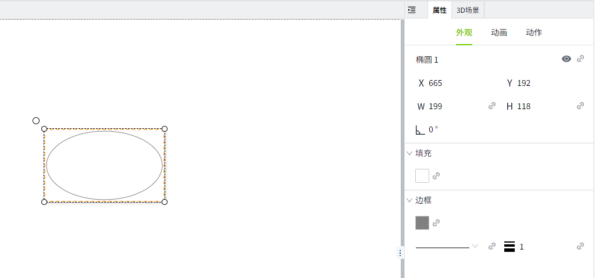
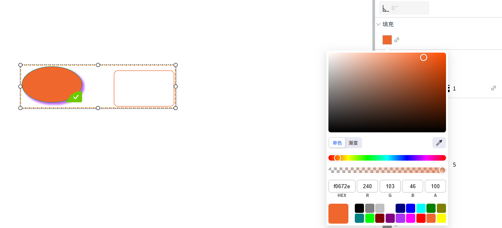

# 修改控件属性

#### 修改单个控件属性

在编辑器页面选中控件后，在右侧的”属性“窗口中，对控件外观进行修改。



## 批量修改控件属性

用户可以选择多个控件后，在属性面板中将显示这些控件共同拥有的 **外观**，**动画** 和 **动作** 属性。可以对共有属性进行批量修改。

#### 批量修改外观属性

当选中多个控件时，如果在外观属性中对某个属性进行了设置或者属性绑定，则该属性的修改将对所有选中的控件生效。

**示例：批量修改文字外观样式**

1. 在页面上选中文本标签，值显示控件。
2. 在属性窗口中显示这2个控件的共有属性。
3. 在属性面板中将字体更改为微软雅黑，字体颜色设置为紫色。
4. 两个控件的文字外观样式同时改变。

    

#### 批量修改动画、动作属性

选中多个控件后，对 **动画** 和 **动作** 进行修改时，只针对当前特定的某一项动画或动作生效，而非整体的动画或动作配置。将当前控件的配置与之前的配置进行比较。如果有更改，则用新配置覆盖之前的配置。如果没有变化，则保持原配置不变。

**示例:为矩形和椭圆同时设置闪烁动画。**

1. 在页面上绘制一个矩形和一个椭圆。
2. 为矩形设置填充动画，椭圆不设置动画。
3. 同时选中矩形和椭圆，在动画面板中，设置闪烁动画。
4. 配置完成后，分别检查矩形和椭圆的动画设置。

结果：

- 矩形显示填充和闪烁动画。
- 椭圆显示闪烁动画。

## 修改组合下的控件属性

有两种方式可以选中组合下的元素：

1. 在资产窗口中，点击组合下的元素

    

2. 在画面上直接双击组合中的某个元素

    

    选中组合下的元素后，该元素属性会显示在右侧的属性面板中，可以直接对属性进行修改。

    

## 通过脚本修改控件外观

系统支持通过脚本动态修改控件的属性，以满足运行时的灵活交互与个性化需求。

- 每个控件均提供一组可修改的属性，例如位置、大小、颜色、数据绑定等。
- 不同类型的控件支持的属性范围可能有所不同。

**示例：**点击按钮，修改数码管的外观样式。

1. 在画面上添加Label、数码管和按钮控件。
2. Label控件的内容设置为“设备状态：”
3. 数码管的内容设置为“RUNNING”，背景色设置为#0f1b01，字体颜色设置为#6ec800
4. 按钮的内容设置为“报警”，背景色设置为#ff0000，字体颜色设置为#ffffff
5. 点击按钮，在动作窗口中，启用鼠标"按下"事件，操作类型选择“脚本”。

    

6. 在脚本编辑器中输入如下内容并保存：

    ```typescript
    const led = await System.UI.findControl('数码管1'); // 通过数码管控件名称获取页面上的数码管控件
    led.backgroundColor = '#ff0000'; // 修改数码管的背景颜色
    led.fontColor = '#fff'; // 修改数码管的字体颜色
    led.text = 'Error';  // 修改数码管的文字内容
    led.applyChanges(); // 应用修改
    ```
 
7. 点击画面的”预览”按钮，在预览页面点击报警按钮，查看数码管的样式变化。

    

**注意**: 使用脚本修改控件属性后需要调用applyChanges()方法应用当前修改。

