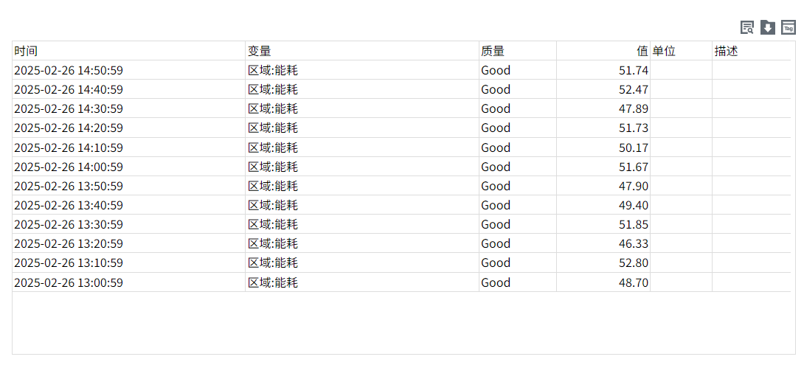

# 历史检索

历史检索控件用于查询和显示变量的历史数据。

**属性**

| **名称** | **描述** |
|:----------|:-------------------|
| 名字     | 此控件的名称。|
| X        | 控件左侧距画布左侧的距离，单位px。|
| Y        | 控件顶部距画布顶部的距离，单位px。 |
| W        | 控件的宽度，单位px。 |
| H        | 控件的高度，单位px。 |
| 时间范围 | 按照设置的时间段进行查询。     - **最近**：设置数据展示的时间范围。 - **自定义**：设置开始时间和结束时间，自定义数据展示的时间范围 |
| 查询方式 | 按照设置的查询方式进行查询。包含：原始值，固定点数，周期性。   - **原始值**：查询所选时间段内的所有原始历史数据。 - **固定点数**：需设置点数。表示将该时间范围按照设置的点数切分为对应的时间片，从每个时间片内按照设置的聚合模式筛选一笔数据。 - **周期性**：需设置周期。表示将该时间范围按照设置的周期切分为对应的时间片，从每个时间片内按照设置的聚合模式筛选一笔数据。   |
| 数据     | 点击数据的绑定按钮，打开数据集绑定变量。只能绑定开启了历史存储的变量。     |
| 排序     | 设置控件排序规则。 - **时间倒叙**：按照变量值的时间倒序排序 - **时间正序**：按照变量值的时间正序排序 |
| 显示     | 设置控件上显示的按钮以及网格。     |
| 按钮样式 | 设置控件上显示的按钮的颜色。      |
| 边框     | 设置边框颜色和边框粗细    |
| 填充     | 设置内容显示区域的背景颜色。 - **表头**：设置表头背景色 - **表体**：设置表体背景色 - **奇数行**：设置奇数行背景色  - **偶数行**：设置偶数行背景色 |
| 表头     | 设置表头字体型号、字体大小、加粗、倾斜、字体颜色，水平对齐方式。 |
| 表体     | 设置表体字体型号、字体大小、加粗、倾斜、字体颜色，水平对齐方式。 | 

**动作**

允许您基于某种条件执行特定的动作。请参阅 “[动作](../../event/index.md)” 页上各种动作的完整描述。

**示例**

查看过去24小时每小时的平均温度。

1. 在画面上插入一个“历史检索”控件。
2. 设置时间范围和聚合模式。

    | **时间范围** | **过去24小时** |
    |:----------|:-------------------|
    | 查询模式     | 周期性|
    | 聚合模式     | 平均值|
    | 周期        | 1小时 |

3. 点击画面的 **预览** 按钮，查看预览效果。

    

