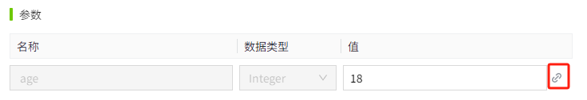
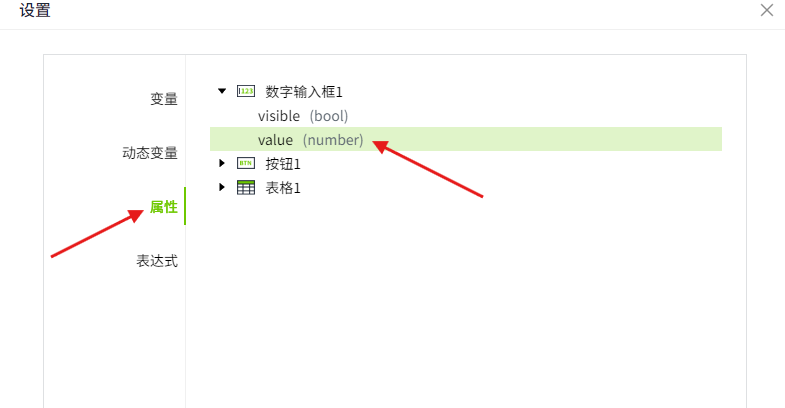
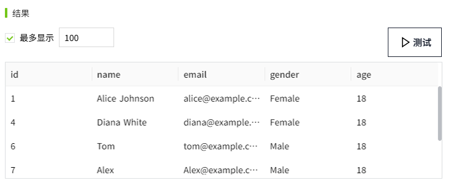
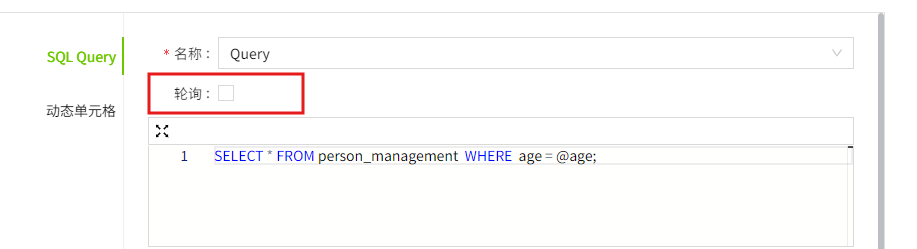
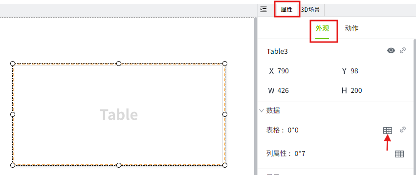
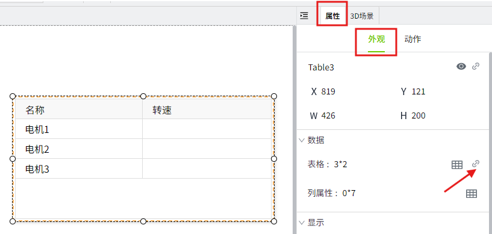
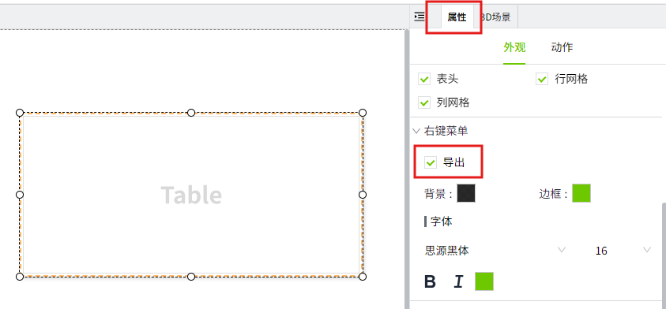

# 表格

以表格形式展示数据。


**属性**

| **名称** | **描述** |
|----------|--------|
| 名字     | 控件的名称。|
| X        | 控件左侧距画布左侧的距离，单位px。 |
| Y        | 控件顶部距画布顶部的距离，单位px。  |
| W        | 控件的宽度，单位px。|
| H        | 控件的高度，单位px。  |
| 表格     | 设置表格内容。  <br>点击该按钮可以设置表格的默认数据。 <br>为表格绑定数据。可以绑定 SQL Query 和动态变量。  当绑定 SQL Query 时，SQL Query 的返回数据就是表格数据。当绑定动态变量时，是对用户手动添加的表格内容进行单元格数据替换。|
| 列属性   | 可以对每列进行配置，例如列宽，列的数据格式等。<br>- **显示JSON**：以json格式显示数据集的数据结构。<br>- **生成列**：将表格属性中手动添加的列显示在此处。如果表格绑定了SQL Query，则将SQL Query查询到的列显示在此处。<br>- **名称**：列名。 <br>- **列宽权重**：每列在表格控件中的宽度占比。 <br>- **隐藏**：在表格控件上隐藏该列。但数据仍可用于查看和选择（隐藏的列不会被导出）。 <br>- **允许排序**：启用列排序。启用后，用户可在运行时点击升序或降序排序。<br>- **允许筛选**：启用列筛选。启用后，用户可在运行时点击筛选按钮对列中的数据筛选。<br>- **对齐方式**：设置列内容的水平对齐方式。<br>- **数据格式**：期望显示的内容格式。可以手动输入，也可以点击设置按钮，双击选择需要的格式。 |
| 显示     | 设置是否显示标题和网格。  <br> |
| 右键菜单 | 设置在运行页面是否支持右键菜单，以及设置右键菜单的样式。  <br>设置右键菜单中导出操作的显示和隐藏。如果勾选了“导出”选项，在画面运行页面右键点击表格区域，将显示“导出”按钮。点击该按钮后，表格内容将以 CSV 文件格式导出。<br>字体：设置右键菜单的字体型号、字体大小、加粗、倾斜、字体颜色。|
| 边框     | 设置边框颜色和边框粗细。  |
| 填充     | 设置背景颜色。<br>- **表头**：设置表头背景色。<br>- **表体**：设置表体背景色。<br>- **奇数行**：设置奇数行背景色。<br>- **偶数行**：设置偶数行背景色。<br>- **选中行背景**：设置选中行的背景色。<br>- **选中行字体**：设置选中行的字体颜色。|
| 表头     | 设置表头样式。<br>- **行高**：设置表头的行高。<br>- **字体**：设置表头的字体型号、字体大小、加粗、倾斜、字体颜色、水平对齐方式。 |
| 表体     | 设置表体样式。<br>- **背景**：设置表体的背景色。如果你想在表体上交替使用不同的颜色，您可以选择背景为奇偶交替，您可以分别为奇数行和偶数行设置背景色。<br>- **行高**：设置每一行的高度。<br>- **字体**：设置表体字体型号、字体大小、加粗、倾斜、字体颜色。  |

**动作**

允许您基于某种条件执行特定的动作。请参阅“[动作](../../event/index.md)”页上各种动作的完整描述。

**示例1**

点击按钮查询最近一段时间的天气信息，并通过表格显示查询结果。

1. 在画面上拖入表格和按钮控件。

2. 选中按钮控件，点击箭头指的图标，打开动作的配置页面。

    

3. 为按钮配置鼠标按下事件，编写如下脚本。按下按钮时，获取天气数据，并通过 [System.Datatable.toDatatable](../../../appendix/system-function/system-datatable/system-datatable-todatatable.md) 函数将查询到的结果转换为表格可以显示的格式。

    

    ```typescript
    const source = [
        {
            "date": "2025-03-04",
            "current_temperature": 2.2,
            "min_temperature": 0.5,
            "max_temperature": 3.9,
            "weather": "阴天",
            "wind_speed": "12 km/h",
            "humidity": "85%"
        },
        {
            "date": "2025-03-05",
            "current_temperature": 4.8,
            "min_temperature": 0.7,
            "max_temperature": 8.8,
            "weather": "多云",
            "wind_speed": "15 km/h",
            "humidity": "78%"
        },
        {
            "date": "2025-03-06",
            "current_temperature": 6.8,
            "min_temperature": 0.0,
            "max_temperature": 13.6,
            "weather": "晴",
            "wind_speed": "10 km/h",
            "humidity": "72%"
        },
        {
            "date": "2025-03-07",
            "current_temperature": 5.8,
            "min_temperature": 0.0,
            "max_temperature": 11.7,
            "weather": "小雨",
            "wind_speed": "18 km/h",
            "humidity": "88%"
        },
        {
            "date": "2025-03-08",
            "current_temperature": 8.8,
            "min_temperature": 1.7,
            "max_temperature": 15.8,
            "weather": "阴天",
            "wind_speed": "14 km/h",
            "humidity": "80%"
        },
        {
            "date": "2025-03-09",
            "current_temperature": 9.6,
            "min_temperature": 4.2,
            "max_temperature": 15.0,
            "weather": "多云",
            "wind_speed": "13 km/h",
            "humidity": "76%"
        },
        {
            "date": "2025-03-10",
            "current_temperature": 11.4,
            "min_temperature": 5.4,
            "max_temperature": 17.4,
            "weather": "晴",
            "wind_speed": "9 km/h",
            "humidity": "68%"
        },
        {
            "date": "2025-03-11",
            "current_temperature": 11.5,
            "min_temperature": 6.2,
            "max_temperature": 16.7,
            "weather": "小雨",
            "wind_speed": "16 km/h",
            "humidity": "85%"
        },
        {
            "date": "2025-03-12",
            "current_temperature": 14.7,
            "min_temperature": 8.6,
            "max_temperature": 20.7,
            "weather": "晴",
            "wind_speed": "10 km/h",
            "humidity": "70%"
        }
    ]
    // 将天气数据转换为表格兼容格式
    const rows = System.Datatable.toDatatable(source);
    // 查找表格
    const tableControl = await System.UI.findControl('Table1');
    // 设置表格内容
    tableControl.table = rows;
    // 重新加载表格数据
    tableControl.reload();
    ```
 
4. 点击画面的预览按钮，在预览页面点击按钮后，查询天气数据，并将数据展示在表格中。

    

**示例2**

根据输入的年龄，查询数据库并显示结果。

1. 创建一个SQL Query。

    !

2. 在设计页面的 **工具** 窗口中找到 ‘**表格**’ 控件，拖动到画面中。

    

3. 选中表格控件，在属性栏中，点击“表格”属性的绑定按钮，为其绑定一个SQL Query。

    

4. 选中 **SQL Query** 后，在“**名称**”下拉框中选择刚刚创建的数据“**Query**”。

    

5. 点击参数“age”的绑定按钮，

    

    弹出属性绑定窗口，将其绑定到数字输入框的 value 属性。当数字输入框输入不同的数值时，按照不同的年龄进行查询。

    

6. 转换功能允许您再次向查询中添加、修改或删除列。单击“测试”按钮后，结果如下：

    

    若需隐藏 **id** 列，可在转换功能中编写以下脚本：

    ```
    function transform(data: Table){
        data.forEach(res=>{
            delete res.id
        })
        return data;
    };
    ```
7. 再次点击“测试”按钮。结果列表中将不再显示 **id** 列。

    

8. 我们将轮询模式设置为关闭。这意味着查询不会连续运行，而只会在参数发生变化时运行，例如在数字输入框内输入了新值。

    

9. 点击“确定”按钮完成绑定，点击画面的预览按钮进行预览。在预览画面的“数字输入框”中输入要查询的年龄，即可检索匹配的数据，并将查询结果显示在表格中。

    

**示例3**

在表格中显示不同电机的实时转速。

通过绑定 [动态单元格](../../property-binding/dynamic-cell.md)，动态替换电机转速值。

1. 在设计页面的工具窗口中找到表格控件，拖动到画面中。

2. 选中表格控件后，在属性栏中点击“表格”的数据集按钮，添加数据。

    

3. 添加2列：名称，转速。创建3行数据，名称分别为电机1，电机2，电机3，转速空着。

    

4. 在属性栏中点击“表格”的绑定按钮，对**转速**进行 [动态单元格](../../property-binding/dynamic-cell.md) 绑定。

    

5. 打开绑定窗口后，为每个转速绑定一个变量。点击弹窗的“确认“按钮完成绑定。

    

6. 点击画面的预览按钮进行查看。结果如下：

    

**示例4**

使用表格自带的导出功能导出表格中的数据。

1. 在设计页面的工具窗口中找到表格控件，拖动到画面中。

2. 选中表格控件，在属性栏中找到导出选项并勾选。

    

3. 通过‘**示例2**’的方式给表格绑定一个 SQL Query。

4. 点击画面的预览按钮进行查看。

    

**示例5**

使用脚本导出表格中的数据。

1. 在‘**示例4**’的基础上，在编辑器的工具窗口中找到‘**按钮**’控件，并拖动到画面中。

2. 选中按钮控件，点击箭头指的图标，打开动作的配置页面。

    

3. 为按钮配置鼠标按下事件，编写如下脚本。按下按钮时，导出表格内容。

    

    ```typescript
    // 查找表格
    const table = await System.UI.findControl('Table1')
    // 导出表格内容
    table.export()
    ```
 
4. 点击画面的预览按钮进入预览画面，在画面上点击按钮。将数据导出。

    

