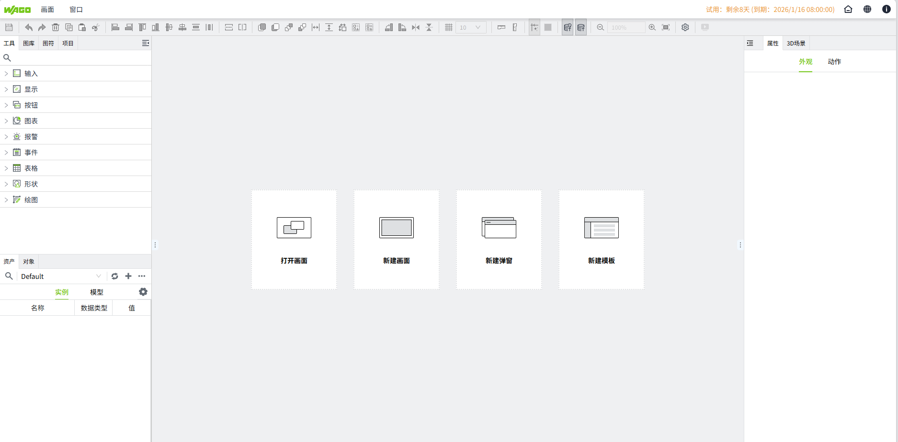
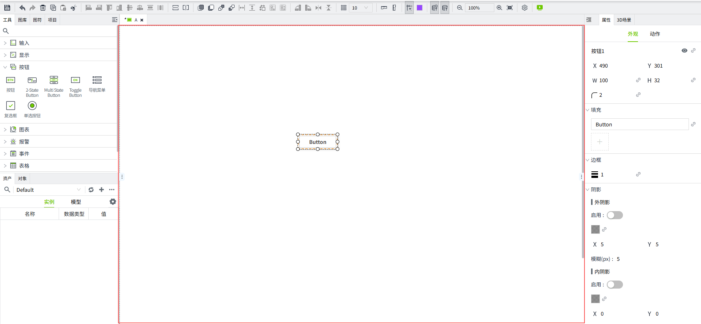
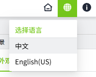
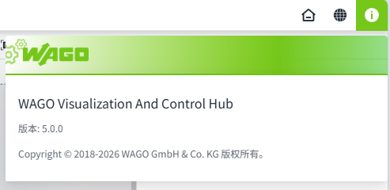

# 编辑器介绍

所有的组态画面需要在编辑器内进行绘制。WAGO VC Hub 内置了所见即所得的编辑器。所见即所得编辑器提供了实时预览、直观操作、减少错误、提升一致性等好处，使用户能够更轻松地创建和编辑内容，并获得更快速、直观的反馈。

首次打开项目时显示的欢迎窗口有如下几个快速启动选项。选择要创建的所需窗口类型来创建新窗口。再次打开时会显示上次关闭浏览器时已打开的窗口，您可以从上次离开的地方继续编辑。

### 工具栏

编辑器顶部有一个工具栏，当鼠标放在工具栏的任一按钮上时，会出现一个提示信息框标明此按钮的功能。

| **按钮**| **功能说明** | **按钮** | **功能说明**|
|------------------------------------------------------------------------------------------------------------------------------------------------------------------------------------------------------------|------------------------------------------------------------------------------------------------------------------------------------------------------------------------|------------------------------------------------------------------------------------------------------------------------------------------------------------------------------------------------------------|-------------------------------------------------------------------------------------------------------------------------------------------------------|
| | 保存当前编辑内容  |  | 将多个选中对象的宽度和高度同时调整为与基准对象的宽高相同   基准：   1. **通过Ctrl键多选**：以最后一个选中的对象为基准；  2. **通过鼠标框选**：以图层最高的元素为基准 |
|  | 撤销上一步操作  |  | 将多个选中对象组合成一个整体|
|  | 恢复被撤销的操作|  | 将已组合的对象拆分   |
|  | 删除选中的元素或控件 |  | 将选中对象按顺时针方向旋转90度  |
|  | 复制选中的元素 |  | 将选中对象按逆时针方向旋转90度 |
|  | 将复制的元素粘贴到画布中 |  | 将选中对象在水平方向上进行翻转 |
|  | 剪切选中的元素 |  | 将选中对象在垂直方向上进行翻转 |
|  | 将多个选中对象按照基准对象的左边界进行对齐   基准：   1. **通过Ctrl键多选**：以最后一个选中的对象为基准  2. **通过鼠标框选**：以图层最高的元素为基准 |  | 隐藏/显示画面的网格|
|  | 将多个选中对象按照基准对象的右边界进行对齐   基准：   1. **通过Ctrl键多选**：以最后一个选中的对象为基准  2. **通过鼠标框选**：以图层最高的元素为基准  |  | 设置网格的间隔大小   |
|  | 将多个选中对象按照基准对象的上边界进行对齐   基准：   1. **通过Ctrl键多选**：以最后一个选中的对象为基准  2. **通过鼠标框选**：以图层最高的元素为基准 |  | 隐藏/显示画面的水平标尺 |
|  | 将多个选中对象按照基准对象的下边界进行对齐   基准：   1. **通过Ctrl键多选**：以最后一个选中的对象为基准  2. **通过鼠标框选**：以图层最高的元素为基准|  | 隐藏/显示画面的垂直标尺 |
|  | 将多个选中对象以基准对象的水平中心线为参考，在水平方向上对齐于同一条中心线   基准：   1. **通过Ctrl键多选**：以最后一个选中的对象为基准  2. **通过鼠标框选**：以图层最高的元素为基准 |  | 隐藏/显示对齐参考线。  拖动组件时，靠近其他组件的边缘、中心线时，自动显示参考线，帮助用户快速实现精确对齐。|
|  | 将多个选中对象以基准对象的垂直中心线为参考，在垂直方向上对齐于同一条中心线   基准：   1. **通过Ctrl键多选**：以最后一个选中的对象为基准 2. **通过鼠标框选**：以图层最高的元素为基准 |  | 设置对齐参考线的颜色 |
|  | 在垂直方向上，把选中对象自动调整为上下间距相等的排列方式 | | 在设计器中加载/不加载历史数据 |
| | 在水平方向上，把选中对象自动调整为左右间距相等的排列方式 |  | 在设计器中加载/不加载实时数据 |
|  | 将选中对象相对于画面水平居中 |  | 缩小画布显示比例 |
| | 将选中对象相对于画面垂直居中|  | 显示当前画面的实际缩放比例，可手动修改比例值 |
| | 将选中对象上移一层|| 放大画布显示比例 |
|| 将选中对象下移一层  |  | 将画布显示比例调整为 100% |
| | 将选中对象移到最上层  | | 打开项目管理窗口 |
| | 将选中对象移到最下层  |  | 打开预览画面  |
| | 将多个选中对象的宽度调整为与基准对象的宽度相同   基准：   1. **通过Ctrl键多选**：以最后一个选中的对象为基准  2. **通过鼠标框选**：以图层最高的元素为基准  |   |   |
|  | 将多个选中对象的高度调整为与基准对象的高度相同   基准：   1. **通过Ctrl键多选**：以最后一个选中的对象为基准  2. **通过鼠标框选**：以图层最高的元素为基准 |  |  |

### 窗口菜单

编辑器带有许多窗口。您可以根据需要确认要打开的窗口，也可以根据使用习惯，调整窗口的显示位置和大小。

窗口显示形式示意：

形式一：

形式二：

| **窗口** | **描述**|
|:----------|:------------------------------------------------------------------------------------------------------------------------------------|
| 工具     | 用于显示所有控件，便于用于使用和查看。 |
| 图库     | 用于显示和管理图片素材。 |
| 图符     | 用于显示和管理所有图符。   |
| 项目     | 用于显示项目信息，包括项目的画面、画面模板、报表。 |
| 对象     | 以列表的形式显示当前所打开的画面上的所有控件，并显示每个控件的状态（锁定、隐藏、设置了动画、设置了动作），并于用户快速对某个控件进行操作。 |
| 资产     | 用于显示资产和变量信息。|
| 属性     | 显示属性配置界面，便于对画面和控件的属性进行设置。|
| 3D场景   | 显示3D 场景，用户通过该窗口去创建3D场景。|
| 重置     | 点击后，将所有的窗口恢复为默认设置。|

### 画面菜单

可以通过该菜单对画面进行新建、保存、关闭等操作。

| **功能** | **描述**                                 |
|:----------|:------------------------------------------|
| 新建画面 | 允许您创建新画面。                        |
| 新建弹窗 | 允许您创建新弹窗。                        |
| 新建模板 | 允许您创建新的画面模板。                  |
| 打开画面 | 允许您打开以前创建的画面，包括画面和弹窗。 |
| 打开模板 | 允许您打开以前创建的画面模板。            |
| 保存     | 保存当前显示的窗口。                      |
| 另存为   | 将当前显示的窗口另存为一个新的窗口。      |
| 保存全部 | 保存所有已打开的窗口。                    |
| 关闭     | 关闭当前显示的窗口。                      |
| 关闭全部 | 关闭所有已打开的窗口。                    |

### 画布

在该区域绘制画面。

### 项目配置

用于设置项目的启动画面、画面的loading效果，权限，运行画面是否需要自动登录。可以自行上传加载样式图片。 

### 预览项目

很多时候，测试已绘制的画面以确保某些绑定或脚本按预期方式工作是很有用的。编辑器可以进入预览模式，这将允许您与当前打开的窗口进行交互，您将能够直接与控件进行交互，而不是在控件之间单击并查看其属性，例如单击按钮以执行其脚本，或在文本字段中输入值以更新变量值。

点击”预览“按钮进入预览模式，在新的浏览器页签显示预览内容。

### 打开控制台菜单

点击后在新的浏览器窗口中打开控制台页面。

### 语言切换菜单

语言切换菜单用于切换不同的语言界面。允许用户根据自己的需要选择适合自己的语言，使用户能够更轻松地理解和操作软件界面。

### 关于菜单

提供有关 WAGO VC Hub 的信息，例如版本、版权等信息。

