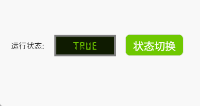
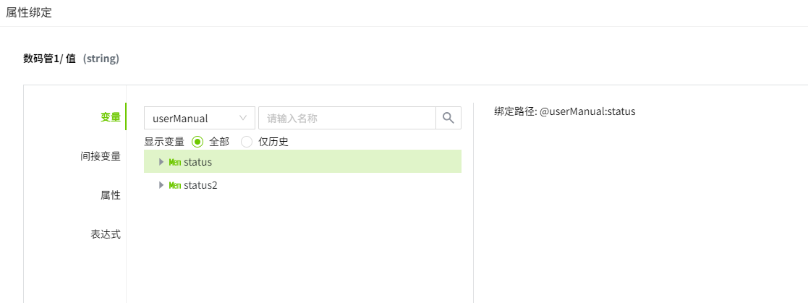
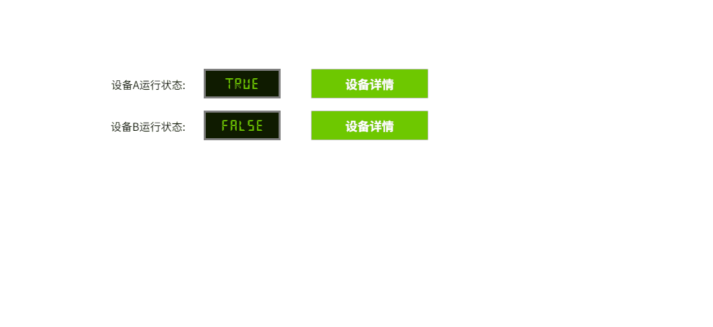

# 脚本

允许您编写自定义脚本实现更灵活的配置方式。

脚本可以通过获取页面上的控件，在运行时改变控件的属性。

如果需要同时执行两个或多个操作（导航，变量赋值等操作），则可以在脚本编辑器中组合这两个操作。

## 通过脚本修改控件外观

**示例**

点击按钮，修改数码管的外观样式。

1. 在画面上添加 Label、数码管和按钮控件。Label 控件的内容设置为“设备状态：”。数码管的内容设置为“RUNNING”，背景色设置为 #0f1b01，字体颜色设置为 #6ec800,  按钮的内容设置为“报警”，背景色设置为 #ff0000，字体颜色设置为 #ffffff。

2. 点击报警按钮，在动作窗口中，启用鼠标按下事件。操作类型选择“脚本”。

    

3. 在脚本编辑器中输入如下内容并保存：

    ```typescript
    const led = await System.UI.findControl('数码管1'); // 通过数码管控件名称获取页面上的数码管控件
    led.backgroundColor = '#ff0000'; // 修改背景颜色
    led.fontColor = '#fff'; // 修改字体颜色
    led.text = 'Error';  // 修改数码管文字信息
    led.applyChanges(); // 应用修改
    ```
 
4. 点击预览按钮，在预览页面点击报警按钮，查看数码管的样式变化。

    

**注意**: 使用脚本修改控件属性后需要调用 **applyChanges()** 方法应用当前修改。

## 通过脚本给变量赋值

**示例**

点击按钮，修改数码管绑定的数值。

1. 在画面上添加 Label、数码管和按钮控件。Label 控件的内容设置为“运行状态：”。数码管的内容默认为“true”， 按钮的内容设置为“状态切换”，背景色设置为 #6ec800，字体颜色设置为 #ffffff。

2. 在数码管的属性窗口选择文本并绑定路径为 userManual:status 的布尔值变量。

    

3. 点击状态切换按钮，在动作窗口中，启用鼠标按下事件。操作类型选择“脚本”。

    

4. 在脚本编辑器中输入如下内容并保存：

    ```typescript
    const ledStatus = await System.Tag.read('@userManual:status'); // 通过变量路径获取到变量信息
    const newValue = !ledStatus.value; 
    await System.Tag.writeValue('@userManual:status', newValue); // 给变量写入新值
    ```
 
5. 点击预览按钮，在预览页面点击状态切换按钮，查看数码管的内容变化。

    

**注意**: System.Tag.read() 可以读取到变量的更多信息。


## 通过脚本打开弹窗

**示例**

点击按钮，在弹窗中显示不同的内容。

1. 在画面上添加两个 Label、两个数码管和两个按钮控件。Label 控件的内容分别设置为“设备A运行状态：”和“设备B运行状态：”。两个数码管的内容默认为“true”，两个按钮的内容设置为“设备详情”，背景色设置为 #6ec800，字体颜色设置为 #ffffff。

2. 新建一个弹窗页面，名称设置为“设备详情”，用于接收脚本传值展示。

3. 两个数码管的文本属性分别绑定到 userManual:status 和 userManual:status2 这 2 个布尔变量。

    - 数码管1绑定:

    

    - 数码管2绑定:

    

4. 点击设备详情按钮，在动作窗口中，启用鼠标按下事件。操作类型选择“脚本”。

    

5. 分别在两个按钮的脚本编辑器中输入如下内容并保存:

    ```typescript
    // 按钮1内容
    const ledValue = await System.Tag.read('@userManual:status'); // 获取当前的设备运行状态
    System.UI.openPopup('设备详情', { // 打开弹窗
        titleBar:{
            title: "设备详情"  // 弹窗标题
        },
        position:{
            type: "follow" // 弹窗打开位置
        },
        pageProperties:{
        custom: { // 向弹窗传递的参数
            name: '设备A',
            status: ledValue.value
        }
        }
    });

    // 按钮2内容
    const ledValue = await System.Tag.read('@userManual:status2'); // 获取当前的设备运行状态
    System.UI.openPopup('设备详情', { // 打开弹窗
        titleBar:{
            title: "设备详情"  // 弹窗标题
        },
        position:{
            type: "follow" // 弹窗打开位置
        },
        pageProperties:{
        custom: { // 向弹窗传递的参数
            name: '设备B',
            status: ledValue.value
        }
        }
    });
    ```
 
6. 点击预览按钮，在预览页面点击两个设备详情按钮，查看弹窗内容。

    

