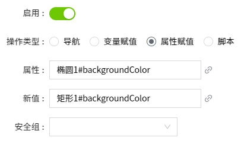

# 属性赋值

将同一画面上的一个属性的值赋给另一个属性。

**示例**

鼠标点击矩形控件时，将矩形的填充色赋给椭圆，作为椭圆的背景色。

1. 在画面上绘制一个矩形和一个椭圆控件，矩形的背景色设置为绿色，椭圆的背景色设置为白色。
2. 在矩形控件上，设置动作，选择鼠标按下事件。
3. 开启“启用”按钮，操作类型选择“属性赋值”。
4. 在“属性”中，选择椭圆的背景色属性。
5. 在“新值”中，选择矩形的背景色属性。
6. 安全组不设置。
7. 点击“**确认**”按钮。
8. 点击画面的“预览”按钮，查看运行效果。

**说明**：属性和新值的文本框内也支持手动输入内容。