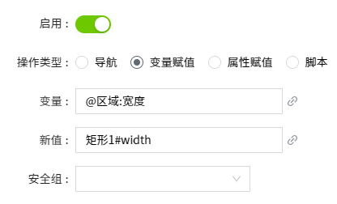

# 变量赋值

将当前画面上的控件属性值或者画面的自定义属性，赋给变量。

**示例**

将矩形的宽度，赋值给变量：宽度。

1. 在画面上绘制一个矩形控件和一个值显示控件。
2. 值显示控件绑定变量：width。
3. 在矩形控件上，设置动作，选择鼠标按下事件。
4. 开启“启用”按钮，操作类型选择“变量赋值”。
5. 在“变量”中输入变量路径或者单击变量后面的绑定图标，然后从变量选择器中选择变量：宽度。
6. 在“新值”中单击后面的绑定图标 ，在弹出的属性窗口中选择矩形的width属性。
7. 安全组不设置。
8. 点击“**确认**”按钮。
9. 点击画面的“预览”按钮，查看运行效果。

**说明**：变量和新值的文本框内也支持手动输入内容。 