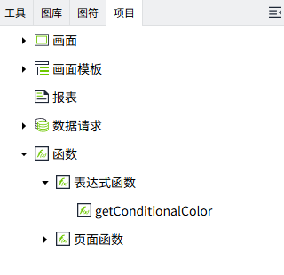
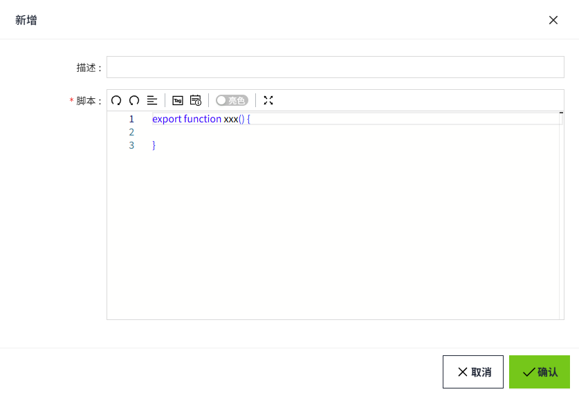

# 表达式函数

## 什么是表达式函数 ？

表达式函数是预先创建好的函数，可以在项目中的多个地方调用。执行表达式函数时，您可以通过传递参数来获取函数执行结果，从而避免重复编写逻辑代码。

表达式函数位于2D编辑器的“项目“>“函数“下。



## 创建表达式函数

在”函数”的“表达式函数”节点上单击鼠标右键，选择“新增”，可以创建表达式函数。




**注意**：表达式函数在使用过程中，是通过 **名称引用** 的，因此重命名时需对所有引用该函数的地方进行更新。

**属性**

| **名称** | **描述** |
|:----------|:-------|
| 描述     | 表达式函数的描述。 |
| 脚本     | **说明**：  <br>1. 表达式函数有且仅有一个`export function`，export function的名称即表达式函数的名称。 <br>2. 对于表达式函数，函数间的名称必须唯一。 <br>3. 如有需要也可以定义非export函数，但是其无法被外部脚本调用。 <br>4. 列表中显示的名称为 export 函数的名称。 <br>5. 表达式函数仅支持`tag`和`property`这两个系统函数，**不支持** `System`命名空间下的所有函数。 <br>6. 表达式函数和页面函数相互独立，不可以 **相互调用**。 |

## 在哪里使用表达式函数？

在任意支持 **表达式** 的属性绑定界面，都可以通过`ExpressionFunction`的命名空间获取创建好的表达式函数。


**场景举例**：判定储罐的报警等级

1. 创建名为`getTankAlarmLevel`的表达式函数，脚本如下：

    ```typescript
    // @param {number} level - 当前液位
    // @param {number} maxLevel - 最大液位
    // @returns {number} 报警等级：0-正常, 1-预警, 2-报警
    export function getTankAlarmLevel(level: number, maxLevel: number) {
        if (level >= maxLevel * 0.9 || level <= maxLevel * 0.1) {
            return 2; // 报警
        } else if (level >= maxLevel * 0.8 || level <= maxLevel * 0.2) {
            return 1; // 预警
        }
        return 0; // 正常
    }
    ```
 
2. 在画面上添加一个矩形控件，点击背景色的绑定按钮，绑定表达式属性。脚本如下：

    ```typescript
    const currentLevel = tag('@Default:currentLevel');
    const alarmLevel = ExpressionFunction.getTankAlarmLevel(currentLevel, 10);
    if(alarmLevel === 2){
    return "#FF0000";// 红色-报警
    }
    if(alarmLevel === 1){
    return "#FFFF00";// 黄色-预警
    }
    return "#00FF00";// 绿色-正常
    ```
 
