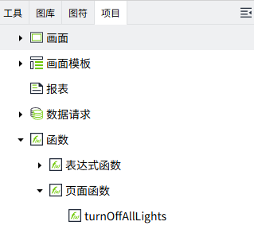

# 画面函数

## 什么是页面函数 ？

页面函数是预先创建好的函数，可以在项目中的多个地方调用。执行页面函数时，您可以通过传递参数来获取函数执行结果，从而避免重复编写逻辑代码。

页面函数位于编辑器的“项目”>“函数”下。



## 创建页面函数

在“函数”的“页面函数”节点上单击鼠标右键，选择“新增”，可以创建页面函数。


**注意**：页面函数在使用过程中，是通过名称引用的，因此重命名时需对所有引用该函数的地方进行更新。 

**属性**

| **名称** | **描述** |
|:----------|:--------------------|
| 描述     | 页面函数的描述。 |
| 脚本     | **说明**： <br>1. 页面函数有且仅有一个 `export function`，export function的名称即页面函数的名称。 <br>2. 对于页面函数，函数间的名称必须唯一。 <br>3. 如有需要也可以定义非export函数，但是其无法被外部脚本调用。 <br>4. 列表中显示的名称为export函数的名称。 <br>5. 页面函数和表达式函数相互独立，不可以相互调用。 |

## 在哪里使用页面函数？

在任意支持脚本的动作配置界面，都可以通过 `PageFunction` 的命名空间获取创建好的页面函数。


**场景举例**: 批量控制泵组启停。

1. 创建名为 `controlPumpGroup` 的页面函数，脚本如下：

    ```typescript
    // @param {string} command - 启停命令（Start 或 Stop）
    // @param {array} pumpTags - 泵控制标签数组
    // @returns {boolean} 操作是否成功
    export async function controlPumpGroup(command: 'Start' | 'Stop', pumpTags: Array<string>) {
        let successCount = 0;

        for (const tag of pumpTags) {
            try {
                await System.Tag.writeValue(tag, command == 'Start');
                successCount++;
            } catch (error) {
                console.error(`控制泵 ${tag} 失败:`, error);
            }
        }

        return successCount === pumpTags.length;
    }
    ```
 
2. 在按钮的鼠标按下事件中，调用该页面函数。

    ```typescript
    const pumpTags = [
        '@Default:Pump1_Control',
        '@Default:Pump2_Control', 
        '@Default:Pump3_Control'
    ];

    const result = await PageFunction.controlPumpGroup("Start", pumpTags);

    if (result) {
        console.log("所有泵启动成功");
    } else {
        console.log("部分泵启动失败");
    }
    ```