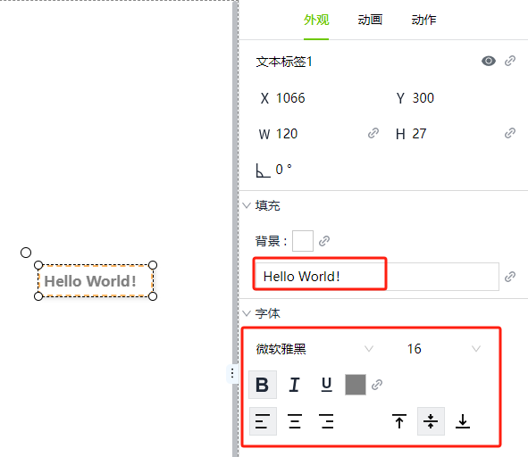
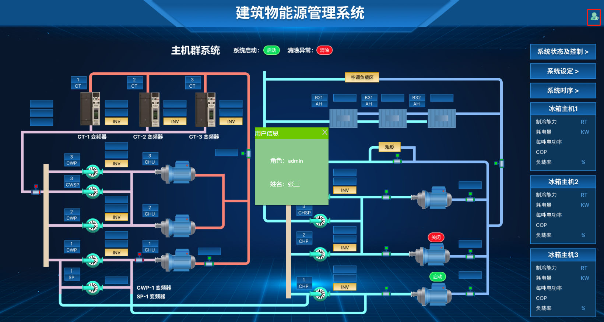

# 2D组态

通过2D组态界面，用户可以直观地了解和控制工业自动化系统中的各个部分，提高操作和管理效率。它广泛应用于工厂自动化、能源管理、楼宇自控等领域，帮助用户实现设备监控、数据分析和远程操作等功能。

以下是2D组态的一些主要功能：

### 控件

2D组态编辑器具有各种内置控件，例如绘图元素、按钮、图表等。每个控件都有多个属性来控制其外观、行为和数据。例如，矩形具有背景属性，文本标签具有文本、字体属性。

### 画面

有2种基本的窗口配置来定义窗口的行为方式：

- 画面 ：  填充整个窗口的画面。
- 弹窗 ： 弹出窗口是当用户执行单击鼠标等操作时出现（弹出）的窗口。 弹出窗口通常保持在当前窗口的顶部，直到关闭，使用户能够在返回上一个窗口之前快速选择选项或设置。

下面是一个画面示例，点击用户按钮时，弹出用户信息弹窗。

### 画面模板

使用画面模板可以大大缩短设计和开发时间。你不需要从零开始设计每个画面，而是可以基于现有的模板进行补充和完善。这样可以节省大量的时间和成本。

当需要对画面进行更新或修改时，画面模板可以简化维护流程。只需对模板进行修改，就可以自动应用到所有基于该模板创建的画面上，而不需要逐个修改每一个画面。

可以根据自己的需求进行模板设计。你可以调整布局、更改颜色和字体等，以满足特定的设计要求和用户需求。

### 图片

除内置控件外，还支持在画面上使用 SVG、PNG 、JPEG 、GIF、BMP、JPG格式的图片。

### 矢量图片

与其他图片类型相比，可缩放矢量图片 （SVG） 具有多个优点。因为它们是矢量图，所以可以在不损失清晰度或分辨率的情况下进行缩放。要在 WAGO VC Hub中使用图片，只需将图片直接拖到您希望它出现的画面位置。

### 绑定

绑定是一种机制，它允许控件上的属性根据WAGO VC Hub中其他位置的值的更改而更改。例如，Tag 的值可以绑定到仪表或数码管上。绑定的力量来自于绑定类型的多样性。

单击以下链接以获取有关绑定类型的完整信息：

- [SQL Query](property-binding/sql-query.md)
- [变量](property-binding/tag.md)
- [属性](property-binding/property.md)
- [表达式](property-binding/expression.md)
- [动态变量](property-binding/dynamic-tag.md)
- [动态单元格](property-binding/dynamic-cell.md) 
- [双向绑定](property-binding/bidirectional-bindings.md)

