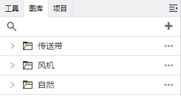
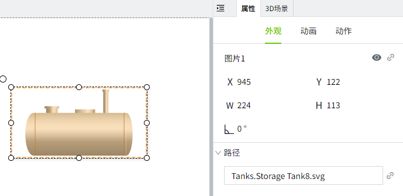
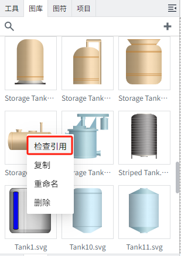
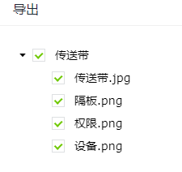

# 图库

在”图库“窗口中对图片进行管理。支持上传 SVG、PNG 、JPEG 、GIF、JPG 格式的图片。图片可以在画面，模板和图符中使用。

## 添加图片

点击图库右侧的新增按钮进行添加。

## 新增图库

您可以根据自己的喜好和实际需求添加图片。在图库窗口点击“新增”->“新增图库”后，会自动创建一个图库，且库名处于编辑状态。

您可以修改库名，修改完成后，单击库内的添加按钮。

将出现“打开”对话框窗口。只需在本地系统上找到您的图片，可以多选，然后单击对话框的“打开”按钮即可上传所选图片。

## 导入图库

当您本地已存在大量图片，可以通过导入图库的方式将这些素材导入到图库中。只需将这些已分类好的文件压缩为 zip 文件，然后点击图库窗口的“新增”->“导入图库”，弹出导入窗口。

点击“上传zip文件”按钮，将出现“打开”对话框窗口。只需在本地系统上找到您的 zip 文件，可以多选，然后单击对话框的“打开”按钮即可上传所选文件。

上传后，会以上传的 zip 文件的名称作为库名， 对应的图片显示在相应的库下。

**注意：** 只有直接显示在 zip 下一级的图片才会被导入。例如下图 others 目录下的所有内容将不会被导入。

## 引用系统库

WAGO VC Hub 内置了丰富的图片素材，在图库窗口点击“新增”->“引用系统库”后，用户可以查看并选择将哪些内置素材添加到图库中。

添加到图库后：

**注意：** 引用的系统图片不支持编辑和删除。若不想继续使用，可以点击库的删除按钮，删除引用。系统库的删除不是真正的删除库，而是删除引用关系，后续可以再次引用。

## 使用图片

1. 将图片上传到图库中。
2. 从图库中将图片直接拖拽到画面上。

**图片路径**

将图片添加到画面后，在属性中会显示图片的路径。**路径**：图库名称.图片名称。

如果是系统库的图片，会在路径的最前面显示。**路径**：图库名称.图片名称。

图片路径支持绑定。

**示例**：当设备处于不同的运行状态时，显示不同的图片。

**步骤**：

1. 在画面上绘制两个按钮，名称分别为：**运行，停止**。

2. 为运行按钮设置鼠标按下动作。

    - 对于 **运行** 按钮：按下时，将标签 `@Region:Motor1.RunningStatus` 的值修改为 `1`，表示设备已开启。

    - 对于 **停止** 按钮：按下时，将标签 `@Region:Motor1.RunningStatus` 的值修改为 `0`，表示设备已停止。

    

3. 在画面上绘制一个文本框，内容设置为：**运行状态**。

4. 从系统库中拖入一个图片到画面上。点击画面路径的 **绑定按钮**，编写如下表达式：

    

5. 点击预览按钮，在预览页面，点击运行按钮时，按钮显示为绿色，点击停止按钮时，按钮显示为红色。

    

**查看图片引用**

您可以快速查看图片的引用关系，以确定图片被哪些地方使用。方法是在图库的图片上右击鼠标，点击“检查引用”，将会弹出引用列表, 显示详细的引用信息。

**缩放图片**

选中图片后，可以拖动鼠标对图片进行缩放。

对于 **SVG** 格式图片，按住 **Shift键** 后拉动图片的四个顶角，对图片进行缩放，将进行 **等比缩放**。

**移动图片**

您能修改图片的路径。要将图片移动到其他图库，请点击拖动图片并移动到目标库上，实现更改图库。

**注意:** 

1. 不支持将图片移动至系统库。

2. 系统库中的图片可以拖拽到用户自行创建的图库中。拖拽操作相当于将图片复制到目标图库，系统库内的原始图片不会受到影响。

## 复制/粘贴图片

在图库中右击图片，点击 **复制** 选项，可以对图片进行复制。系统库的图片和用户自己上传的图片，均支持复制。

复制后，点击图库右上角的“...”按钮或者图库的空白处，进行粘贴。

**说明**：只能将复制的图片粘贴到用户自行创建的图库中，系统库不支持粘贴。 

## 导出图片

#### 导出图库

在图库后面点击导出按钮，可以将图库内的素材进行导出。

在导出窗口中，可以选择需要导出的图片。

#### 导出项目

导出项目时不会导出系统库，其他的图库会。将导出的项目在另一个工程导入时，如果导出的项目使用了系统库的图片，工程导入后需再次引用一下系统库，否则画面上已用到的系统库图片将显示为破裂的图片。

#### 导出工程

导出工程时，会将所有图库一起导出。将导出的工程在其他节点导入时，打开工程下的项目画面，画面上使用的图片均可以正常显示。

