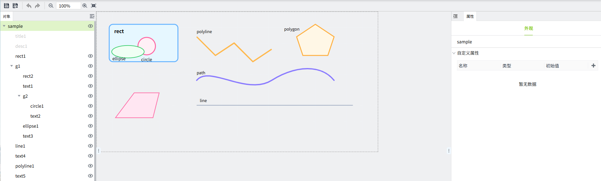
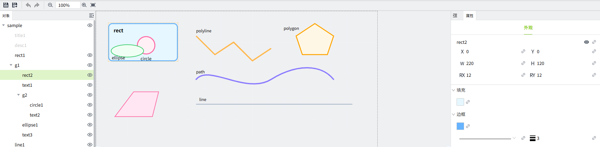
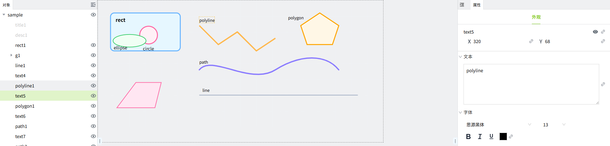
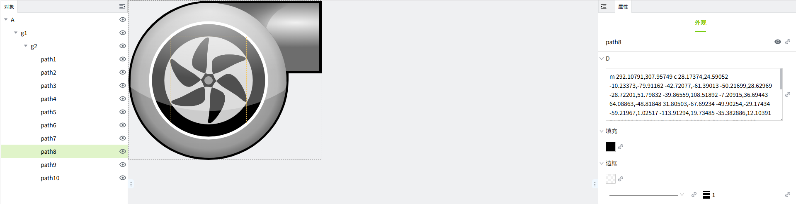
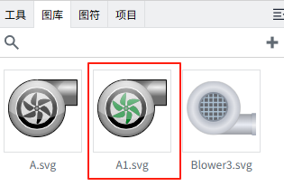
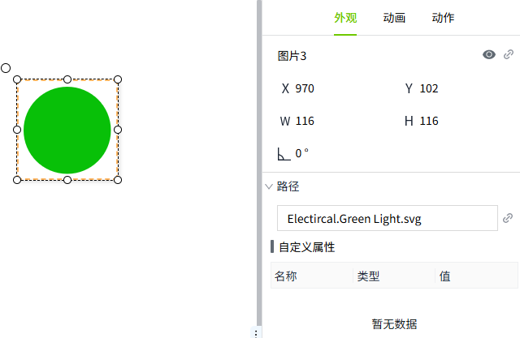
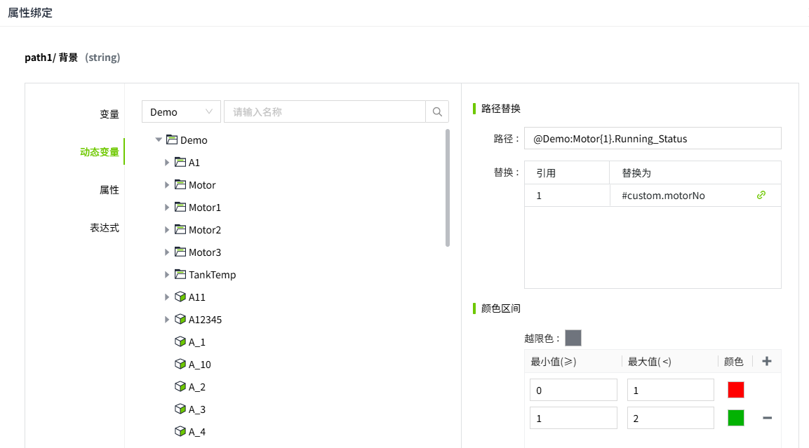
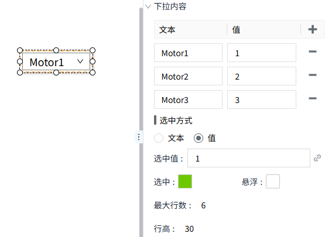
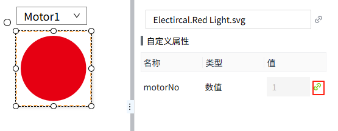

# SVG编辑器

SVG编辑器用于对图库中的SVG图形进行编辑，包括背景色，边框色，可见性，位置，尺寸，文本等。

## 如何打开SVG编辑器

有如下4种方式，可以打开SVG编辑器。

- 在图库中，双击SVG格式的图片
- 在图库的SVG格式图片上右击鼠标，在菜单中点击”编辑“
- 在画面上双击SVG格式的图片
- 在画面中的SVG格式图片上右击鼠标，在菜单中点击”编辑“

SVG编辑器界面如下：

## 支持编辑的元素类型

- rect
- circle
- ellipse
- line
- polyline
- polygon
- path
- text
- group

不支持编辑的元素类型，在对象窗口中会显示为灰色。

## 元素属性

#### rect

**属性**

| **名称** | **描述**                         |
|:----------|:----------------------------------|
| 名字     | 此控件的名称。                    |
| X        | 控件左侧距画布左侧的距离，单位px。 |
| Y        | 控件顶部距画布顶部的距离，单位px。 |
| W        | 控件的宽度，单位px。               |
| H        | 控件的高度，单位px。               |
| RX       | 矩形水平方向上圆角的半径。        |
| RY       | 矩形垂直方向上圆角的半径。        |
| 填充     | 矩形的填充色。                    |
| 边框颜色 | 矩形的边框颜色。                  |
| 边框粗细 | 矩形的边框粗细。                  |

#### circle

**属性**

| **名称** | **描述**                       |
|:----------|:--------------------------------|
| 名字     | 此控件的名称。                  |
| CX       | 圆心在水平方向上的位置，单位px。 |
| CY       | 圆心在垂直方向上的位置，单位px。 |
| R        | 圆的半径，单位px。               |
| 填充     | 控件的填充色。                  |
| 边框颜色 | 控件的边框颜色。                |
| 边框粗细 | 控件的边框粗细。                |

#### ellipse

**属性**

| **名称** | **描述**                             |
|:----------|:--------------------------------------|
| 名字     | 此控件的名称。                        |
| CX       | 椭圆的圆心在水平方向上的位置，单位px。 |
| CY       | 椭圆的圆心在垂直方向上的位置，单位px。 |
| RX       | 椭圆在水平方向上的半径，单位px。       |
| RY       | 椭圆在垂直方向上的半径，单位px。       |
| 填充     | 控件的填充色。                        |
| 边框颜色 | 控件的边框颜色。                      |
| 边框粗细 | 控件的边框粗细。                      |

#### line

**属性**

| **名称** | **描述**                               |
|:----------|:----------------------------------------|
| 名字     | 此控件的名称。                          |
| X1       | 直线起始点的水平（X 轴）坐标，单位px。     |
| Y1       | 直线起始点的垂直方向（Y 轴）坐标，单位px。 |
| X2       | 直线终点的水平（X 轴）坐标，单位px。       |
| Y2       | 直线终点的垂直方向（Y 轴）坐标，单位px。   |
| 边框颜色 | 控件的边框颜色。                        |
| 边框粗细 | 控件的边框粗细。                        |

#### polyline

**属性**

| **名称** | **描述**   |
|:----------|:-----------|
| 名字     | 此控件的名称。|
| 点       | 一串坐标点，其形式为    x1， y1    x2， y2    x3， y3    …   会从第一个点开始，依次连接后面的点，形成一条折线。 |
| 边框颜色 | 控件的边框颜色。|
| 边框粗细 | 控件的边框粗细。|

#### polygon

**属性**

| **名称** | **描述**    |
|:----------|:-------------|
| 名字     | 此控件的名称。|
| 点       | 一串坐标点，其形式为    x1， y1    x2， y2    x3， y3    …   会从第一个点开始，依次连接后面的点，和 polyline 不同，polygon 会自动把最后一个点连回第一个点，形成闭合区域。 |
| 填充     | 控件的填充色。 |
| 边框颜色 | 控件的边框颜色。  |
| 边框粗细 | 控件的边框粗细。|

#### path

**属性**

| **名称** | **描述**  |
|:----------|:---------------|
| 名字     | 此控件的名称。 |
| D        | “D”属性是一个包含一系列指令和坐标值的字符串。这些指令和坐标值决定了路径的形状。  常见的指令有：   - **M**：移动到指定位置。M10,10：移动到（10，10）点。   - **L**：绘制一条线至指定位置。L100，100：从（10，10）点绘制一条线至（100，100）点。   - **C**：绘制一个三次贝塞尔曲线。C40，10， 65，10， 95，50：绘制一个带有控制点（40，10）和（65，10）以及终点（95，50）的三次贝塞尔曲线。   - **S**：绘制一条平滑的贝塞尔曲线。S150，150， 200，100：绘制一条带有自动计算的控制点并以（200，100）点结束的平滑三次贝塞尔曲线。   - **Q**：绘制一个二次贝塞尔曲线。Q50，10， 90，50：绘制一个带有控制点（50，10）和终点（90，50）的二次贝塞尔曲线。   - **T**：绘制一条平滑的二次贝塞尔曲线。T150，150：绘制一条带有自动计算的控制点并以（150，150）点结束的平滑二次贝塞尔曲线。   - **Z**：闭合路径（返回起始点）。Z：闭合路径并返回起始点。 |
| 填充     | 控件的填充色。|
| 边框颜色 | 控件的边框颜色。 |
| 边框粗细 | 控件的边框粗细。 |

#### text

**属性**

| **名称** | **描述**                                         |
|:----------|:--------------------------------------------------|
| 名字     | 此控件的名称。                                    |
| X        | 控件左侧距画布左侧的距离，单位px。                 |
| Y        | 控件顶部距画布顶部的距离，单位px。                 |
| 文本     | 文本内容。                                        |
| 字体     | 设置字体样式，字体大小，加粗，倾斜，下划线，字体颜色。 |

#### group

**属性**

| **名称** | **描述**      |
|:----------|:---------------|
| 名字     | 此控件的名称。 |

## 示例

**示例1：** 手动修改 SVG 图片中元素的颜色。

1. 双击图库中的一张svg图片，例如下图的A.svg

    

2. 在SVG编辑器中的对象窗口中，选中一个path元素

    

3. 将填充色修改为绿色并另存为A1

    

4. 在图库中查看保存后的图片，显示修改后的效果。

    

**示例2：** 通过属性绑定，动态改变 SVG 图片中元素的颜色。

1. 从图库中添加一个 SVG 图片到画面上

    

2. 双击该图片，打开 SVG 编辑器

3. 在 SVG 编辑器内，选择一个元素，点击其填充色的绑定按钮

    

4. 绑定一个数值型变量，并设置如下颜色区间。

    

5. 保存后关闭 SVG 编辑器，点击画面的预览按钮，查看图片的预览效果，会发现随着变量值的变化，SVG 图片呈现不同的颜色效果。

    

**示例3：** 通过属性 SVG 图片的自定义属性，反应不同设备的运行状态。

1. 从图库中添加一个 SVG 图片到画面上，该图片用作反应设备运行状态的指示灯

    

2. 双击该图片，打开 SVG 编辑器

3. 在 SVG 编辑器内，点击图片的根节点，为其添加一个自定义属性 motorNo,用作设备编号

    

4. 点击元素，例如上图的 path1, 为其填充色绑定动态属性，用于显示 Motor1,Motor2，Motor3 的运行状态，并为状态值设置对应的填充色。

    

5. 保存并关闭SVG编辑器，在画面上添加一个下拉框，将其下拉内容的 **文本** 和 **值** 设置为下图所示内容。

    

6. 将SVG的自定义属性绑定到下拉框的 selectedValue 属性。

    

    

7. 点击预览按钮，在运行页面，切换下拉选项时，SVG 图片会根据对应设备的运行状态，显示不同的颜色。

    

