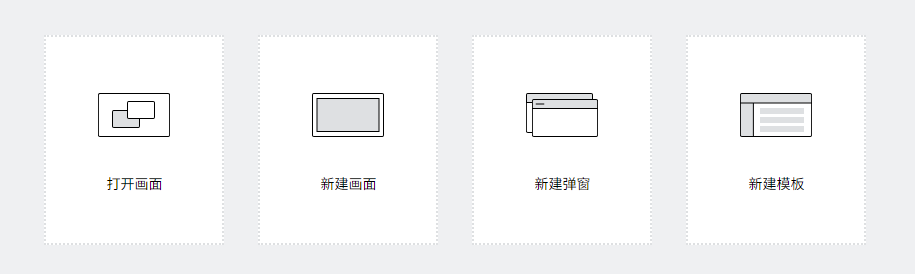
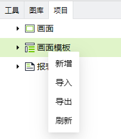

# 画面模板

画面模板是一个预定义的布局和设计，模板内包括一组已定义好的控件、排列方式、颜色和字体等，它是一个完整的画面。

通过使用画面模板，可以快速创建新的画面并应用现有的设计和布局。当需要对系统进行更新或修改时，只需更新模板即可，而不必逐个修改每个画面。

画面模板分为5个区域：**主区域、上边栏、下边栏、左边栏、右边栏**。其中主区域不可编辑，其他区域可编辑。

## 创建画面模板

入口1：在 “画面” 菜单中，点击 “新建模板”。

入口2：在编辑器的引导页面（首次打开编辑器或者编辑器内未打开任何画面），点击 “新建模板”。

入口3：在 “项目” 窗口的 “画面模板” 节点上右击，在弹出的菜单中点击 “新增”。

#### 模板属性

| **名称** | **描述**  |
|:----------|:------------------------------------------------------------------------------------------------------------------------------------------------------------------------------------------------------------------------------------------------------------------------------------------------------------------------------------------------------------------------------------------------------------------------------------------------------------------------------------------------------------------------------------------------------------------------|
| W        | 模板画面的宽度，单位px。 |
| H        | 模板画面的高度，单位px。 |
| 背景     | 模板的背景色。 |
| 布局     | 可以设置每个区域的尺寸。点击下面的按钮，可以设置区域在水平、垂直方向上的铺满方式。    向左铺满画面。   向右铺满画面。   向上铺满画面。    向下铺满画面。 |

**如何查看画面模板属性**

1. 点击画面模板的空白区域
2. 点击画面模板的tab页名称

    

3. 点击画面模板之外的灰色区域，下图红框内区域。

    

**布局样式示例：**

- 上边栏和下边栏水平方向上铺满整个画面。

    

- 左边栏在垂直方向上铺满，上边栏右边铺满，右边栏下边铺满。

    

## 使用画面模板

在画面的属性中，选择需要使用的画面模板。

画面引用画面模板后，不可以对模板的内容进行编辑，只可以在模板的主区域内进行画面绘制。

