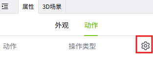
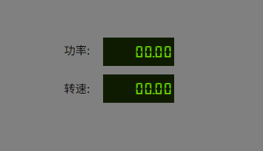
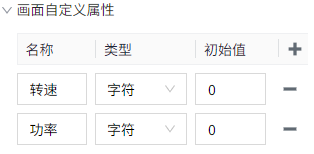
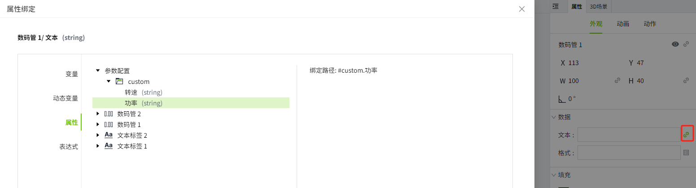
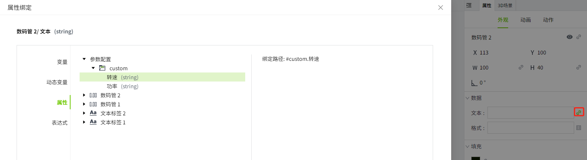
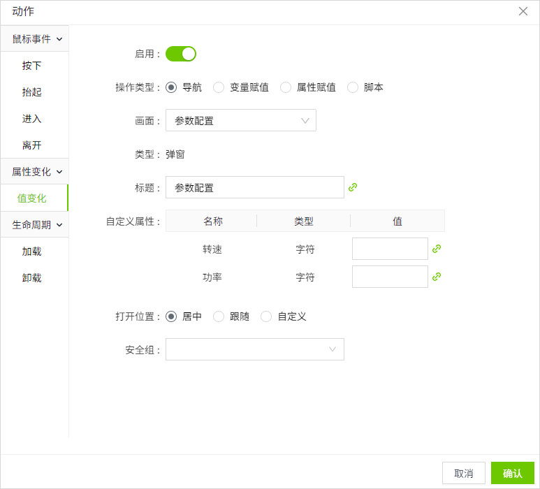
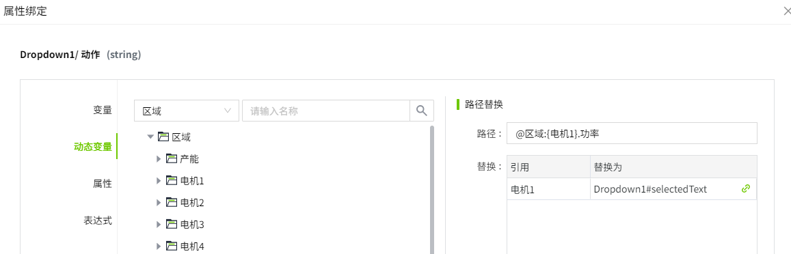

# 画面导航

通过设置画面导航，您可以在WAGO VC Hub 中的不同画面之间跳转。

在控件的动作属性中，进行导航设置。

## 导航步骤

1. 选择一种动作类型，例如：鼠标按下。
2. 开启“启用”按钮。
3. 选择画面。选择后会自动显示 [画面类型](page-type.md) 及其自定义属性。如果画面类型是弹窗，还会显示弹窗的标题。

    
    

4. 设置打开位置。
5. 点击”确认”按钮。

## 标题

当画面类型为弹窗时，显示该属性。支持修改和绑定。参见下方 **示例2**。

## 自定义属性

选择画面后，自动显示该画面的自定义属性，支持修改和绑定。参见下方 **示例2**。

## 打开位置

#### 画面

- 替换窗口：原窗口关闭，用新窗口替换原来的窗口。

- 新标签页：原窗口不受影响，在浏览器的新标签页显示新窗口。

#### 弹窗

- 居中：弹窗的位置显示在窗口的中间。

- 跟随：弹窗显示在鼠标当前点击的位置上。

- 自定义：您可以自己设置弹窗的位置。

## 脚本

以下脚本函数可用于画面导航：

- [​System.UI.back​](../../appendix/system-function/system-ui/system-ui-back.md)
- [​System.UI.close​](../../appendix/system-function/system-ui/system-ui-close.md) 
- [System.UI.forward](../../appendix/system-function/system-ui/system-ui-forward.md) 
- [System.UI.goHome](../../appendix/system-function/system-ui/system-ui-gohome.md) 
- [System.UI.open](../../appendix/system-function/system-ui/system-ui-open.md)
- [System.UI.openNewTab](../../appendix/system-function/system-ui/system-ui-opennewtab.md) 
- [System.UI.openPopup](../../appendix/system-function/system-ui/system-ui-openpopup.md) 

## 导航示例

**示例1：** 使用按钮控件，实现两个画面间的导航。

1. 在“项目”窗口中，右键单击“画面”节点，在弹出的菜单中点击“新建画面，”创建一个新的画面：画面1。重复此步骤创建画面 2。画面1的背景色设置为橙色，画面2的背景色设置为蓝色。

    

2. 在画面1上拖入一个文本标签和按钮控件。文本标签内容称设置为：画面1，按钮填充内容设置为：打开画面2。

    

3. 在画面1上的按钮的动作中，设置鼠标按下时导航到画面2。

    

4. 在画面2上拖入一个文本标签和按钮控件。文本标签内容称设置为：画面2，按钮填充内容设置为：打开画面1。

    

5. 在画面2上的按钮的动作中，设置鼠标按下时导航到画面1。

    

6. 回到画面1，点击预览按钮，查看运行效果。

    在画面1上点击 “打开画面2” 按钮时，显示画面2；在画面2上点击 “打开画面1” 按钮时，显示画面1。

    

**示例2：** 在下拉框中选择不同的设备，弹出设备的”参数设置“弹窗。

1. 创建一个画面：画面1，在画面上添加一个下拉框控件。下拉选项设置为：

    

2. 创建一个弹窗，名称为：参数配置。弹窗上放置两个“文本标签“控件和两个“数码管“控件。文本标签的内容分别设置为：功率，转速。功率后面的数码管名称为：数码管1；转速后面的数码管名称为：数码管2。

    

    

3. 在弹窗上创建2个自定义属性：功率，转速。

    

    数码管1的 “文本” 绑定到画面自定义属性的 “功率”。

    

    数码管2的 “文本” 绑定到画面自定义属性的 “转速”。

    

    保存弹窗。

4. 在 “画面1” 上点击下拉框控件，在 “动作” 属性中设置值变化，如下所示。

    **操作类型**：导航。

    **画面**：选择 “参数配置”。

    

    **标题：** 绑定表达式  "参数设置"+"_"+ property('Dropdown1#selectedText')

    

    **自定义属性：** 转速的值绑定到动态变量，当下拉框选择 “电机1” 时，转速值的变量路径为：@区域:电机1.转速；当下拉框选择 “电机2” 时，转速值的变量路径为：@区域:电机2.转速。

    

    功率的值绑定到动态变量，当下拉框选择 “电机1”时，转速值的变量路径为：@区域:电机1.功率；当下拉框选择 “电机2” 时，转速值的变量路径为：@区域:电机2.功率。

    

5. 保存画面，点击 “预览” 按钮，切换下拉框的选项时，弹窗中根据下拉框的当前选项，显示不同的内容。

     

