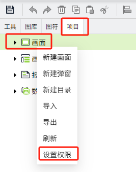
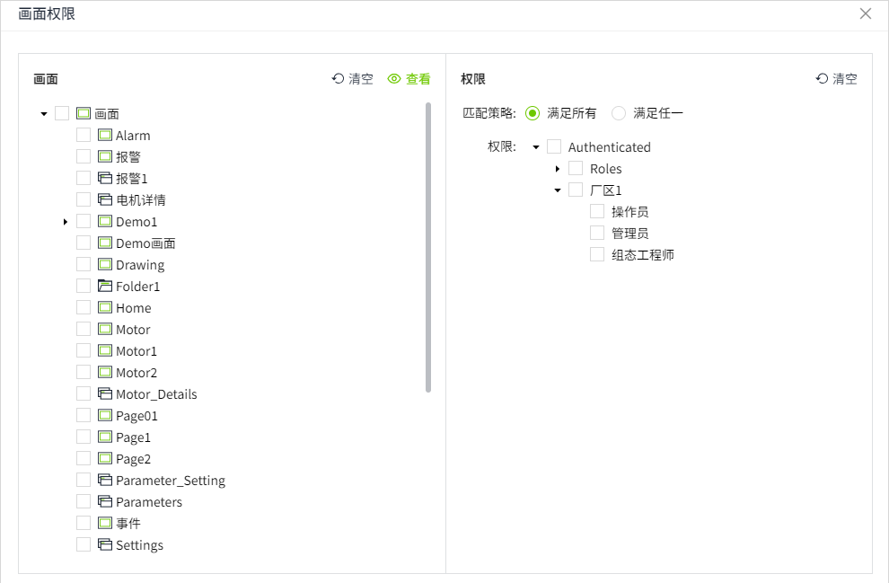
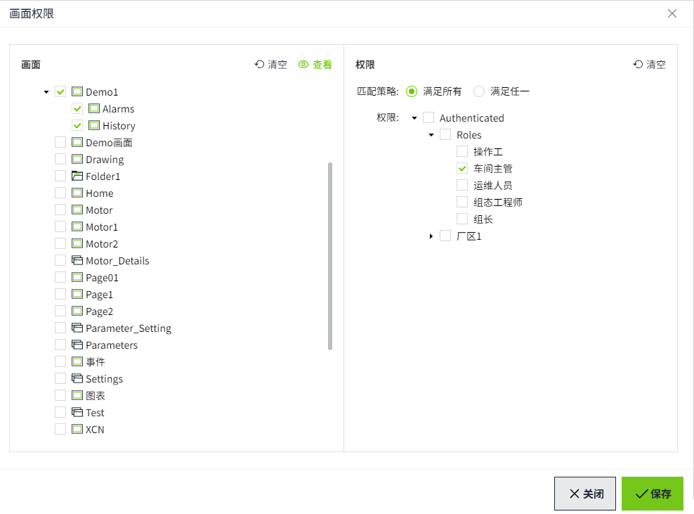
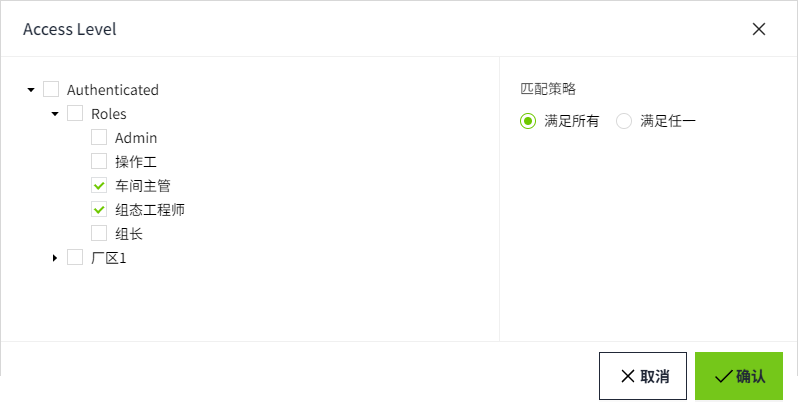

# 画面权限

您可以在WAGO VC Hub 中为画面设置安全性。设置安全性后，只有满足该安全性要求的用户，才能成功查看该画面的运行画面。

画面创建后，会有一个初始权限：Authenticated.

## 画面权限设置方式：

- 批量设置权限
- 为单个画面设置权限

## 批量设置画面权限

1. 在编辑器的 “项目” 窗口中，右击 “画面” 节点，在弹出的菜单中点击 “设置权限” 按钮。

   

2. 在弹出的画面权限窗口中，在窗口左侧选择画面，默认所有画面均不选中。画面支持多选。点击画面区域的“清空”按钮，可以清除所有已选画面。

   

3. 选择画面后，在弹窗右侧的权限区域为所选画面 **设置权限**。

   点击权限区域的“**清空**”按钮，可以清除所有已选权限。

   - **匹配策略**：只能单选。默认选择“满足所有”，可以修改。
      - 当选择“满足所有”时，用户需具有该画面设置的所有权限时，才能查看该画面的运行画面；
      - 当选择“满足任一”时，用户只需具有该画面设置的其中一个权限，就可以查看该画面的运行画面。
   - **权限**：在权限树上为这些画面设置权限。默认所有权限均不选中。支持多选。不可以同时选择父节点及其子节点。

4. 设置完成，点击“**保存**”按钮，进行保存。例如下图，为画面 **Demo1,Alarms,History** 设置了 **Authenticated/Roles/车间主管** 的权限。

   

5. 点击 **保存** 按钮后，弹窗不会关闭，画面和权限重新处于清空状态，可以继续选择其他画面为其设置权限。
6. 如果想查看画面已设置的权限，可以点击画面区域的“**查看**”按钮，查看每个画面已设置的权限。

   

**说明：**  

1. 目录节点无需设置权限。 

2. 在进行批量设置时，勾选画面后，不会在右侧的权限区域显示这些区域已经设置的权限，请通过画面区域的“**查看**”按钮进行查看。 

## 为单个画面设置权限

1. 在编辑器的“**项目**”窗口中，在画面树上右击单个画面，在弹出的菜单中点击“**设置权限**”按钮。

   

2. 在弹出的 **Access Level** 弹窗中，为该画面设置权限。会 **默认显示该画面已设置的权限和匹配策略**。可以重新设置。

   

3. 设置完成，点击“确认”按钮，完成对该画面的权限设置。

**示例1：**

用户的权限和画面权限一致，查看运行画面。

1. 创建一个用户，用户的角色为：操作工。
2. 创建一个画面A，为画面设置权限。画面权限为：Authenticated/Roles/操作工
3. 该用户查看画面A的运行画面，可以成功查看。

**示例2：**

画面的access level路径包含在用户的accesss level路径内，用户有权查看画面。

1. 创建一个用户，通过Identity Provider->User Grants将用户的access level设置为：Authenticated/车间A/组长

2. 创建一个画面A，为画面设置权限。画面权限为：Authenticated/车间A

3. 该用户查看画面A的运行画面，可以成功查看。

**示例3：**

用户的 access level 路径包含在画面的 accesss level 路径内，用户无权查看画面。

1. 创建一个用户，通过Identity Provider->User Grants将用户的access level设置为：`Authenticated/车间A`

2. 创建一个画面A，为画面设置权限。画面权限为：`Authenticated/车间A/组长`

3. 该用户查看画面A的运行画面，无权限查看。

   

