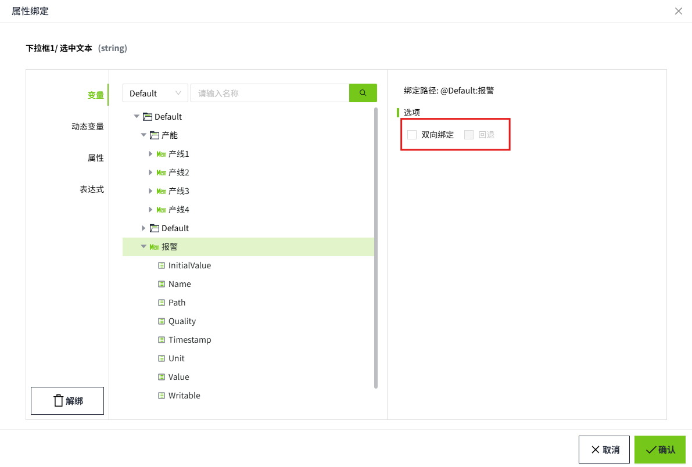
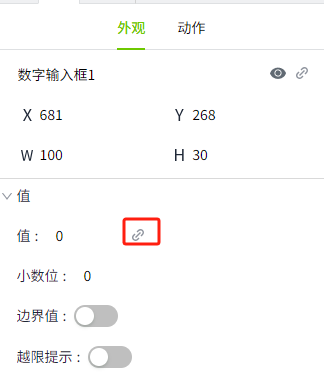
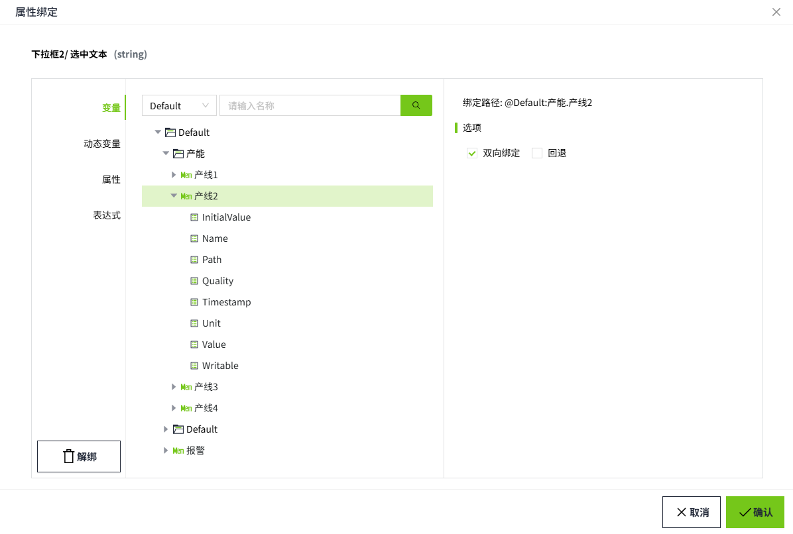
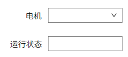

# 双向绑定

双向绑定指的是控件的属性与变量、间接变量、属性之间的自动同步。

这意味着，当数据源发生变化时，控件样式或值会自动更新；当用户修改控件样式或者值时，也会自动更新数据源。

## 支持双向绑定的控件及其属性

| **控件**   | **属性**        |
|:------------|:-----------------|
| 文本输入框 | 文本            |
| 数字输入框 | 值              |
| 滑动条     | 值              |
| 复选框     | 选中            |
| 单选按钮   | 选中文本/选中值 |
| 下拉框     | 选中文本/选中值 |
| 日历       | 日期            |

## 双向绑定变量

在属性绑定窗口，选择变量后，可以勾选“**双向绑定**”。开启双向绑定后，可以设置回退，当属性更改失败时，回退到上一次的有效值。

**示例**

数字输入框和变量进行双向绑定。

1. 在画面上绘制一个数字输入框。
2. 点击控件的“值”属性的绑定按钮。

    

3. 在属性弹窗中选择变量后，勾选“双向绑定”，点击确认按钮，完成绑定。

    

4. 在运行页面，当变量的值发生变化时，数字输入框内显示的值同步变化；在数字输入框输入值后点击回车键，会将输入的值回写到绑定的变量上。

## 双向绑定属性

在属性绑定窗口，选择属性后，可以勾选“**双向绑定**”。开启双向绑定后，可以设置回退，当属性更改失败时，回退到上一次的有效值。

**示例**

数字输入框和滑动条进行双向绑定。

1. 在画面上绘制一个数字输入框和一个滑动条控件。
2. 点击数字输入框的“值”属性的绑定按钮。

    

3. 在属性弹窗中选择滑动条的 **value** 属性后，勾选“双向绑定”，点击“确认”按钮，完成绑定。

    

4. 在运行页面，当滑动条的值发生变化时，数字输入框内显示的值同步变化；在数字输入框输入值后点击回车键，滑动条的值随之变化。

    

## 双向绑定动态变量

在属性绑定窗口，选择动态变量后，可以勾选“双向绑定”。开启双向绑定后，可以设置回退，当属性更改失败时，回退到上一次的有效值。

**示例**

文本输入框绑定间接变量，用来显示不同的电机的运行状态，当下拉框选择不同的电机时，在文本输入框内显示该电机的运行状态，并且可以修改电机的运行状态。

1. 在画面上绘制一个文本输入框，一个下拉框，2 个文本标签控件。

    

2. 下拉框控件的下拉选项设置为：电机 1，电机 2，电机 3。
3. 点击文本输入框的“文本”属性的绑定按钮。

    

4. 在属性弹窗中选择间接变量后，进行如下设置，勾选“双向绑定”，点击“确认”按钮，完成绑定。

    

5. 在运行页面，当下拉框的选项发生变化时，文本输入框的值随之变化。选择电机 1 时，文本输入框显示电机1的运行状态，选择电机 2 时，文本输入框显示电机 2 的运行状态。
6. 在文本输入框内输入 **true** 或者 **false**, 点击回车键，会修改当前所选电机的运行状态。

