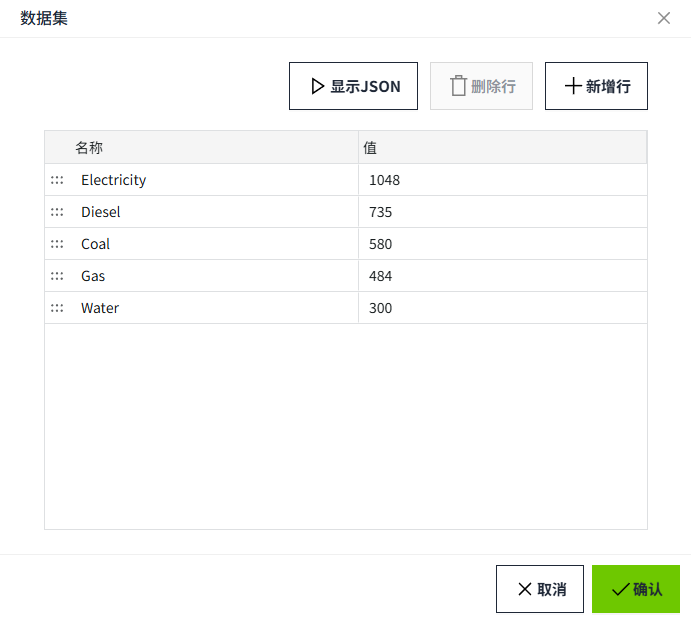
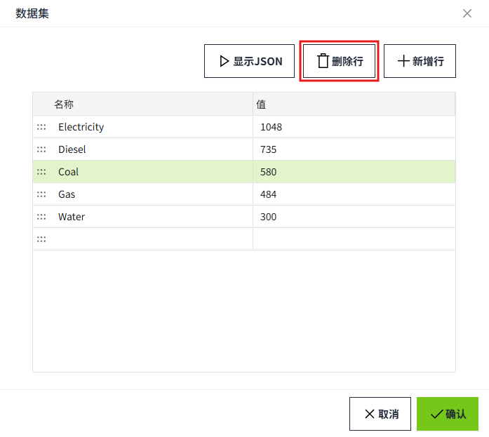
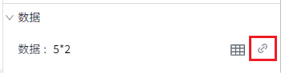
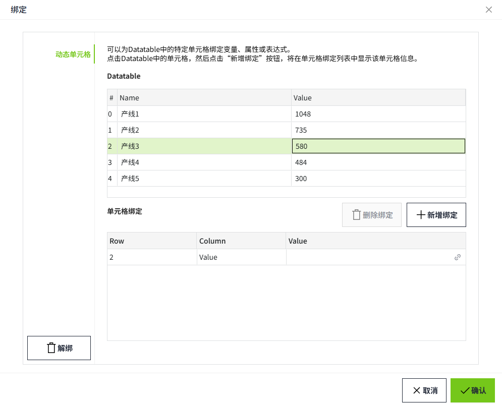
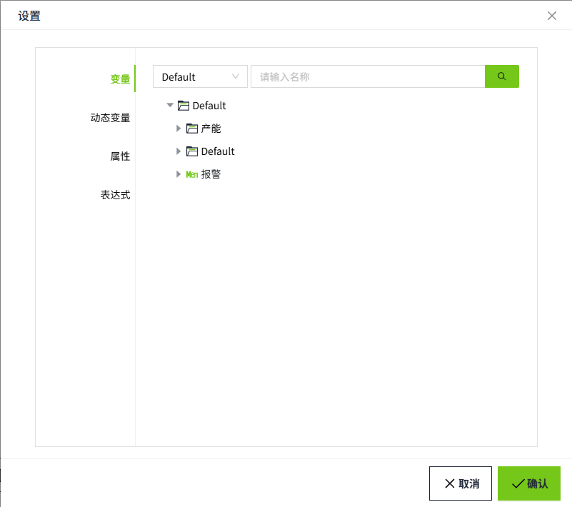

# 动态单元格

动态单元格绑定允许您将数据集内的单元格绑定到 Tag 或属性上，使您能够轻松地使数据集中的一个或多个单元格动态化。

目前支持的控件有：柱状图、饼图、自定义曲线。

## 数据集设置

 以饼图为例，点击数据后面的数据集按钮。

弹出如下数据集窗口。

#### 新增数据

- 如若未选中某一行，此时点击“新增行”按钮，将在列表末尾新增一行；
- 如果鼠标点击了某行，该行处于选中状态，此时点击“新增行”按钮，将在该行的下方新增一行；

双击文本框，可编辑内容。

#### 查看数据集

在数据集弹窗中，点击“显示JSON”按钮可以展示数据集的数据结构。当您想通过脚本操作控件的数据集(data)属性时，可以参照此Json格式，在此基础啊上进行修改。

#### 删除数据

鼠标点击需要删除的行，此时该行处于选中状态，点击“删除行”按钮，可以删除该行。当未选中任何行时，“删除行”按钮处于灰色不可点状态。

## 动态单元格绑定

点击数据的绑定按钮。

弹出如下绑定窗口。

有如下两种方式添加单元格绑定：

**方式1：** 单击选中 Datatable 里某个单元格，再点击“新增绑定”，此时单元格绑定列表会增加一条数据，**Row** 列表示该单元格在 Datatable 里的行索引，**Column** 列表示该单元格在 Datatable 里的列索引，**Value** 列表示绑定内容。

点击 **Value** 列的绑定按钮，弹出设置窗口。 可以为该单元格绑定变量、属性或者编写表达式。

**方式2：** 在未选中 Datatable 里某个单元格时，您也可以直接点击“新增绑定”按钮，在单元格绑定列表中将增加一条空白行，你可以手动输入行、列信息和 Datatable 中的数据进行对应。

例如下图中，单元格绑定中，设置的行为 0，列为 Name, 对应 Datatable 中的 A。

设置完成后，在运行页面，会议绑定的值替换掉 Datatable 中的值。

