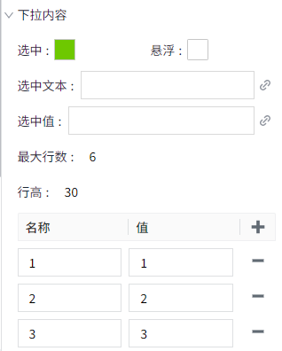
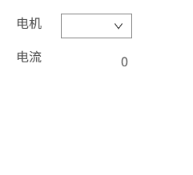

# 动态变量

动态变量绑定与变量绑定非常类似，区别在于您可以在动态变量绑定中引入任意数量的间接参数，动态建立变量路径。这些参数使用大括号标记，例如`{1}`。在间接参数被所绑定的控件属性替换后，绑定将链接到该变量所表示的变量路径。

## 绑定

| **名称** | **描述** |
|:----------|:-----------------|
| 路径     | 包含参数的变量路径  |
| 替换列表 | 列表中的每一行对应一个 **{}** 内的参数引用，每一行可以绑定到当前画面上的所有属性。  要将参数引用绑定到属性，只需选择对应的行，并点击“替换为”列中的属性绑定按钮，在弹出的属性选择器弹框中选择一个属性。 |

**示例**

存在4个电机，每个电机都是一个文件夹，电机下存在变量：电流。我们需要查看这个4个电机的电流值，变量路径分别为：

- Default:电机1.电流
- Default:电机2.电流
- Default:电机3.电流
- Default:电机4.电流

与其为这4个变量创建四个控件来显示变量值，我们可以创建一个控件并使其间接显示不同的变量值。对此，我们只需一个用于显示值的控件（值显示控件）和允许用户选择需要查看电机的控件（下拉框控件）。

1. 在画面上绘制一个值显示控件和下拉框控件。
2. 设置下拉框的下拉选项

   

3. 选中值显示控件，点击“文本”属性的绑定按钮。

   

4. 在弹出的属性绑定窗口，选择 **动态变量** 绑定。

   a. 在左侧的资产树上选择变量 **Default:电机1.电流**
   b. 在右侧的路径替换部分，在路径中删除变量路径中的 **1**，用 **{1}** 替换它。
   c. 在替换列表中，选择该行，点击绑定按钮，绑定到下拉框控件的 selectedValue 属性。
   d. 点击确认按钮。
   
   

5. 在编辑器上点击“预览”按钮，进入预览页面。

6. 在下拉框中选择 **1** 时， 路径为：**Default:电机1.电流**，此时在值显示 控件上显示电机 1 的电流值； 

   在下拉框中选择 **2** 时， 路径为：**Default:电机2.电流**，此时在值显示 控件上显示电机 2 的电流值；

   在下拉框中选择 **3** 时， 路径为：**Default:电机3.电流**，此时在值显示 控件上显示电机 3 的电流值； 

   在下拉框中选择 **4** 时， 路径为：**Default:电机4.电流**，此时在值显示 控件上显示电机 4 的电流值；

   

