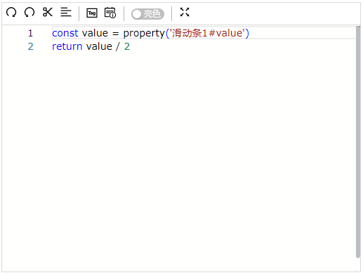
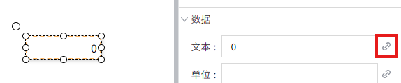
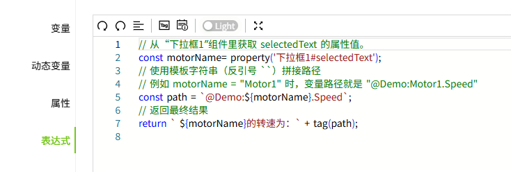

# 表达式

通过在脚本编辑器中编写脚本，来实现值绑定。

**工具栏按钮**

|     图标     |      描述    |
|:-------------|:---------------------------|
|  | 重做，重新执行被取消的操作，将文本恢复到"撤销"之前的状态 |
|  | 撤销，取消最近的编辑操作，将文本恢复到之前的状态    |
|  | 格式化文档  |
|  | 选择变量，点击后弹出变量选择窗口      |
|  | 选择属性，点击后弹出属性选择窗口     |
|  | 切换编辑器主题色   |
|  | 全屏显示  |

**示例1**

在数码管上显示实时变量值及其单位。

1. 在画面上绘制一个数码管。
2. 将数码管的填充色和边框色设置为 6ec800，字体颜色设置为 ffffff。
3. 点击数码管的“文本”的绑定按钮。

    

4. 在属性绑定窗口选择表达式，并在编辑器内编写如下表达式。

    

5. 点击画面的运行按钮，查看显示示效果。

    

**示例2**

数码管的值为滑动条的值的一半。

1. 在画面上绘制一个数码管和一个滑动条。
2. 将数码管的填充色和边框色设置为 6ec800，字体颜色设置为 ffffff。
3. 点击数码管的“文本”的绑定按钮。

    

4. 在属性绑定窗口选择表达式，并在编辑器内编写如下表达式。

    

5. 点击画面的预览按钮，在运行页面上，手动拖动滑动条的滑块改变其值，查看数码管的显示效果。数码管的值为滑动条的值的一半。

    

**示例3**

根据下拉框选择的电机名称，显示对应电机的转速。

1. 在画面上绘制一个值显示控件和一个下拉框控件。
2. 下拉框的下拉选项设置 3 个值：Motor1，Motor2，Motor3
3. 点击值显示控件的“文本”的绑定按钮。

    

4. 在属性绑定窗口中编写如下表达式。

    

5. 点击画面的预览按钮，在运行页面上，在下拉框中选择电机名称，即可显示对应电机的转速。

    

