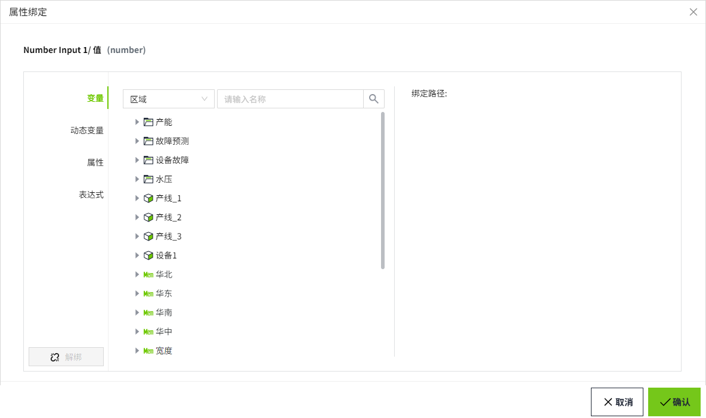
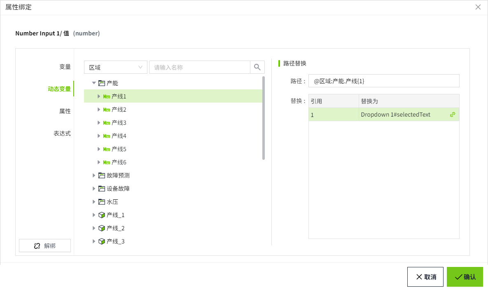

# 属性绑定

绑定是将一个控件的属性链接到其他控件上。

## 属性绑定类型

- [变量](tag.md)：直接绑定到 Tag 属性（通常是值），每次所选 Tag 属性更改时，都会将新值推送到绑定属性中。

- [动态变量](dynamic-tag.md)：动态变量绑定与变量绑定非常相似，不同之处在于您可以引入任意数量的参数来在运行时动态构建变量路径，而不是直接绑定到变量的路径。这些参数用大括号表示，例如 {1}。在参数被它们绑定到的文本值替换后，绑定将链接到变量路径所表示的变量。

- [属性](property.md)：将一个属性绑定到当前画面的自定义属性或者当前画面上的控件的其中一个属性。当该属性发生更改时，新值将推送到设置绑定的属性中。

- [表达式](expression.md)：使用简单的表达式对可能涉及大量动态数据的值进行计算。

- [动态单元格](dynamic-cell.md)：将数据集内的单元格绑定到变量或属性。可以轻松地使数据集内的一个或多个单元格动态化。常用于图表类控件，例如柱状图等。

- [SQL Query](sql-query.md)：将已创建的 SQL Query 绑定到控件上，将从数据库查询到的数据在控件上呈现。常用于表格类控件，例如表格。

## 设置绑定

放置在屏幕上的每个控件都具有各种属性，这些属性会更改控件的外观和行为。若要使控件执行有用的操作，例如显示动态信息或对设备进行控制，请在控件上配置绑定。通过绑定可以使您的控件栩栩如生，并让它们执行有用的操作。在属性编辑器中，可绑定的属性后面会显示绑定图标，要进行属性绑定，只需单击属性右侧的绑定图标即可。

未绑定属性时，该图标为灰色。

绑定后，该图标变为绿色。

您可以通过绑定图标的颜色快速分辨出哪些属性设置了属性绑定。

说明：在进行属性绑定时，绑定的属性要和当前属性的数据类型匹配，不匹配的属性会无法绑定。例如下图，管道的高度属性为number类型，则只可以绑定其他为number类型的属性。

总结如下：

- number类型只能绑定number类型的属性；

- bool类型只能绑定bool类型的属性；

- string类型可以绑定所有类型（number、bool、string）的属性。

## 复制绑定

复制控件时，所有属性绑定、脚本等都会随它一起复制。