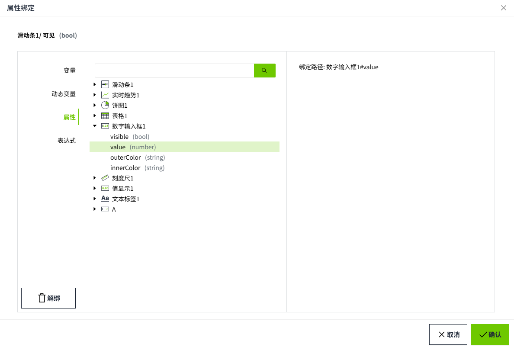

# 属性

属性绑定是将一个控件的属性绑定到另一个控件上。当该属性发生更改时，新值将推送到设置了绑定的属性中。

**说明**：只有部分属性可以绑定。

## 绑定

**示例**

在“滑动条”上显示“数字输入框”内的值。

1. 在画面上绘制一个“滑动条”和“数字输入框”。
2. 选中“滑动条”，在属性中点击值的绑定按钮。

    

3. 选择属性绑定，绑定到控件“数字输入框1”的 value 属性上，点击确认按钮。

    

4. 在编辑器上点击“预览”按钮，进入预览页面。

5. 在数字输入框内输入数值，该值将显示在滑动条上。

    

