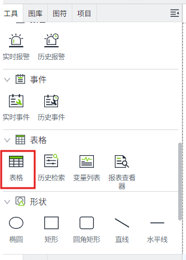
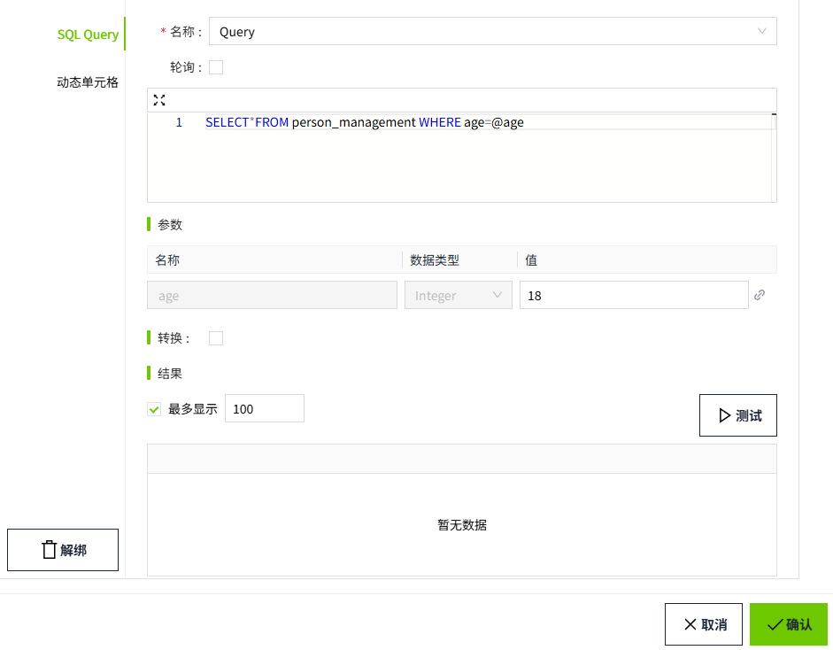

# SQL Query

SQL Query绑定允许您从数据库中查询数据并展示到表格中。

目前仅支持 **表格** 控件。

1. 在设计页面的 **工具** 窗口中找到‘**表格**’控件，拖动到画面中。

    

2. 选中表格控件，在属性栏中，点击“表格”属性的绑定按钮。

    

3. 在弹出绑定窗口后，选择“**SQL Query**”，然后在 **名称** 下拉框中选择已创建的 SQL Query, 点击“确定”按钮完成绑定。

    

4. 在表格控件中，显示查询结果。

    

**说明**：如需了解SQL Query更详细的使用，请查阅 

- [Query](../sql-query/sql-query-example/query.md) 
- [Scalar Query](../sql-query/sql-query-example/scalar-query.md)
- [Update Query](../sql-query/sql-query-example/update-query.md)

